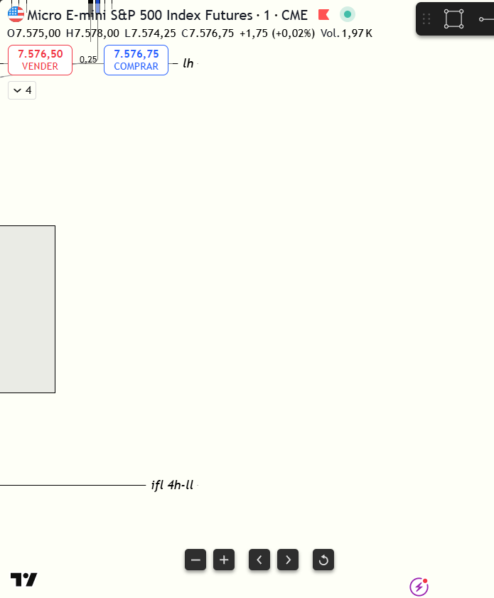

# 📅 BITÁCORA DE TRADING — 01 de Julio de 2026
**Pre-Trade Link:** [[2026-07-01_pre_trade]]

## 📊 RESUMEN GENERAL DE LA SESIÓN
- **Resultado Neto:** `+525.00 USD`
- **Trades Realizados:** `2`
- **Resultado:** `WIN`

---

## 🖼️ CAPTURA DE PANTALLA

---

## 🔍 ANÁLISIS ESTRUCTURAL DE TEMPORALIDADES (TOP-DOWN)
### 1. Temporalidades Mayores (HTF: 4h / 1h)
- **Bias:** Alcista 🟢 (ES liderando) / NQ neutral a alcista
- **Narrativa:** El pre-trade proyectaba una sesión de rango rotacional debido a la desalineación estructural en el premarket. Sin embargo, en la apertura de la Killzone de Nueva York, la inyección de volumen y un SMT Alcista limpio (NQ sosteniendo mínimos más altos, ES barriendo a mínimos más bajos) reestructuraron el escenario, iniciando una distribución alcista fuerte y sosteniéndose entre la primera y la segunda desviación estándar del VWAP.

### 2. Temporalidades Intermedias (30m / 15m)
- **Zonas clave (POIs):** Mitigación del área de descuento macro de 1H en ES (`7,518.00`), la cual sirvió como soporte y base de acumulación institucional.

### 3. Temporalidad de Ejecución (5m / 2m / 1m)
- **Gatillo / Desplazamiento:** Desplazamientos alcistas en 1m/2m que invalidaron ineficiencias de venta. El volumen de Cumulative Delta positivo en ES empujó las cotizaciones con momentum.

---

## 📈 REPORTE DETALLADO DE LOS TRADES

### 🟢 TRADE #1: Long en ES (MES 09-26)
- **Entrada:** `7,518.50` (08:47:08 local)
- **MAE:** `0.0 ticks`
- **MFE:** `5.0 ticks`
- **Resultado:** Win (`+1.25 puntos`, `+$37.50 USD` netos)
- **Confluencias:** CISD en zona de descuento macro de 1H, Heatmap (bloque de liquidez limit de compra en Bookmap).
- **Autopsia:** Entrada precisa en la zona de soporte del premarket. Se cerró rápido con un scalp defensivo de 5 ticks al ver fricción en el DOM/heatmap (temor a spoofing inestable en la apertura). Aunque el precio expandió mucho más, la decisión de proteger capital en el inicio volátil es tácticamente correcta.

### 🟢 TRADE #2: Long en ES (MES 09-26)
- **Entrada:** `7,531.00` (08:55:00 local)
- **MAE:** `11.0 ticks` (`2.75 puntos`)
- **MFE:** `91.0 ticks` (`22.75 puntos`)
- **Resultado:** Win (`+16.25 puntos`, `+$487.50 USD` netos)
- **Confluencias:** FVG de 1m de continuación, SMT Alcista activo, Heatmap (ausencia de liquidez por debajo que diera vía libre al precio para subir).
- **Autopsia:** Operación de alto rendimiento. Se identificó el vacío de liquidez inferior en el heatmap y la acumulación de delta de ES, entrando en la continuación del FVG de 1m. El Stop Loss se colocó detrás de los POC de volumen que actuaban como soporte. Se realizó trailing stop de forma dinámica y disciplinada, saliendo en el extremo Premium a `7,547.25` antes de la reversión a la media, asegurando un trade de +65 ticks.

---

## 🧠 LECCIONES DE LA SESIÓN
1. **La Ausencia de Liquidez en el Heatmap da Vía Libre:** Analizar el heatmap de Bookmap no solo sirve para buscar obstáculos (Resistencias); verificar que no hay liquidez contraria por debajo te confirma que el precio puede expandirse rápidamente sin retrocesos profundos.
2. **Defensa Dinámica (Trailing Stop) con POCs de Volumen:** En distribuciones con momentum de apertura, trackear tu stop loss detrás de los POCs del volumen volumetric te protege y te permite maximizar las ganancias (+65 ticks) sin salir prematuramente por miedo.
3. **El Spoofing en el Open exige Cierres Defensivos:** En los primeros minutos, las órdenes grandes del DOM parpadean y desaparecen rápidamente. Tomar ganancias de scalp si observas señales ambiguas en el DOM (como en el Trade #1) es una práctica sana para conservar capital.
4. **Disciplina de Cierre de Sesión:** Terminar el día con `+$525.00 USD` brutos y apagar pantallas evita el sobreoperar (Overtrading), protegiendo las ganancias de la sesión frente al cansancio cognitivo.
