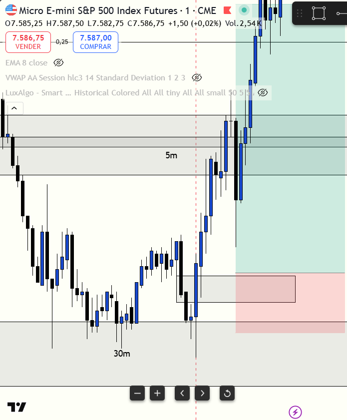

# 📅 BITÁCORA DE TRADING — 02 de Julio de 2026
**Pre-Trade Link:** [[2026-07-02_pre_trade]]

## 📊 RESUMEN GENERAL DE LA SESIÓN
- **Resultado Neto:** `+$967.50 USD` (9 contratos de MES)
- **Trades Realizados:** `1`
- **Resultado:** `WIN` 🟢

---

## 🖼️ CAPTURA DE PANTALLA

---

## 🔍 ANÁLISIS ESTRUCTURAL DE TEMPORALIDADES (TOP-DOWN)
### 1. Temporalidades Mayores (HTF: 4h / 1h)
- **Bias:** Alcista 🟢
- **Narrativa:** El sesgo diario en ES era fuertemente alcista desde la temporalidad diaria (Day TF) gracias a la detección del CRT (Change of Real Trend / Cambio de Tendencia Real). Esto nos predispuso a buscar compras en zonas de descuento macro.

### 2. Temporalidades Intermedias (30m / 15m)
- **Zonas clave (POIs):** Existían vacíos de liquidez (FVG) alcistas inmitigados por debajo del precio. Durante la apertura de la sesión de Nueva York, el precio se desplazó hacia abajo para mitigar estas zonas de demanda. En el heatmap de liquidez (Bookmap) de ES se veía claramente que no había liquidez institucional abajo, mientras que arriba (cerca de la zona de target en 7579.75) se observaban grandes muros de limit orders de venta.

### 3. Temporalidad de Ejecución (5m / 2m / 1m)
- **Gatillo / Desplazamiento:** Se observó una clara manipulación durante la apertura por el tamaño de tick/mecha que dejó la vela al tocar los FVGs inferiores (absorción/esfuerzo sin resultado). En 1m se formó un Inverse FVG (iFVG) alcista que actuó como el gatillo definitivo. La entrada se confirmó mediante la divergencia SMT con el Nasdaq (MNQ bajó a tomar los mínimos del día realizando un Stop Hunt de manual, mientras que ES, actuando como líder de la sesión, no tuvo necesidad de romper sus mínimos y sostuvo una estructura más fuerte).

---

## 📈 REPORTE DETALLADO DE LOS TRADES
### 🟢 TRADE #1: Long en MES 09-26 (PAAPEX5465670000001)
- **Entrada:** `7558.25`
- **MAE:** `0.0` ticks (Drawdown nulo, el precio jamás cotizó por debajo de la entrada tras el llenado).
- **MFE:** `120.0` ticks (Máxima excursión favorable alcanzando `7583.50`).
- **Resultado:** `+$967.50 USD` (Llenado en Take Profit a `7579.75` con 9 contratos).

---

## 🧠 CENTRO DE APRENDIZAJE Y RETROALIMENTACIÓN (MÉTODO STEENBARGER)

> [!TIP]
> **TARJETA DE MEMORIA DE RÁPIDA CONSULTA (Revisar antes de abrir el mercado)**
> - **El Foco de Hoy:** Paciencia para esperar el testeo de zonas inmitigadas en la apertura combinando SMT y Order Flow delta.
> - **Acción de Éxito a Repetir (Músculo):** Entrar al confirmarse la inversión estructural del iFVG de 1m y proteger a Breakeven una vez alcanzado el 3:1 R:R.
> - **Error Crítico a Evitar (Eliminar):** Evitar chaser la vela inicial de la apertura y no dudar cuando las confluencias (SMT + Delta + Heatmap) están totalmente alineadas.

### ⚖️ Clasificación: Proceso vs. Resultado
*¿Ejecutaste el plan de manera disciplinada, independientemente de ganar o perder dinero?*
- **Trade #1:** [+$967.50 USD] ➔ **Proceso:** **CORRECTO (Buen Trade)** \| *Razón:* Entrada impecable basada en Discount POI, manipulación y absorción de volumen en apertura, divergencia SMT con el mercado débil (MNQ), delta de compra fuertemente alcista (+10,413) y uso lógico de la liquidez del Bookmap para el target. Gestión defensiva excelente moviendo el Stop Loss a breakeven (`7558.50`) al expandir.

### 📈 Plan de Acción Inmediato para la Próxima Sesión
- **Qué mantendré:** El análisis de correlación de fuerza inter-mercado (SMT) y la paciencia para esperar mitigaciones en la apertura en lugar de tomar trades precipitados.
- **Qué corregiré activamente:** Continuar usando el heatmap para establecer el Draw on Liquidity (DOL) y no avariciar persinguiento targets demasiado lejanos si la liquidez inmediata ya cubre tu meta diaria.
