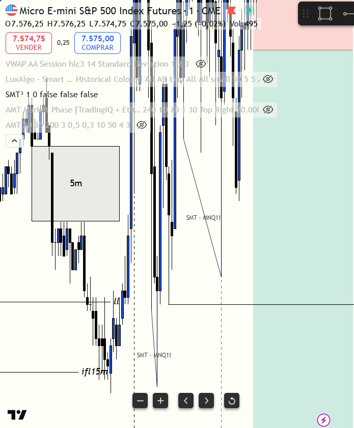

# 📅 BITÁCORA DE TRADING — 06 de julio de 2026
**Pre-Trade Link:** [[2026-07-06_pre_trade]]

## 📊 RESUMEN GENERAL DE LA SESIÓN
- **Resultado Neto:** `-150.00 USD`
- **Trades Realizados:** `1`
- **Resultado:** `LOSS` (WIN / LOSS / BE)

---

## 🖼️ CAPTURA DE PANTALLA

---

## 🔍 ANÁLISIS ESTRUCTURAL DE TEMPORALIDADES (TOP-DOWN)
### 1. Temporalidades Mayores (HTF: 4h / 1h)
- **Bias:** Neutral 🟡 (4H en Premium 🔴, 1H/30m en Discount 🟢)
- **Narrativa:** Conflicto de rangos. MES cotizaba en la zona de descuento de 1H, lo que activó compras institucionales y absorción en mínimos. Nasdaq (MNQ) rompió con fuerza el nivel psicológico mayor de `30000` y arrastró al mercado.

### 2. Temporalidades Intermedias (30m / 15m)
- **Zonas clave (POIs):** Caja de oferta de 5m en `7558 - 7561` y el swing high en `7566.73` en MES.

### 3. Temporalidad de Ejecución (5m / 2m / 1m)
- **Gatillo / Desplazamiento:** iFVG bajista al cierre de la vela de 1m a las `08:53` tras mitigar zona premium en `7572.50`.

---

## 📈 REPORTE DETALLADO DE LOS TRADES
### 🔴 TRADE #1: Short en MES 09-26
- **Entrada:** `7564.50` (Market al cierre de la vela de 1m)
- **SL Inicial:** `7573.00` (Swing High)
- **SL Final (Trailing):** `7570.50` (Traqueado detrás del POC y SMT)
- **MAE:** `24 ticks` (6.00 puntos flotantes en contra)
- **MFE:** `33 ticks` (8.25 puntos flotantes a favor al tocar `7556.25`)
- **Resultado:** `Loss (-$150.00 USD)`
- **Confluencias:** Mitigación Premium intradía, iFVG 1m al cierre, SMT bajista en retesteo a las 08:57 y absorción de delta en NinjaTrader.

---

## 🧠 CENTRO DE APRENDIZAJE Y RETROALIMENTACIÓN (MÉTODO STEENBARGER)

> [!TIP]
> **TARJETA DE MEMORIA DE RÁPIDA CONSULTA (Revisar antes de abrir el mercado)**
> - **El Foco de Hoy:** No perseguir velas de gran rango en el cierre; usar órdenes límite en la zona premium de la vela para acotar el stop loss.
> - **Acción de Éxito a Repetir (Músculo):** Gestión defensiva del stop loss detrás de POCs de volumen para acotar la pérdida del stop inicial de 8.5 puntos a solo 6 puntos.
> - **Error Crítico a Evitar (Eliminar):** Chasing (entrar tarde en el mínimo de la vela) y shortear un activo cuando el líder (Nasdaq) está rompiendo con fuerza un nivel psicológico mayor (`30000`).

### ⚖️ Clasificación: Proceso vs. Resultado
*¿Ejecutaste el plan de manera disciplinada, independientemente de ganar o perder dinero?*
- **Trade #1:** [-$150.00] ➔ **Proceso:** **INCORRECTO (Mal Trade)** \| *Razón:* Aunque el análisis de zonas Premium y dirección era correcto, se cometió el error de Chasing al entrar a mercado al cierre de una vela de 1m muy extendida que arruinó el R:R inicial, y se ignoró el soporte de Discount macro de 1H/30m en MES y la tracción alcista del Nasdaq liderando.

### 📈 Plan de Acción Inmediato para la Próxima Sesión
- **Qué mantendré:** El mapeo analítico de zonas y el traqueo defensivo del stop.
- **Qué corregiré activamente:** Ejecutar con órdenes límite en retroceso (Sell Limit) en lugar de entradas a mercado al cierre de velas largas. No operar en contratendencia del líder si este muestra expansión libre.
