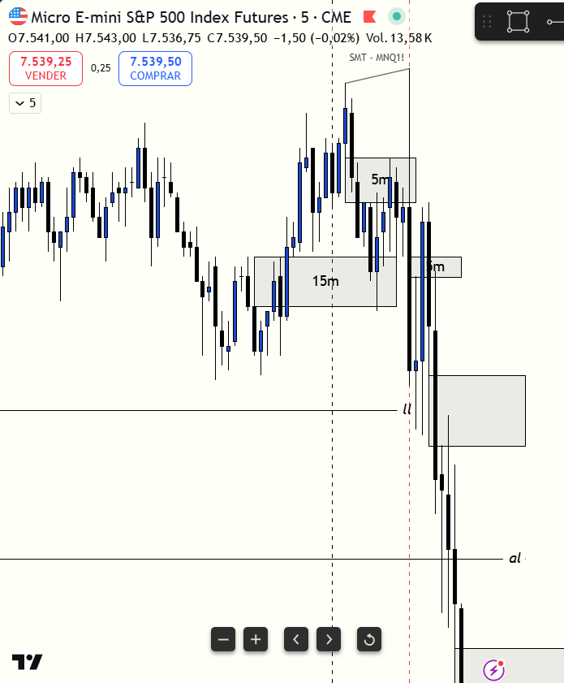

# 📅 BITÁCORA DE TRADING — 07 de Julio de 2026
**Pre-Trade Link:** [[2026-07-07_pre_trade]]

## 📊 RESUMEN GENERAL DE LA SESIÓN
- **Resultado Neto:** `-340.00 USD`
- **Trades Realizados:** `1`
- **Resultado:** `LOSS` 🔴

---

## 🖼️ CAPTURA DE PANTALLA

---

## 🔍 ANÁLISIS ESTRUCTURAL DE TEMPORALIDADES (TOP-DOWN)
### 1. Temporalidades Mayores (HTF: 4h / 1h)
- **Bias:** Bajista 🔴 (Expansión Intradía)
- **Narrativa:** Aunque el análisis estructural del premarket proyectaba un bias local alcista basado en la fuerza del S&P 500, desde la apertura de Nueva York (9:30 AM NY) el mercado invalidó este sesgo. La acción del precio rompió con fuerza y velocidad los niveles premarket de soporte, estableciendo una tendencia bajista de expansión constante que hizo mínimos decrecientes de manera sistemática.

### 2. Temporalidades Intermedias (30m / 15m)
- **Zonas clave (POIs):** Barrido de liquidez externa de sesión en el London Low (`7570.50`) y del Asia Low (`7563.00`). La inercia bajista del día superó con facilidad estos niveles de soporte, utilizándolos como áreas de continuación vendedora en lugar de reversión.

### 3. Temporalidad de Ejecución (5m / 2m / 1m)
- **Gatillo / Desplazamiento:** A las 8:45 AM, tras la barrida inicial del London Low, se produjo un rebote que en la perspectiva visual de TradingView cerró por encima del FVG de 5m en `7578.26` (cerrando en `7580.00`), lo que fue interpretado por mí como un iFVG alcista con confluencia de absorción en mecha. El gatillo se ejecutó de forma disciplinada con orden límite en `7577.50` (50% de la vela de desplazamiento) para mantener la gestión de R:R recomendada por el manual operativo.

---

## 📈 REPORTE DETALLADO DE LOS TRADES
### 🔴 TRADE #1: Long en MES 09-26
- **Entrada:** `7577.50` (Long - 8 contratos)
- **MAE:** 34 ticks (mínimo de la operación en `7569.00`, donde tocó el stop loss).
- **MFE:** 14 ticks (máximo alcanzado en `7581.00`).
- **Resultado:** Loss (`-$340.00 USD`, stop out en `7569.00`).

---

## 🧠 CENTRO DE APRENDIZAJE Y RETROALIMENTACIÓN (MÉTODO STEENBARGER)

### ⚖️ Clasificación: Proceso vs. Resultado
*¿Ejecutaste el plan de manera disciplinada, independientemente de ganar o perder dinero?*
- **Trade #1:** [-$340.00] ➔ **Proceso:** **INCORRECTO (Mal Trade)** | *Razón:* Aunque el gatillo técnico de iFVG en TradingView se consideró confirmado y la colocación de la orden límite al 50% de la vela fue una excelente muestra de disciplina técnica para evitar el chasing, el trade es calificado como incorrecto en el proceso debido a un **error de clasificación de contexto**. Operamos un Long contratendencia bajo la premisa equivocada de estar en un "Día de Rango" (buscando reversión a la media en la banda de -2 desviaciones del VWAP), cuando en realidad el mercado estaba en un **Día de Tendencia Bajista Fuerte (Expansión)**. 

### 📝 El pensamiento y el porqué me equivoqué:
*   **Mi pensamiento:** Vi que el precio barrió el London Low en el Open y generó una absorción con volumen de parada. MES sostenía mínimos más altos respecto a MNQ (divergencia SMT alcista) y el FVG 5m fue superado en el cierre en mi pantalla de TradingView. Busqué una compra en zona de descuento para un rebote rápido a la media del VWAP. 
*   **Por qué me equivoqué:** Me confié de la clasificación inicial del premarket y me enfoqué excesivamente en el comportamiento oscilatorio del VWAP en los primeros minutos. Pasé por alto que el mercado estaba haciendo una expansión direccional fuerte hacia abajo desde el Open. En un día de expansión bajista, el precio "camina" por la banda de -2 y -3 desviaciones estándar del VWAP sin regresar a la media, e ignorar esa inercia me llevó a tomar una compra contratendencia de alto riesgo. Además, coloqué mi Stop Loss en `7569.00`, que estaba flotando justo en medio del vacío antes del Asia Low estructural real en `7563.00`, dejándolo totalmente expuesto al barrido.

> [!TIP]
> **TARJETA DE MEMORIA DE RÁPIDA CONSULTA (Revisar antes de abrir el mercado)**
> - **El Foco de Hoy:** La acción del precio y la estructura de mercado (BOS, CHOCH, cierres de cuerpo) mandan sobre cualquier indicador. El VWAP es secundario.
> - **Acción de Éxito a Repetir (Músculo):** Seguir usando el "Chasing Filter" (órdenes límite al 50% de la vela de desplazamiento) para no comprar a mercado de forma emocional.
> - **Error Crítico a Evitar (Eliminar):** Comprar contratendencia en días de expansión bajista. Si el precio se sostiene sobre las bandas de -2 desviaciones del VWAP y rompe soportes con cierres de cuerpo completo, queda prohibido buscar Longs.

### 📈 Plan de Acción Inmediato para la Próxima Sesión
- **Qué mantendré:** La paciencia para no entrar a mercado y colocar órdenes límite en zonas premium/discount de la vela gatillo para optimizar el R:R.
- **Qué corregiré activamente:** Clasificar el tipo de día únicamente según la estructura de mercado y cierres de cuerpo de velas (Regla 3 de AGENTS.md), quitándole la sobre-atención al VWAP. En días de tendencia fuerte, operaré únicamente a favor del movimiento y no buscaré Mean Reversion.
