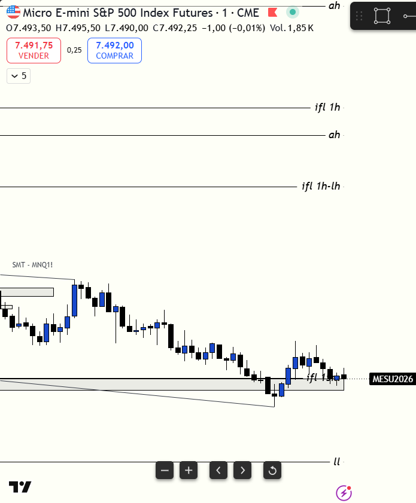

# 📅 BITÁCORA DE TRADING — 08 de Julio de 2026
**Pre-Trade Link:** [[2026-07-08_pre_trade]]

## 📊 RESUMEN GENERAL DE LA SESIÓN
- **Resultado Neto:** `+220.00 USD`
- **Trades Realizados:** `1`
- **Resultado:** `WIN` 🟢

---

## 🖼️ CAPTURA DE PANTALLA

---

## 🔍 ANÁLISIS ESTRUCTURAL DE TEMPORALIDADES (TOP-DOWN)
### 1. Temporalidades Mayores (HTF: 4h / 1h)
- **Bias:** Bajista 🔴 (Expansión Intradía)
- **Narrativa:** El precio abrió la sesión de Nueva York con una marcada inercia bajista establecida desde la caída de las 4:00 AM (Open de Londres), cotizando muy por debajo de las áreas de valor previas. Esto declaró un **Día de Imbalance (Tendencial) Bajista**, donde el Premium/Discount de altas temporalidades se ignora y el mercado expande agresivamente hacia los imanes inferiores (DOL).

### 2. Temporalidades Intermedias (30m / 15m)
- **Zonas clave (POIs):** El precio retrocedió de forma ordenada a Premium del rango de 1m/5m, respetando las zonas de mitigación de oferta tras la primera caída de la apertura. 

### 3. Temporalidad de Ejecución (5m / 2m / 1m)
- **Gatillo / Desplazamiento:** Entrada en corto en MES en `7516.50` a las 08:51:46 en el retesteo del FVG bajista en 1m/4m de MNQ, el cual fue respetado. Se aplicó el filtro anti-chasing esperando el retroceso.

---

## 📈 REPORTE DETALLADO DE LOS TRADES
### 🔴 TRADE #1: Short en MES 09-26
- **Entrada:** `7516.50` (Venta a Mercado - 8 contratos) | **Hora:** `08:51:46`
- **MAE:** `14 ticks` (Máximo flotante en contra en `7520.00`)
- **MFE:** `37 ticks` (Máximo recorrido a favor en `7507.25` en la primera pierna, expandiendo luego a más de `80 ticks` en la continuación)
- **Exit:** `7511.00` (Compra a mercado para cerrar) | **Hora:** `08:56:03`
- **Resultado:** WIN (`+220.00 USD` netos, `+5.50` puntos).

---

## 🧠 CENTRO DE APRENDIZAJE Y RETROALIMENTACIÓN (MÉTODO STEENBARGER)

### ⚖️ Clasificación: Proceso vs. Resultado
*¿Ejecutaste el plan de manera disciplinada, independientemente de ganar o perder dinero?*
- **Trade #1:** [+$220.00 USD] ➔ **Proceso:** **CORRECTO (Buen Trade)** | *Razón:* El trade estuvo perfectamente estructurado bajo las reglas de Día de Tendencia (Imbalance). Se operó a favor del sesgo bajista de Londres hacia un DOL inferior muy claro (el FVG de 5m sin mitigar en MNQ) y se aplicó con disciplina el filtro de no persecución, entrando únicamente al retesteo de los FVGs bajistas en 1m. La operación demostró ser de alta probabilidad, ya que el precio cayó posteriormente a las 09:44 AM hasta `7494.75` (lo que habría validado con creces el TP original de `7500.75`).

### 📝 Mi Proceso de Pensamiento & Hipótesis Inicial (El Trade según el Usuario)
*   **La Hipótesis:** Había un 5m FVG sin mitigar abajo en MNQ que actuaba como un DOL claro y magnético para la sesión. La fuerza de la caída de las 4:00 AM (Londres) en ambos índices indicaba que la inercia del día era de venta, confirmando un Día de Imbalance donde debíamos ignorar el Premium/Discount macro de 1H/4H.
*   **La Estructura Local:** Aunque el London High en MNQ se quedó sin mitigar (lo que me generó cierta duda inicial de si el mercado subiría primero a barrerlo), se identificó un SMT bajista local respecto a MES y un iFVG en 1m.
*   **El Gatillo de Entrada:** Esperé a que el mercado subiera a retestear los FVGs bajistas de 1m recién creados en la caída y, al ver que los respetaba, entré short en MES en `7516.50`.
*   **La Salida:** Fui arrastrando el SL detrás de los muros defensivos del heatmap. Decidí salir de manera anticipada en `7511.00` asegurando `+$220.00 USD` porque detecté un SMT alcista local y una toma de liquidez antes del TP. Preferí priorizar la protección de capital y la reconstrucción de confianza tras dos días rojos. Aunque el precio finalmente fue a TP (`7500.75`), considero que la salida fue correcta por la cercanía del London High sin mitigar arriba, lo que representaba un riesgo latente de pullback profundo (el cual ocurrió, subiendo a `7520.25` antes del desplome final).

### ⚖️ El Debate de Proceso: ¿Qué era lo Correcto al Final? (IA Mentor vs. Trader)
*   **Postura del Trader (Confirmada por el Mercado):** 
    *   *1. La regla del Día de Tendencia:* En días tendenciales, el Premium/Discount macro no importa. Vender en descuento para continuación era el proceso correcto porque el mercado expande hacia el DOL. El precio de MES cayó a `7494.75` (TP de sobra).
    *   *2. Salida Justificada:* La salida anticipada en `7511.00` estuvo protegida técnicamente. El precio realizó un pullback violento a `7520.25` justo después de cerrar, lo que habría puesto la posición en drawdown o activado un stop en BE.
*   **Corrección Analítica de Antigravity (Puntos de Fila en el Proceso):**
    *   *1. Reconocimiento del Error de la IA:* Inicialmente clasifiqué el Short como "Incorrecto" argumentando que era una zona de soporte macro y SMT alcista, sugiriendo buscar Longs. Esta fue una lectura errónea; el pre-trade proyectaba correctamente buscar Shorts y el mercado estaba en un Día de Expansión Bajista puro. Buscar Longs hoy habría violado la inercia del mercado.
    *   *2. Gestión del Volumen:* El retroceso a `7520.25` fue solo una mitigación premium intradía antes de la expansión final. Tu tesis del DOL inferior fue la ganadora.
*   **¿Qué era lo correcto al final?:**
    *   Lo correcto era **buscar Shorts (Ventas)** en continuación de la caída de Londres, tal como planteó el pre-trade. Tu trade fue de alta probabilidad y la salida anticipada fue una excelente muestra de gestión discrecional defensiva frente al riesgo del London High inmitigado.

> [!TIP]
> **TARJETA DE MEMORIA DE RÁPIDA CONSULTA (Revisar antes de abrir el mercado)**
> - **El Foco de Hoy:** En días de imbalance/tendencia bajista, opera únicamente cortos en los retesteos a FVG/OB y mantén la mira en el DOL inferior.
> - **Acción de Éxito a Repetir (Músculo):** Salida defensiva manual al detectar SMT opuesto o absorción local en zona de pullback, protegiendo ganancias de forma proactiva.
> - **Error Crítico a Evitar (Eliminar):** Dudar de la clasificación de Día de Tendencia cuando los cierres de cuerpo confirman la ruptura bajista de Londres.

### 📈 Plan de Acción Inmediato para la Próxima Sesión
- **Qué mantendré:** El uso del heatmap para el trailing stop defensivo y la espera paciente de retesteos de FVGs (Chasing Filter).
- **Qué corregiré activamente:** Fortalecer la confianza en la clasificación inicial de Día de Imbalance para no dudar del target final (DOL) cuando el plan esté corriendo.
