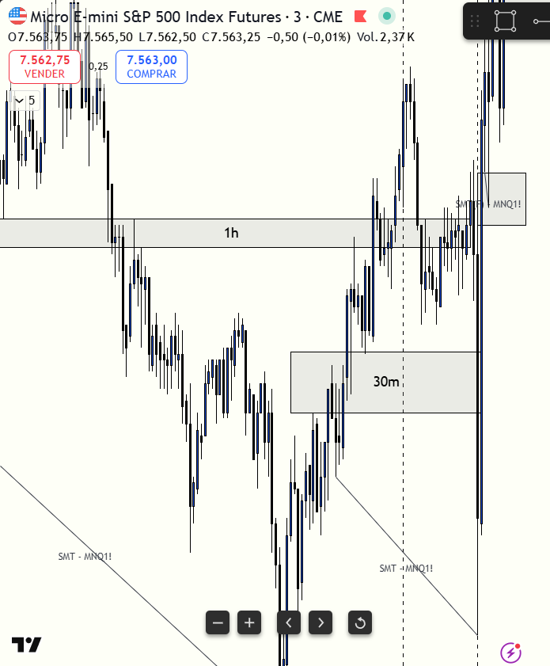

# 📅 BITÁCORA DE TRADING — 09 de Julio de 2026
**Pre-Trade Link:** [[2026-07-09_pre_trade]]

## 📊 RESUMEN GENERAL DE LA SESIÓN
- **Resultado Neto:** `-138.75 USD`
- **Trades Realizados:** `2`
- **Resultado:** `LOSS` 🔴

---

## 🖼️ CAPTURA DE PANTALLA

---

## 🔍 ANÁLISIS ESTRUCTURAL DE TEMPORALIDADES (TOP-DOWN)
### 1. Temporalidades Mayores (HTF: 4h / 1h)
- **Bias:** Neutral 🟡 / Estructura Bajista 🔴 (MES)
- **Narrativa:** El mercado cotizaba en zonas premium del rango previo, mostrando un SMT bajista en máximos históricos/locales. S&P 500 (MES) expandió a nuevos máximos de la sesión mientras Nasdaq (MNQ) marcaba un máximo más bajo, indicando una potencial distribución institucional en resistencia macro.

### 2. Temporalidades Intermedias (30m / 15m)
- **Zonas clave (POIs):** El precio de MES retesteaba niveles premium buscando mitigar zonas de oferta de 30m, mientras que MNQ se apoyaba en un FVG alcista de 15m/5m sin mitigar.

### 3. Temporalidad de Ejecución (5m / 3m / 1m)
- **Gatillo / Desplazamiento:** Se identificó la formación de un iFVG bajista en la temporalidad de 3m en MES. Sin embargo, MNQ rebotó agresivamente tras mitigar y respetar con precisión su FVG alcista de 5m.

---

## 📈 REPORTE DETALLADO DE LOS TRADES
### 🔴 TRADE #1 (Accidental): Long en MES 09-26
- **Entrada:** `7553.00` (Compra a Mercado - 3 contratos) | **Hora:** `08:51:01`
- **Exit:** `7553.00` (Venta a Mercado para cerrar) | **Hora:** `08:51:04`
- **Resultado:** BE (`0.00 USD`, `0` puntos).
- **Nota:** Entrada accidental por error en la interfaz de usuario de NinjaTrader debido al congelamiento del gráfico en TradingView.

### 🔴 TRADE #2: Short en MES 09-26
- **Entrada:** `7552.25` (Venta a Mercado - 3 contratos) | **Hora:** `08:51:16`
- **MAE:** `37 ticks` (Stop Loss ejecutado en `7561.50`)
- **MFE:** `0 ticks`
- **Exit:** `7561.50` (Stop Loss hit) | **Hora:** `08:52:05`
- **Resultado:** LOSS (`-138.75 USD` netos, `-9.25` puntos).

---

## 🧠 CENTRO DE APRENDIZAJE Y RETROALIMENTACIÓN (MÉTODO STEENBARGER)

### ⚖️ Clasificación: Proceso vs. Resultado
*¿Ejecutaste el plan de manera disciplinada, independientemente de ganar o perder dinero?*
- **Trade #1 (Accidental):** [$0.00] ➔ **Proceso: INCORRECTO (Mal Trade)** | *Razón:* Entrada por error de clics en la plataforma.
- **Trade #2 (Short):** [-$138.75 USD] ➔ **Proceso: INCORRECTO (Mal Trade)** | *Razón:* Doble falla de proceso. Primero, se violó la regla de correlación inter-mercado al abrir un corto en el activo débil (MES) ignorando que el activo fuerte (MNQ) estaba en soporte de 5m FVG y respetándolo (lo que impulsó al alza a todo el mercado). Segundo, se forzó la entrada a mercado en medio de un congelamiento técnico de TradingView, perdiendo por completo la consciencia situacional.

### 📝 Mi Proceso de Pensamiento & Hipótesis Inicial (El Trade según el Usuario)
*   **La Hipótesis:** MES se mostraba débil en comparación con MNQ y teníamos un SMT bajista en máximos de la sesión (distribución). Al detectar la formación de un FVG bajista invertido (iFVG) en la vela de 3m en MES, decidí presionar el gatillo de venta corta.
*   **La Distracción:** Mi TradingView se congeló justo antes de la entrada. Me concentré obsesivamente en resolver el problema técnico y forzar la entrada a mercado para no "perder el movimiento". Esto estrechó mi visión táctica y me impidió verificar qué estaba haciendo Nasdaq.
*   **El Desenlace:** Nasdaq rebotó con violencia en su FVG alcista de 5m, lo que jaló inmediatamente a MES al alza, rompiendo mi stop loss en `7561.50` a los 49 segundos de haber ingresado. Asumo el error técnico y la falta de atención debido a la frustración con la plataforma.

### ⚖️ El Debate de Proceso: ¿Qué era lo Correcto al Final? (IA Mentor vs. Trader)
*   **Postura del Trader:** La idea técnica de shortear el activo débil (MES) en base a un iFVG de 3m estaba en el plan. El error no fue la lectura del setup de MES, sino la distracción técnica que me impidió ver el soporte de NQ.
*   **Corrección de Antigravity:** 
    *   *1. Filtro Inter-mercado:* Nunca se debe shortear el activo débil si el activo fuerte (MNQ) está testeando y respetando un soporte macro alcista (FVG de 5m). El líder siempre arrastrará al rezagado.
    *   *2. Regla de Oro ante Fallas de Plataforma:* Si la plataforma experimenta lag o se congela, la regla conductual es **No-Trade** absoluto. Forzar órdenes a ciegas sin ver el mercado en tiempo real es una conducta impulsiva de alto riesgo.

> [!TIP]
> **TARJETA DE MEMORIA DE RÁPIDA CONSULTA (Revisar antes de abrir el mercado)**
> - **El Foco de Hoy:** Ante cualquier fallo técnico o congelamiento de TradingView, suspende la sesión de inmediato (No-Trade).
> - **Acción de Éxito a Repetir (Músculo):** Análisis veloz inter-mercado de soportes en el activo líder antes de gatillar en el rezagado.
> - **Error Crítico a Evitar (Eliminar):** Shortear el rezagado mientras el líder rebota con fuerza en un soporte de FVG de 5m.

### 📈 Plan de Acción Inmediato para la Próxima Sesión
- **Qué mantendré:** El control estricto del Stop Loss predefinido (pérdida pequeña de 9.25 puntos).
- **Qué corregiré activamente:** Detener por completo la operativa si TradingView se congela. Validar siempre que el activo fuerte (MNQ) no esté en soporte alcista antes de shortear MES.
