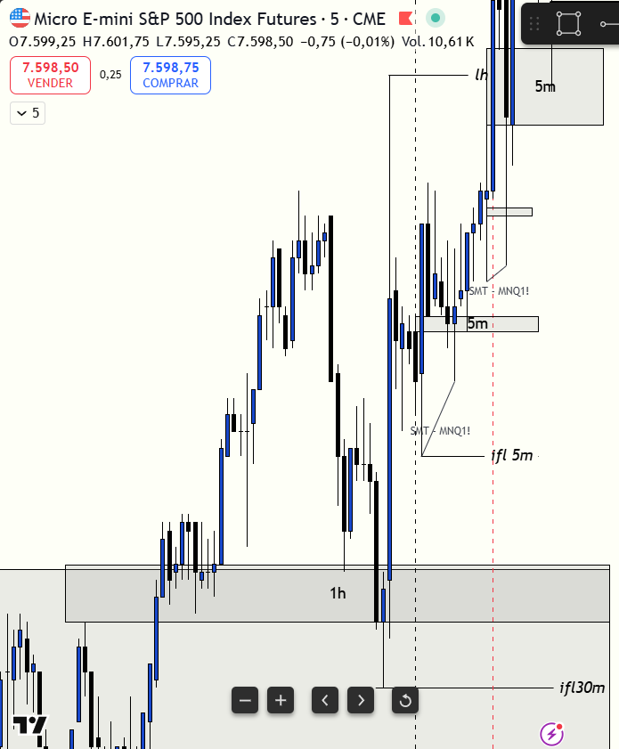

# 📅 BITÁCORA DE TRADING — 10 de Julio de 2026
**Pre-Trade Link:** [[2026-07-10_pre_trade]]

## 📊 RESUMEN GENERAL DE LA SESIÓN
- **Resultado Neto:** `-132.50 USD`
- **Trades Realizados:** `2`
- **Resultado:** `LOSS` 🔴

---

## 🖼️ CAPTURA DE PANTALLA

---

## 🔍 ANÁLISIS ESTRUCTURAL DE TEMPORALIDADES (TOP-DOWN)
### 1. Temporalidades Mayores (HTF: 4h / 1h)
- **Bias:** Alcista local 🟢 (MES liderando con delta comprador)
- **Narrativa:** El mercado abrió la sesión de Nueva York con una inercia alcista liderada por S&P 500 (MES), que cotizaba en zonas premium del rango previo con delta positivo. Nasdaq (MNQ) abría rezagado, mostrando debilidad relativa y delta negativo (`-3,435`), lo que generaba un contexto de divergencia inter-mercado.

### 2. Temporalidades Intermedias (30m / 15m)
- **Zonas clave (POIs):** El precio de MES mitigó zonas de demanda previas y expandió. Sin embargo, MNQ cotizaba cerca de un POI de oferta macro y ya había mitigado su Draw on Liquidity (DOL) superior al inicio de la sesión, lo que limitaba el recorrido alcista general.

### 3. Temporalidad de Ejecución (5m / 1m)
- **Gatillo / Desplazamiento:** Se tomó un trade de continuación alcista en MES al retesteo de un iFVG de 1m, apoyado en el sesgo alcista de 5m. Sin embargo, la entrada fue tardía e ineficiente debido a la falta de un DOL claro arriba y al agotamiento en el activo líder.

---

## 📈 REPORTE DETALLADO DE LOS TRADES

### 🟢 TRADE #1: Long en MES 09-26
- **Entrada:** `7599.50` (Compra a Mercado - 4 contratos) | **Hora:** `08:48:00`
- **Exit:** `7599.75` (Venta a Mercado para cerrar) | **Hora:** `08:55:04`
- **Resultado:** BE (`+5.00 USD` netos, `+0.25` puntos).
- **Nota:** Salida a Break-Even + 1 tick para proteger la posición ante la falta de velocidad inicial.

### 🔴 TRADE #2: Long en MES 09-26
- **Entrada:** `7603.50` (Compra a Mercado - 10 contratos) | **Hora:** `08:59:10`
- **MAE:** `11 ticks` (Precio de salida manual en `7600.75`)
- **Stop Loss Original:** `7598.25` (21 ticks / 5.25 puntos por debajo del entry)
- **MFE:** `0 ticks`
- **Exit:** `7600.75` (Salida manual anticipada para mitigar pérdida) | **Hora:** `09:00:53`
- **Resultado:** LOSS (`-137.50 USD` netos, `-2.75` puntos).

---

## 🧠 CENTRO DE APRENDIZAJE Y RETROALIMENTACIÓN (MÉTODO STEENBARGER)

### ⚖️ Clasificación: Proceso vs. Resultado
*¿Ejecutaste el plan de manera disciplinada, independientemente de ganar o perder dinero?*
- **Trade #1:** [+$5.00 USD] ➔ **Proceso: CORRECTO (Buen Trade)** | *Razón:* Gestión defensiva rápida para proteger la cuenta al no ver continuación inmediata.
- **Trade #2:** [-$137.50 USD] ➔ **Proceso: INCORRECTO (Mal Trade) con Gestión de Salida Correcta** | *Razón:* Entrada deficiente y tardía (mal proceso de selección de entrada). Se compró continuación alcista en el extremo superior en zona premium sin un DOL claro arriba donde apuntar, y obviando que el activo débil (MNQ) ya había mitigado su DOL superior y estaba exhausto. No obstante, **la salida manual fue 100% correcta y disciplinada**, pues al detectar la reversión técnica de NQ se cerró a mercado, salvando -$125.00 USD de pérdida (evitando que tocara el stop loss completo de `7598.25` que habría costado -$262.50 USD).

### 📝 Mi Proceso de Pensamiento & Hipótesis Inicial (El Trade según el Usuario)
*   **La Hipótesis:** Intenté operar una continuación alcista en MES en base a un iFVG de 1m, apoyado en el sesgo alcista del gráfico de 5m de la apertura. 
*   **La Falla de Consciencia:** Reconozco que entré mal. Compré en zona premium sin tener un DOL claro y limpio arriba adonde apuntar (el precio ya estaba extendido). Omití que MNQ ya había alcanzado y mitigado su DOL superior justo en ese momento, por lo que el mercado no tenía más inercia para subir.
*   **La Reacción de Salida:** Decidí salirme manualmente antes de que tocara mi stop loss en `7598.25` porque vi la formación de un **Bearish BPR (Balanced Price Range)** en el gráfico de 1m de MNQ. Sabía que ese BPR bajista en Nasdaq confirmaba distribución y que el mercado caería, arrastrando a MES.

### ⚖️ El Debate de Proceso: ¿Qué era lo Correcto al Final? (IA Mentor vs. Trader)
*   **Análisis Causal de la Falla (¿Por qué se perdió?):**
    Tu descripción de la falla es **totalmente correcta y muy precisa**. Compraste la punta del movimiento de MES cuando el mercado ya no tenía combustible. Bajo la teoría de **PB Blake** e **inversión de FVGs (iFVG)**:
    1.  *Target Exhaustion:* Si el activo correlacionado (MNQ) ya tocó su DOL, el movimiento alcista global del mercado se considera maduro/finalizado. Comprar el otro índice (MES) es una trampa de liquidez.
    2.  *El BPR de Nasdaq:* La aparición del **Bearish BPR en MNQ** (el solapamiento de FVGs alcistas y bajistas invertidos) fue la firma de distribución institucional definitiva. Al ser NQ el activo débil, esa resistencia actuó como un techo de concreto que tiró a ambos mercados.
*   **¿Qué era lo correcto hoy?:**
    Lo correcto era mantenerse **plano (No-Trade)** en largos tras la mitigación del DOL de MNQ, o esperar el desplazamiento bajista en MNQ en la zona del BPR para tomar un **Short de distribución**, en lugar de insistir en compras en MES.
    *Acierto a destacar:* Tu lectura del BPR bajista de NQ para salirte manualmente antes de tu SL demuestra que tienes la agudeza visual para reaccionar al flujo de órdenes en tiempo real. Reducir la pérdida a la mitad en un trade mal tomado es una victoria de disciplina conductual.

> [!TIP]
> **TARJETA DE MEMORIA DE RÁPIDA CONSULTA (Revisar antes de abrir el mercado)**
> - **El Foco de Hoy:** Si uno de los índices (líder o rezagado) ya tocó su DOL del día, el movimiento ha terminado. Queda prohibido meter continuaciones.
> - **Acción de Éxito a Repetir (Músculo):** Salida manual inmediata si el activo correlacionado forma un patrón de reversión violento (como un BPR o iFVG contrario).
> - **Error Crítico a Evitar (Eliminar):** Comprar continuaciones premium sin tener un DOL superior limpio e inmitigado adonde apuntar.

### 📈 Plan de Acción Inmediato para la Próxima Sesión
- **Qué mantendré:** La capacidad de abortar un trade con pérdida menor al detectar firmas institucionales contrarias (BPR en NQ).
- **Qué corregiré activamente:** Definir siempre el DOL superior/inferior antes de poner una orden de continuación. Si no hay DOL claro o ya fue tocado por el otro índice, el trade no existe.
