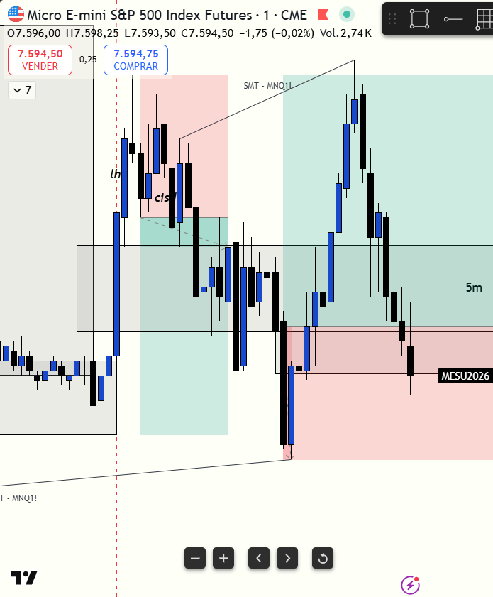

# 📅 BITÁCORA DE TRADING — 13 de Julio de 2026
**Pre-Trade Link:** [[2026-07-13_pre_trade]]

## 📊 RESUMEN GENERAL DE LA SESIÓN
- **Resultado Neto:** `+$302.50 USD`
- **Trades Realizados:** `2`
- **Resultado:** `WIN`
- **Estatus de la Cuenta (Eval):**
  * Balance Actual: `$54,336.25 USD`
  * Objetivo de Beneficio: `$53,000.00 USD`
  * Distancia al Objetivo: **OBJETIVO SUPERADO POR `+$1,336.25 USD` 🎉 (Evaluación Aprobada)**

---

## 🖼️ CAPTURA DE PANTALLA

---

## 🔍 ANÁLISIS ESTRUCTURAL DE TEMPORALIDADES (TOP-DOWN)

### 1. Temporalidades Mayores (HTF: 4h / 1h)
- **Bias:** Bearish local (con MES resistiendo de forma alcista en macro).
- **Narrativa:** Nasdaq (`MNQ`) abrió la sesión con un fuerte desplazamiento vendedor que quebró niveles y fue directo a buscar su DOL inferior (el sweep de mínimos). Por su parte, el S&P 500 (`MES`) se mostró considerablemente más fuerte (bullish) y resistió el impulso bajista general apoyándose en zonas de soporte institucional.

### 2. Temporalidades Intermedias (30m / 15m)
- **Zonas clave (POIs):** El precio de MES reaccionó en la zona de soporte del FVG de 5m, la cual inicialmente actuó como resistencia y luego se consolidó como soporte tras frenar la caída.

### 3. Temporalidad de Ejecución (1m)
- **Gatillo / Desplazamiento:**
  - **Trade #1 (Short):** Entrada por CISD en 1m en MES, intentando acompañar la caída de Nasdaq. Sin embargo, MES chocó con un FVG de 5m inmitigado (resistencia/soporte) y no logró desplazarse.
  - **Trade #2 (Long):** Entrada en 1m iFVG alcista en MES. Tras el sweep de mínimos de Nasdaq y al ver que el order flow indicaba absorción/freno del movimiento vendedor seguido de una leve acumulación, la vela cerró e invirtió un FVG bajista gatillando la entrada en el retesteo.

---

## 📈 REPORTE DETALLADO DE LOS TRADES

### 🔴 TRADE #1: Short en MES (Micro E-mini S&P 500)
- **Entrada:** `7602.00` (08:38 AM local / 09:38 AM NYT)
- **SL:** `7606.00`
- **Exit:** `7602.00` (BE - Salida promedio de `7601.625` tras cubrir 6 contratos a BE y 2 contratos a `7600.50`)
- **MAE:** `2.0 ticks` (0.50 puntos en contra)
- **MFE:** `6.0 ticks` (1.50 puntos a favor)
- **Resultado:** `BE (+$15.00 USD)`
- **Notas:** Error conductual por FOMO. Se buscaba vender en el mercado más fuerte (`MES`) contra la tendencia local solo porque el Nasdaq (`MNQ`) caía verticalmente sin darnos entrada. Se ignoró la resistencia de un FVG de 5m de MES que frenó la expansión bajista. Salió a Breakeven.

### 🟢 TRADE #2: Long en MES (Micro E-mini S&P 500)
- **Entrada:** `7597.25` (08:55 AM local / 09:55 AM NYT)
- **SL:** `7592.25`
- **TP:** `7608.75`
- **Exit:** `7608.75` (TP alcanzado)
- **MAE:** `0.0 ticks` (Entrada de precisión exacta en retesteo)
- **MFE:** `46.0 ticks` (11.50 puntos a favor)
- **Resultado:** `WIN (+$287.50 USD)`
- **Relación R:R:** **2.3:1**
- **Notas:** Excelente trade. Esperamos pacientemente a que el mercado bajista frenara y consolidara. Tras la toma de liquidez inferior en Nasdaq, se validó el soporte del FVG de 5m en MES y se gatilló en el 1m iFVG con absorción confirmada en el order flow.

---

## 🧠 CENTRO DE APRENDIZAJE Y RETROALIMENTACIÓN (MÉTODO STEENBARGER)

> [!TIP]
> **TARJETA DE MEMORIA DE RÁPIDA CONSULTA (Revisar antes de abrir el mercado)**
> - **El Foco de Hoy:** Mantener la paciencia para esperar el agotamiento de la tendencia y no perseguir movimientos en el activo equivocado.
> - **Acción de Éxito a Repetir (Músculo):** Esperar la confluencia inter-mercado (barrida de mínimos en NQ) y entrar tras una clara acumulación de order flow y gatillo de 1m iFVG.
> - **Error Crítico a Evitar (Eliminar):** Evitar abrir cortos emocionales (FOMO) en el activo fuerte (`MES`) cuando el activo débil (`MNQ`) cae con fuerza pero no da entrada.

### ⚖️ Clasificación: Proceso vs. Resultado
*¿Ejecutaste el plan de manera disciplinada, independientemente de ganar o perder dinero?*
- **Trade #1:** [BE (+$15.00)] ➔ **Proceso:** **INCORRECTO (Mal Trade)** | *Razón:* Caer en el FOMO. Operar en corto en el activo fuerte mientras Nasdaq caía, sin verificar la resistencia del FVG de 5m en MES y forzando el gatillo por desesperación de no estar dentro.
- **Trade #2:** [WIN (+$287.50)] ➔ **Proceso:** **CORRECTO (Buen Trade)** | *Razón:* Disciplina de esperar la desaceleración del mercado vendedor. Identificación del sweep de liquidez de Nasdaq y el iFVG en MES con el order flow confirmando absorción. El plan se ejecutó al pie de la letra.

### 📈 Plan de Acción Inmediato para la Próxima Sesión
- **Qué mantendré:** La lectura del order flow de absorción (freno y acumulación leve) antes de ir contra movimientos de momentum fuerte.
- **Qué corregiré activamente:** Eliminar las entradas por correlación forzada (FOMO en MES porque NQ cae) y asegurar el escaneo completo de resistencias y soportes locales en 5m antes de tirar la orden.
