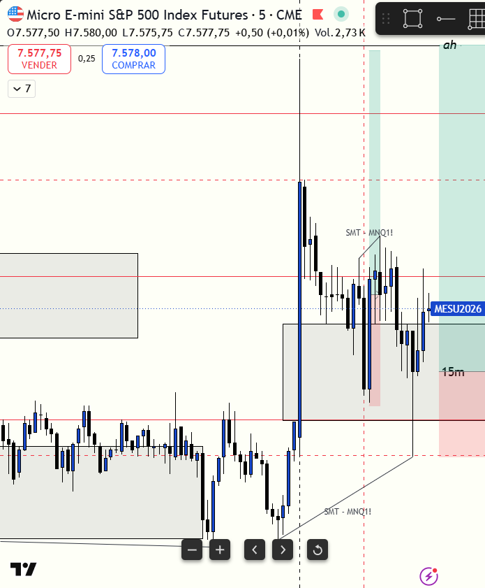

# 📅 BITÁCORA DE TRADING — 14 de Julio de 2026
**Pre-Trade Link:** [[2026-07-14_pre_trade]]

## 📊 RESUMEN GENERAL DE LA SESIÓN
- **Resultado Neto:** `+$156.25 USD`
- **Trades Realizados:** `2`
- **Resultado:** `WIN`
- **Contexto de Cuenta Fondeada (PA):**
  * Balance Actual: `$50,993.25 USD` (al 14/07/2026)
  * Estado de la Cuenta: Activa y Operando 🟢
  * PnL Acumulado en Bitácora: `+$4,492.50 USD`

---

## 🖼️ CAPTURA DE PANTALLA

---

## 🔍 ANÁLISIS ESTRUCTURAL DE TEMPORALIDADES (TOP-DOWN)
### 1. Temporalidades Mayores (HTF: 4h / 1h)
- **Bias:** Alcista local (S&P 500 liderando) | S&P 500 presentaba una base técnica de 4H Bullish (🟢), mientras que Nasdaq (MNQ) venía Bearish (🔴). Esto validó prioritariamente operar compras (Longs) en el mercado fuerte (MES).
- **Narrativa:** El mercado experimentó una caída violenta a causa de la volatilidad del CPI temprano y las noticias de carpeta roja de las 10:00 AM NYT, buscando liquidez en descuento extremo.

### 2. Temporalidades Intermedias (30m / 15m)
- **Zonas clave (POIs):** Mitigación del FVG de 15m de demanda en MES en el rango `7,561.50 - 7,575.50`. El precio barrió mínimos locales y rebotó con precisión quirúrgica tras ingresar a este bloque de compras institucionales.

### 3. Temporalidad de Ejecución (5m / 2m / 1m)
- **Gatillo / Desplazamiento:** 
  * **Trade #1:** Formación de iFVG de 4m posterior a la apertura. Se esperó el retesteo al FVG alcista de 1m para ejecutar entrada en `7,580.50`.
  * **Trade #2:** Tras el stophunt a la zona del FVG de 15m, se formó un iFVG alcista de 1m confluyendo con una divergencia SMT alcista frente a Nasdaq. Gatillo de entrada en `7,568.75`.

---

## 📈 REPORTE DETALLADO DE LOS TRADES

### 🟢 TRADE #1: Long en MES (Micro E-mini S&P 500)
- **Entrada:** `7,580.50` (08:40:17 local / 09:40:17 NYT)
- **Exit:** `7,582.25` (09:00:04 local / 10:00:04 NYT)
- **SL:** `7,576.50` (Riesgo: 4.00 puntos)
- **MAE:** `1.0 puntos` (5 ticks)
- **MFE:** `3.0 puntos` (15 ticks)
- **Resultado:** `WIN (+$26.25 USD)`
- **Relación R:R:** **0.44:1**
- **Notas:** Entrada en el retesteo del 1m FVG tras iFVG de 4m. El precio se movió en rango sucio (chopped) pre-noticia y se cerró manualmente al segundo 4 de las 10:00 AM NYT por preservación de capital para evitar el latigazo de la carpeta roja.

### 🟢 TRADE #2: Long en MES (Micro E-mini S&P 500)
- **Entrada:** `7,568.75` (09:20:00 local / 10:20:00 NYT)
- **Exit:** `7,575.25` (09:23:36 local / 10:23:36 NYT)
- **SL:** `7,561.50` (Riesgo: 7.25 puntos - protegido por debajo del swing low y el FVG 15m)
- **MAE:** `0.5 puntos` (2.5 ticks)
- **MFE:** `6.75 puntos` (33 ticks)
- **Resultado:** `WIN (+$130.00 USD)`
- **Relación R:R:** **0.90:1**
- **Notas:** Entrada tras barrida de mínimos en la apertura y mitigación de FVG 15m en MES. Confluencia con divergencia SMT Alcista y gatillo en 1m iFVG. Salida manual de seguridad en el techo del FVG de 15m al detectar resistencia en el FVG 5m de MNQ, bloque de órdenes en el heatmap de MES y absorción en el orderflow.

---

## 🧠 CENTRO DE APRENDIZAJE Y RETROALIMENTACIÓN (MÉTODO STEENBARGER)

> [!TIP]
> **TARJETA DE MEMORIA DE RÁPIDA CONSULTA (Revisar antes de abrir el mercado)**
> - **El Foco de Hoy:** Respetar de forma inflexible las zonas de fricción/resistencia en días picados y mitigar el FOMO esperando retesteos en descuento.
> - **Acción de Éxito a Repetir (Músculo):** Esperar pacientemente el retroceso ordenado al FVG de microtemporalidad en vez de perseguir el desplazamiento.
> - **Error Crítico a Evitar (Eliminar):** Evitar el sesgo retrospectivo de arrepentimiento por salidas rápidas en zonas de confluencia contraria cuando el mercado está "chopped" por noticias.

### ⚖️ Clasificación: Proceso vs. Resultado
*¿Ejecutaste el plan de manera disciplinada, independientemente de ganar o perder dinero?*
- **Trade #1:** [WIN +$26.25] ➔ **Proceso: CORRECTO (Buen Trade)** | *Razón:* Disciplina total. Se evitó perseguir el precio al open y se aplicó la salida defensiva obligatoria antes de la noticia de carpeta roja de las 10:00 AM NYT.
- **Trade #2:** [WIN +$130.00] ➔ **Proceso: CORRECTO (Buen Trade)** | *Razón:* Entrada impecable en descuento (POI 15m FVG) con confluencia de SMT y 1m iFVG. La salida manual fue técnicamente correcta y no constituye un error de ejecución por las siguientes razones analíticas:
  1. **Respeto a la Resistencia (Evitar Sesgo de Omisión):** La alerta conductual de hoy era "Ignorar Resistencia" (60.9%). El precio de Nasdaq (MNQ) tocó un FVG bajista de 5m actuando como resistencia institucional, y en MES se detectó en el Heatmap un muro de limit orders (bloque de oferta) confluyendo con absorción en el orderflow. Mantenerse adentro con fe ignorando estas señales contrarias reales habría sido un error técnico.
  2. **Dinámica de BE en Días Chopped:** En una mañana con alta fricción y ruido post-noticia, defender a BE+ o BE chato muy temprano suele resultar en que los retrocesos de volatilidad te saquen en $0.00 antes de la expansión real. Asegurar ganancias líquidas (+6.50 puntos) exactamente en la zona superior de fricción del FVG de 15m (salida en 7575.25 frente al techo del FVG en 7575.50) es la práctica de scalping óptima.
  3. **Mitigación del Sesgo Retrospectivo:** La posterior expansión alcista del mercado es información que no estaba disponible al momento de la salida y no invalida la lectura fría del riesgo en ese instante. Proteger la ganancia neta en una cuenta PA real frente a fricciones del mercado es el sello de un trader profesional.

### 📈 Plan de Acción Inmediato para la Próxima Sesión
- **Qué mantendré:** El enfoque multitemporal para ubicar la fuerza relativa del mercado (operar MES por ser el más fuerte) y la paciencia para no entrar a mercado.
- **Qué corregiré activamente:** Trabajar en la mentalidad de aceptación de las decisiones en vivo. Si se toma una salida discrecional fundada en datos de resistencia reales (como hoy), se debe registrar como un acierto técnico y no castigarse psicológicamente si el precio expande después. La preservación de capital es la prioridad absoluta de una cuenta PA real.
