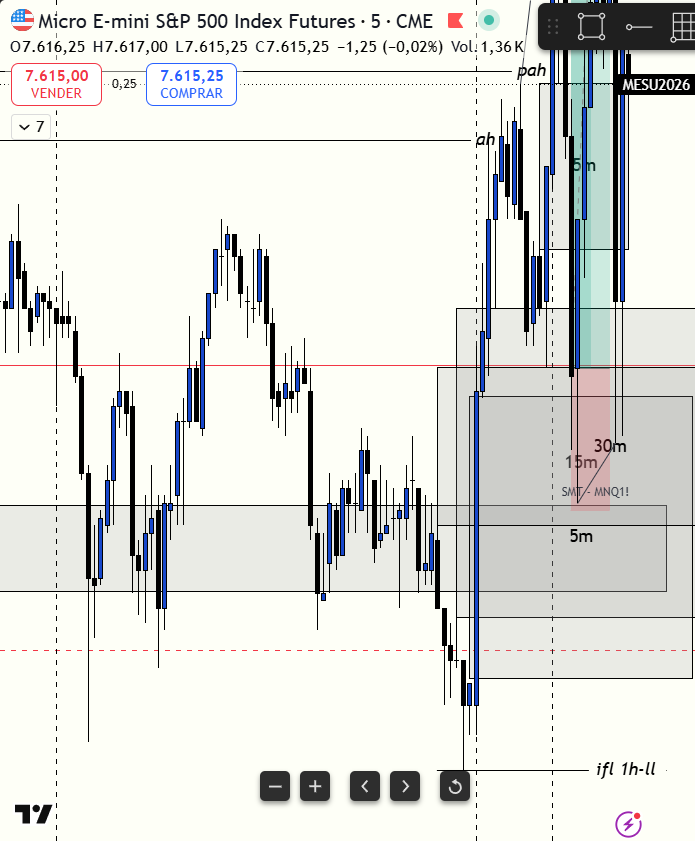

# 📅 BITÁCORA DE TRADING — 15 de Julio de 2026
**Pre-Trade Link:** [[2026-07-15_pre_trade]]

## 📊 RESUMEN GENERAL DE LA SESIÓN
- **Resultado Neto:** `+$637.50 USD`
- **Trades Realizados:** `1`
- **Resultado:** `WIN`
- **Contexto de Cuenta Fondeada (PA):**
  * Balance Anterior: `$50,993.25 USD`
  * Balance Actual: `$51,630.75 USD` (al 15/07/2026)
  * Estado de la Cuenta: Activa y Operando 🟢

---

## 🖼️ CAPTURA DE PANTALLA

*(Captura centrada en la ejecución de la posición de compra en MES)*

---

## 🔍 ANÁLISIS ESTRUCTURAL DE TEMPORALIDADES (TOP-DOWN)

### 1. Temporalidades Mayores (HTF: 4h / 1h)
- **Bias:** Alcista 🟢
- **Narrativa:** S&P 500 (`MES`) se mantuvo fuertemente soportado por zonas de demanda de temporalidades altas (FVG alcista de 4H y 1H respetados), mientras que Nasdaq (`MNQ`) mostraba una debilidad severa, rompiendo sus equivalentes macro. Esto generó una asimetría estructural que confirmaba a `MES` como el mercado fuerte para compras.

### 2. Temporalidades Intermedias (30m / 15m)
- **Zonas clave (POIs):** `MES` defendió con precisión sus FVG alcistas de 30m y 15m. La llegada y reacción en estas zonas validó la entrada en descuento institucional (Discount).

### 3. Temporalidad de Ejecución (1m)
- **Gatillo / Desplazamiento:** Se operó un **CISD** (Change in State of Delivery) a las 09:50 NYT en la temporalidad de 1m en `MES` justo tras la apertura del mercado. La entrada se ejecutó en `7606.00` con confluencia del muro de órdenes de compra en el heatmap (soporte de limit orders) y absorción en el orderflow.

---

## 📈 REPORTE DETALLADO DE LOS TRADES

### 🟢 TRADE #1: Long en MES (Micro E-mini S&P 500)
- **Entrada:** `7606.00` (09:53:02 NYT / 08:53:02 local)
- **Exit:** `7618.75` (10:03:02 NYT / 09:03:02 local)
- **SL:** `7601.75` (Riesgo inicial: 4.25 puntos / 17 ticks)
- **MAE:** `1.0 puntos` (4 ticks)
- **MFE:** `13.5 puntos` (54 ticks)
- **Resultado:** `WIN (+$637.50 USD)`
- **Relación R:R:** **3.0:1**
- **Notas:** Entrada en Long (10 contratos) utilizando la confirmación del CISD en 1m y la confluencia de un SMT alcista en la apertura (MNQ barriendo mínimos de London/Asia y MES sosteniendo mínimos más altos). Se gestionó defensivamente moviendo el SL a BE+ en `7610.75` debido a un FVG de 5m en contra en MES y la inminencia de noticias. Salida manual de precisión en `7618.75` al chocar contra un bloque gigante de órdenes límite de venta (resistencia) en el heatmap de MES y verificar absorción en el orderflow. La salida fue totalmente convalidada por el precio minutos después al frenar, consolidar y desplomarse con fuerza a la baja.

---

## 🧠 CENTRO DE APRENDIZAJE Y RETROALIMENTACIÓN (MÉTODO STEENBARGER)

> [!TIP]
> **TARJETA DE MEMORIA DE RÁPIDA CONSULTA (Revisar antes de abrir el mercado)**
> - **El Foco de Hoy:** La asimetría entre mercados requiere selección de activo inteligente y salidas defensivas.
> - **Acción de Éxito a Repetir (Músculo):** Tomar ganancias en el muro del heatmap (resistencia) al ver absorción, en lugar de forzar el target original por codicia.
> - **Error Crítico a Evitar (Eliminar):** Evitar dudar del trade porque el activo débil (MNQ) rompa soportes; concéntrate en la fuerza del activo que operes si respeta sus zonas.

### ⚖️ Clasificación: Proceso vs. Resultado
*¿Ejecutaste el plan de manera disciplinada, independientemente de ganar o perder dinero?*
- **Trade #1:** [+$637.50 USD] ➔ **Proceso: CORRECTO (Buen Trade) 🟢**
  * Razón: La selección del activo fue perfecta (`MES` como el fuerte, respetando sus FVG macro). Se respetaron las reglas de entrada con confluencia estructural, SMT y trigger micro. La gestión del Stop Loss a BE+ protegió el capital ante un FVG hostil de 5m y noticias. La salida manual en 1:3 fue de precisión quirúrgica, respetando la resistencia del heatmap y evitando devolver ganancias antes de la caída del mercado.

### 💬 Debate de Proceso & Pensamiento (IA vs. Humano)
* **Hipótesis del Trader:** "El precio en MES tiene fortaleza y soporte macro. Sostener el mínimo de London/Asia mientras Nasdaq se desploma confirma un SMT alcista de acumulación. Sin embargo, me preocupa que Nasdaq esté destruyendo sus soportes alcistas (creando iFVGs bajistas) y que MES esté subiendo lento y sin poder invertir sus propios gaps de resistencia. Prefiero salirme en 1:3 en la zona de resistencia gigante del heatmap y asegurar ganancias antes de que el ancla del Nasdaq arrastre a todo el mercado".
* **Análisis de la IA (Analítica Fría):** La lectura discrecional del trader fue 100% acertada y la salida fue de precisión élite. El mercado consolidó en la zona de salida durante unos minutos y posteriormente pegó un golpe bajista agresivo que desplomó el precio. Quedarse en la operación esperando la relación 1:4 habría resultado en un Stop Loss a BE o pérdida. Este desenlace demuestra que el orderflow bajista de Nasdaq (iFVGs activos en MNQ) y el bloqueo en el heatmap de MES actuaron como resistencias infranqueables para las compras en la apertura.

### 📈 Plan de Acción Inmediato para la Próxima Sesión
- **Qué mantendré:** La lectura de confluencia macro de FVG (soportes) combinada con el SMT y el control de la resistencia a través del heatmap/orderflow.
- **Qué corregiré activamente:** Mantener el mismo nivel de paciencia para no perseguir el precio en la campana de apertura y dejar que se formen los desplazamientos.
