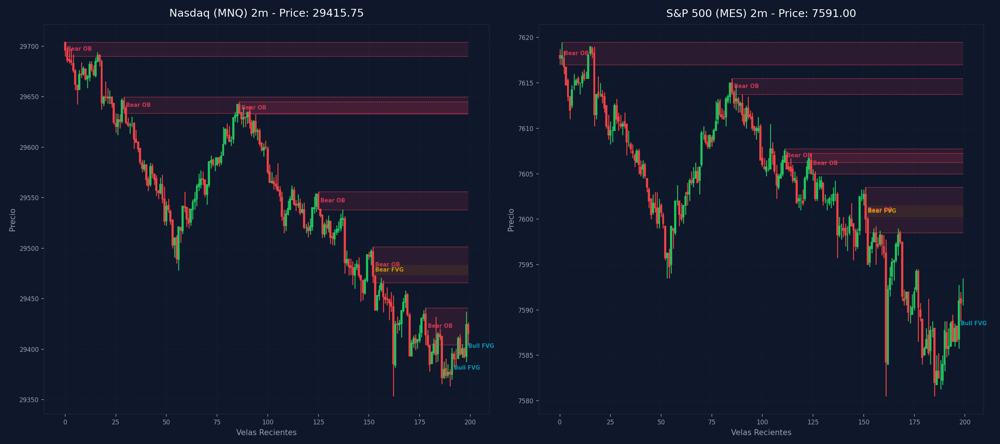

# 🛠️ Reporte Pre-Trade Avanzado: Mapa Dual de Confluencias (MNQ & MES)

Este reporte evalúa la estructura de mercado y dibuja la confluencia entre tus marcas de TradingView recopiladas vía CDP a lo largo de las 9 temporalidades analizadas en Nasdaq (`MNQ`) y S&P 500 (`MES`).

---

## 📅 Información de la Sesión
* **Fecha:** `2026-07-16`
* **Mercados Analizados:** Nasdaq (MNQ) y S&P 500 (MES)
* **Precios de Referencia:** MNQ: `29415.75` | MES: `7591.00`
* **Vinculación Temporal:** 
  * 🔗 [Ver Autopsia y Bitácora Post-Trade de esta Sesión](2026-07-16_session.md) (Se generará al finalizar tu sesión)

---

## ⚖️ Análisis de Bias y Fuerza Relativa
* **Bias Local Dominante:** `Bearish local (S&P 500 resistiendo mejor)`
* **Mercado Más Alcista (Fuerte):** `S&P 500 (MES) 🟢`
* **Mercado Más Bajista (Débil):** `Nasdaq (MNQ) 🔴`
* **Puntuación de Fuerza ESTRUCTURAL:** NQ Score: `-10.5` | ES Score: `-5.5`

---

## 🌊 Confluencias de Order Flow (NinjaTrader 8)
### 📊 Gráfico Activo: `MNQ 09-26` (1 Min Volumetric)
  * **Order Flow Trade Detector**: `null`
  * **Order Flow Cumulative Delta**: `499` ➔ **Presión Compradora a Mercado (Alcista) 🟢**
  * **Oscilador de volumen**: `0`
### 📊 Gráfico Activo: `MES 09-26` (1 Min Volumetric)
  * **Order Flow Trade Detector**: `null`
  * **Order Flow Cumulative Delta**: `420` ➔ **Presión Compradora a Mercado (Alcista) 🟢**
  * **Oscilador de volumen**: `0`

---

## 📈 Tabla Comparativa de Estructura (Multi-Temporalidad)

| Temporalidad | Sesgo MNQ | Rango MNQ | Sesgo MES | Rango MES |
| :--- | :--- | :--- | :--- | :--- |
| **4H** | Neutral | Discount (Compras) 🟢 | Neutral | Premium (Ventas) 🔴 |
| **1H** | Bearish 🔴 | Discount (Compras) 🟢 | Bullish 🟢 | Discount (Compras) 🟢 |
| **30m** | Bearish 🔴 | Premium (Ventas) 🔴 | Bearish 🔴 | Premium (Ventas) 🔴 |
| **15m** | Bearish 🔴 | Premium (Ventas) 🔴 | Bearish 🔴 | Premium (Ventas) 🔴 |
| **5m** | Bearish 🔴 | Premium (Ventas) 🔴 | Bearish 🔴 | Premium (Ventas) 🔴 |
| **4m** | Bearish 🔴 | Discount (Compras) 🟢 | Bearish 🔴 | Premium (Ventas) 🔴 |
| **3m** | Bearish 🔴 | Premium (Ventas) 🔴 | Bearish 🔴 | Premium (Ventas) 🔴 |
| **2m** | Bearish 🔴 | Premium (Ventas) 🔴 | Bearish 🔴 | Premium (Ventas) 🔴 |
| **1m** | Bearish 🔴 | Premium (Ventas) 🔴 | Bearish 🔴 | Discount (Compras) 🟢 |

---

## 🛡️ Alerta del Guardia de Riesgo (IA Risk Mentor)

> [!IMPORTANT]
> **Estadísticas de Bitácora:** Sesiones: `25` | PnL Acumulado: `$5130.00 USD` | Win Rate: `56.0%`
> 
> **🚨 TUS ERRORES PSICOLÓGICOS MÁS RECURRENTES A EVITAR HOY:**
> * **Ignorar Resistencia:** presente en el `64.0%` de las sesiones previas.
> * **FOMO:** presente en el `56.0%` de las sesiones previas.
>
> **📝 LECCIONES CLAVE A RECORDAR:**
> * 1. La Disciplina ante el Bias Paga Rentabilidad: Alinearse estrictamente con el HTF Bias (Bullish) en zona de descuento macro y descartar los cortos contra-tendencia es la base de los trades de alta probabilidad.
> * La Espera del Retesteo Reduce el Riesgo: No entrar persiguiendo velas de expansión alcista sino esperar con paciencia el pullback al FVG mitigador es la diferencia entre ser liquidado o lograr una entrada limpia con excelente R:R.
> * El Plan Vence a la Intuición: Ignorar el impulso de tomar shorts discrecionales (incluso cuando otros mentores o el ruido de micro-temporalidades sugerían caídas) y aferrarse a las reglas del manual operativo condujo a una sesión sumamente rentable.

---

## 🎯 Plan Operativo de Sesión (Gatillos Estructurales)

### 🟢 Escenario para LONG (Compras)
1. **Barrida de Liquidez Estructural (Sweep):** El precio de S&P debe barrer liquidez externa inferior (mínimo de sesión previa o swing low local en 29667.0 o similar) en temporalidad intermedia.
2. **Desplazamiento y Confirmación (iFVG):** Tras barrer liquidez, el precio debe desplazarse fuereña en el gráfico LTF (1m-5m) y cerrar con cuerpo completo por encima de un FVG bajista, convirtiéndolo en un Inverse FVG (iFVG).
3. **Perfil de Entrada Preferente:** Priorizar perfiles G-R-G (Fáciles de Invertir) para validar el orderflow alcista con momentum.

### 🔴 Escenario para SHORT (Ventas)
1. **Barrida de Liquidez Estructural (Sweep):** El precio de Nasdaq debe barrer liquidez externa superior (máximo de sesión previa o swing high local) y mitigar una zona de resistencia de Oferta.
2. **Desplazamiento y Confirmación (iFVG):** Reacción impulsiva bajista en LTF que rompa y cierre por debajo de un FVG alcista (perfil R-G-R preferente) para validar la inversión institucional a iFVG.
3. **Alineación de Fuerza:** Entrar en short en el mercado más débil para maximizar la velocidad de la caída.

---

## 🚫 Filtros Negativos (Zonas de Peligro)

### ⚠️ Mala Idea Tirar LONGS (No Comprar)
1. **Premium HTF:** Si el precio de MNQ o MES está cotizando dentro de zona Premium del rango de 1H/30m.
2. **Mitigación Hostil:** Si el precio está chocando directamente con una resistencia fuerte o Supply OB de 1H/4H.
3. **Divergencia SMT Bajista:** Si detectamos divergencia SMT Bajista (S&P 500 hace altos más altos pero Nasdaq falla en hacerlos), lo que indica distribución institucional activa.

### ⚠️ Mala Idea Tirar SHORTS (No Vender)
1. **Discount HTF:** Si el precio se encuentra cotizando en zona de descuento estructural (Discount) de 1H/30m.
2. **Soporte Hostil:** Si el precio se apoya en un Demand OB de 1H/4H inmitigado.
3. **Divergencia SMT Alcista:** Si detectamos divergencia SMT Alcista (S&P 500 barre mínimos pero Nasdaq sostiene mínimos más altos), lo que indica acumulación e invalida ventas.

---

## 🌀 Estrategia de VWAP y Nivel de Liquidez (DOL)
* **Estado de Mercado Esperado:** **Día de Tendencia (Expansión) 🚀**
* **Guía Operativa del VWAP:**
  * **El Premium/Discount de altas temporalidades deja de importar y la media del VWAP también.**
  * Concéntrate más en las **Bandas de Desviación Estándar 2 y 3**, ya que el precio tenderá a caminar y sostenerse sobre ellas a favor de la tendencia.
  * **⚠️ ADVERTENCIA:** Está estrictamente prohibido usar las bandas externas de +2 o +3 desviaciones para buscar contratendencias (cortos si sube, largos si cae); el precio tenderá a "caminar" sobre ellas.

---

## ⚡ Correlación Inter-Mercado (SMT Divergence)
* **Estado SMT:** `S&P 500 (MES) y Nasdaq (MNQ) alineados de forma regular en el Open (Sin divergencias activas).`

---

## 🧠 Predicciones de Machine Learning (Win Rate Classifier)
### 💻 Predicción Nasdaq (MNQ):
```text
=== PREDICCIÓN DE PROBABILIDAD DE ÉXITO ===

==================================================
SETUP EVALUADO:
 - Instrumento: NQ | Dirección: Short | Sesión: NY AM KZ
 - Confluencias: in kill zone (london / ny am / pm), at htf pd array (ob / fvg / breaker), fair value gap (fvg) on entry tf, order block (ob) alignment, htf market structure bias confirmed
--------------------------------------------------
PROBABILIDAD DE WIN RATE ESTIMADA: 39.2%
❌ SETUP BAJA PROBABILIDAD: Se sugiere estrictamente omitir el trade (No-Trade Zone).
==================================================
```
### 📊 Predicción S&P 500 (MES):
```text
=== PREDICCIÓN DE PROBABILIDAD DE ÉXITO ===

==================================================
SETUP EVALUADO:
 - Instrumento: ES | Dirección: Long | Sesión: NY AM KZ
 - Confluencias: in kill zone (london / ny am / pm), at htf pd array (ob / fvg / breaker), fair value gap (fvg) on entry tf, order block (ob) alignment, htf market structure bias confirmed
--------------------------------------------------
PROBABILIDAD DE WIN RATE ESTIMADA: 46.7%
⚠️ SETUP MODERADO: Reducir riesgo a la mitad (0.5%) o esperar más confirmaciones.
==================================================
```

---

## 🎨 Comparación con Marcaciones Manuales (TradingView CDP)

### 💻 Marcaciones en Nasdaq (MNQ) por Temporalidad:
  * **Caja Gris con etiqueta '5m'** en rango `29293.77 - 29312.75` | Estado: 🟡 Fuera del precio | Sin confluencia SMC directa
  * **Caja Gris con etiqueta '5m'** en rango `29287.00 - 29293.57` | Estado: 🟡 Fuera del precio | Sin confluencia SMC directa
  * **Caja Gris** en rango `29315.75 - 29317.73` | Estado: 🟡 Fuera del precio | Sin confluencia SMC directa
  * **Caja Gris** en rango `29480.50 - 29502.21` | Estado: 🟡 Fuera del precio | Confluencias: **FVG 4H** (29458.2 - 29548.5), **FVG 1H** (29458.2 - 29502.8), **FVG 30m** (29473.5 - 29502.8), **FVG 15m** (29501.5 - 29502.8), **FVG 3m** (29473.5 - 29483.5), **OB 2m** (29465.8 - 29501.5)
  * **Caja Gris** en rango `29583.25 - 29590.19` | Estado: 🟡 Fuera del precio | Confluencias: **FVG 30m** (29562.0 - 29591.8), **FVG 15m** (29562.0 - 29584.0), **FVG 5m** (29585.8 - 29595.8), **FVG 3m** (29585.8 - 29590.8)
  * **Caja Gris** en rango `29768.25 - 29772.53` | Estado: 🟡 Fuera del precio | Confluencias: **OB 1H** (29667.0 - 29796.5), **OB 30m** (29667.0 - 29796.5), **OB 15m** (29667.0 - 29796.5)
  * **Caja Gris con etiqueta '5m'** en rango `29903.77 - 29922.50` | Estado: 🟡 Fuera del precio | Sin confluencia SMC directa
  * **Caja Gris** en rango `29622.25 - 29639.04` | Estado: 🟡 Fuera del precio | Confluencias: **OB 30m** (29591.8 - 29644.8), **OB 15m** (29611.0 - 29644.8), **OB 5m** (29622.8 - 29644.8)
  * **Caja Gris con etiqueta '5m'** en rango `29577.50 - 29582.00` | Estado: 🟡 Fuera del precio | Confluencias: **FVG 30m** (29562.0 - 29591.8), **FVG 15m** (29562.0 - 29584.0)
  * **Caja Gris** en rango `29602.63 - 29621.50` | Estado: 🟡 Fuera del precio | Confluencias: **OB 30m** (29591.8 - 29644.8), **OB 15m** (29611.0 - 29644.8), **FVG 5m** (29606.5 - 29607.0), **FVG 4m** (29606.5 - 29607.0)
  * **Caja Gris con etiqueta '4h'** en rango `29561.40 - 29631.63` | Estado: 🟡 Fuera del precio | Confluencias: **OB 30m** (29591.8 - 29644.8), **FVG 30m** (29562.0 - 29591.8), **OB 15m** (29611.0 - 29644.8), **FVG 15m** (29562.0 - 29584.0), **OB 5m** (29622.8 - 29644.8), **FVG 5m** (29606.5 - 29607.0), **FVG 5m** (29585.8 - 29595.8), **OB 4m** (29542.5 - 29562.0), **FVG 4m** (29606.5 - 29607.0), **OB 3m** (29542.5 - 29562.0), **FVG 3m** (29585.8 - 29590.8)
  * **Caja Gris con etiqueta '1h'** en rango `29459.28 - 29502.15` | Estado: 🟡 Fuera del precio | Confluencias: **FVG 4H** (29458.2 - 29548.5), **FVG 1H** (29458.2 - 29502.8), **FVG 30m** (29473.5 - 29502.8), **FVG 15m** (29501.5 - 29502.8), **FVG 3m** (29473.5 - 29483.5), **OB 2m** (29465.8 - 29501.5)
  * **Caja Gris** en rango `29265.23 - 29436.77` | Estado: 🟢 PRECIO DENTRO | Confluencias: **OB 3m** (29402.0 - 29441.0), **OB 2m** (29404.2 - 29441.0), **FVG 2m** (29380.5 - 29382.5), **FVG 2m** (29402.0 - 29404.2), **OB 1m** (29404.2 - 29441.0), **OB 1m** (29391.5 - 29397.5), **FVG 1m** (29416.0 - 29422.0)
  * **Caja Gris con etiqueta '5m'** en rango `29293.77 - 29312.75` | Estado: 🟡 Fuera del precio | Sin confluencia SMC directa
  * **Caja Gris con etiqueta '5m'** en rango `29287.00 - 29293.57` | Estado: 🟡 Fuera del precio | Sin confluencia SMC directa
  * **Caja Gris** en rango `29315.75 - 29317.73` | Estado: 🟡 Fuera del precio | Sin confluencia SMC directa
  * **Caja Gris** en rango `29480.50 - 29502.21` | Estado: 🟡 Fuera del precio | Confluencias: **FVG 4H** (29458.2 - 29548.5), **FVG 1H** (29458.2 - 29502.8), **FVG 30m** (29473.5 - 29502.8), **FVG 15m** (29501.5 - 29502.8), **FVG 3m** (29473.5 - 29483.5), **OB 2m** (29465.8 - 29501.5)
  * **Caja Gris** en rango `29583.25 - 29590.19` | Estado: 🟡 Fuera del precio | Confluencias: **FVG 30m** (29562.0 - 29591.8), **FVG 15m** (29562.0 - 29584.0), **FVG 5m** (29585.8 - 29595.8), **FVG 3m** (29585.8 - 29590.8)
  * **Caja Gris** en rango `29768.25 - 29772.53` | Estado: 🟡 Fuera del precio | Confluencias: **OB 1H** (29667.0 - 29796.5), **OB 30m** (29667.0 - 29796.5), **OB 15m** (29667.0 - 29796.5)
  * **Caja Gris con etiqueta '5m'** en rango `29903.77 - 29922.50` | Estado: 🟡 Fuera del precio | Sin confluencia SMC directa
  * **Caja Gris** en rango `29622.25 - 29639.04` | Estado: 🟡 Fuera del precio | Confluencias: **OB 30m** (29591.8 - 29644.8), **OB 15m** (29611.0 - 29644.8), **OB 5m** (29622.8 - 29644.8)
  * **Caja Gris con etiqueta '5m'** en rango `29577.50 - 29582.00` | Estado: 🟡 Fuera del precio | Confluencias: **FVG 30m** (29562.0 - 29591.8), **FVG 15m** (29562.0 - 29584.0)
  * **Caja Gris** en rango `29602.63 - 29621.50` | Estado: 🟡 Fuera del precio | Confluencias: **OB 30m** (29591.8 - 29644.8), **OB 15m** (29611.0 - 29644.8), **FVG 5m** (29606.5 - 29607.0), **FVG 4m** (29606.5 - 29607.0)
  * **Caja Gris con etiqueta '4h'** en rango `29561.40 - 29631.63` | Estado: 🟡 Fuera del precio | Confluencias: **OB 30m** (29591.8 - 29644.8), **FVG 30m** (29562.0 - 29591.8), **OB 15m** (29611.0 - 29644.8), **FVG 15m** (29562.0 - 29584.0), **OB 5m** (29622.8 - 29644.8), **FVG 5m** (29606.5 - 29607.0), **FVG 5m** (29585.8 - 29595.8), **OB 4m** (29542.5 - 29562.0), **FVG 4m** (29606.5 - 29607.0), **OB 3m** (29542.5 - 29562.0), **FVG 3m** (29585.8 - 29590.8)
  * **Caja Gris con etiqueta '1h'** en rango `29459.28 - 29502.15` | Estado: 🟡 Fuera del precio | Confluencias: **FVG 4H** (29458.2 - 29548.5), **FVG 1H** (29458.2 - 29502.8), **FVG 30m** (29473.5 - 29502.8), **FVG 15m** (29501.5 - 29502.8), **FVG 3m** (29473.5 - 29483.5), **OB 2m** (29465.8 - 29501.5)
  * **Caja Gris** en rango `29265.23 - 29436.77` | Estado: 🟢 PRECIO DENTRO | Confluencias: **OB 3m** (29402.0 - 29441.0), **OB 2m** (29404.2 - 29441.0), **FVG 2m** (29380.5 - 29382.5), **FVG 2m** (29402.0 - 29404.2), **OB 1m** (29404.2 - 29441.0), **OB 1m** (29391.5 - 29397.5), **FVG 1m** (29416.0 - 29422.0)
  * **Caja Gris con etiqueta '5m'** en rango `29293.77 - 29312.75` | Estado: 🟡 Fuera del precio | Sin confluencia SMC directa
  * **Caja Gris con etiqueta '5m'** en rango `29287.00 - 29293.57` | Estado: 🟡 Fuera del precio | Sin confluencia SMC directa
  * **Caja Gris** en rango `29315.75 - 29317.73` | Estado: 🟡 Fuera del precio | Sin confluencia SMC directa
  * **Caja Gris** en rango `29480.50 - 29502.21` | Estado: 🟡 Fuera del precio | Confluencias: **FVG 4H** (29458.2 - 29548.5), **FVG 1H** (29458.2 - 29502.8), **FVG 30m** (29473.5 - 29502.8), **FVG 15m** (29501.5 - 29502.8), **FVG 3m** (29473.5 - 29483.5), **OB 2m** (29465.8 - 29501.5)
  * **Caja Gris** en rango `29583.25 - 29590.19` | Estado: 🟡 Fuera del precio | Confluencias: **FVG 30m** (29562.0 - 29591.8), **FVG 15m** (29562.0 - 29584.0), **FVG 5m** (29585.8 - 29595.8), **FVG 3m** (29585.8 - 29590.8)
  * **Caja Gris** en rango `29768.25 - 29772.53` | Estado: 🟡 Fuera del precio | Confluencias: **OB 1H** (29667.0 - 29796.5), **OB 30m** (29667.0 - 29796.5), **OB 15m** (29667.0 - 29796.5)
  * **Caja Gris con etiqueta '5m'** en rango `29903.77 - 29922.50` | Estado: 🟡 Fuera del precio | Sin confluencia SMC directa
  * **Caja Gris** en rango `29622.25 - 29639.04` | Estado: 🟡 Fuera del precio | Confluencias: **OB 30m** (29591.8 - 29644.8), **OB 15m** (29611.0 - 29644.8), **OB 5m** (29622.8 - 29644.8)
  * **Caja Gris con etiqueta '5m'** en rango `29577.50 - 29582.00` | Estado: 🟡 Fuera del precio | Confluencias: **FVG 30m** (29562.0 - 29591.8), **FVG 15m** (29562.0 - 29584.0)
  * **Caja Gris** en rango `29602.63 - 29621.50` | Estado: 🟡 Fuera del precio | Confluencias: **OB 30m** (29591.8 - 29644.8), **OB 15m** (29611.0 - 29644.8), **FVG 5m** (29606.5 - 29607.0), **FVG 4m** (29606.5 - 29607.0)
  * **Caja Gris con etiqueta '4h'** en rango `29561.40 - 29631.63` | Estado: 🟡 Fuera del precio | Confluencias: **OB 30m** (29591.8 - 29644.8), **FVG 30m** (29562.0 - 29591.8), **OB 15m** (29611.0 - 29644.8), **FVG 15m** (29562.0 - 29584.0), **OB 5m** (29622.8 - 29644.8), **FVG 5m** (29606.5 - 29607.0), **FVG 5m** (29585.8 - 29595.8), **OB 4m** (29542.5 - 29562.0), **FVG 4m** (29606.5 - 29607.0), **OB 3m** (29542.5 - 29562.0), **FVG 3m** (29585.8 - 29590.8)
  * **Caja Gris con etiqueta '1h'** en rango `29459.28 - 29502.15` | Estado: 🟡 Fuera del precio | Confluencias: **FVG 4H** (29458.2 - 29548.5), **FVG 1H** (29458.2 - 29502.8), **FVG 30m** (29473.5 - 29502.8), **FVG 15m** (29501.5 - 29502.8), **FVG 3m** (29473.5 - 29483.5), **OB 2m** (29465.8 - 29501.5)
  * **Caja Gris** en rango `29265.23 - 29436.77` | Estado: 🟢 PRECIO DENTRO | Confluencias: **OB 3m** (29402.0 - 29441.0), **OB 2m** (29404.2 - 29441.0), **FVG 2m** (29380.5 - 29382.5), **FVG 2m** (29402.0 - 29404.2), **OB 1m** (29404.2 - 29441.0), **OB 1m** (29391.5 - 29397.5), **FVG 1m** (29416.0 - 29422.0)
  * **Caja Gris con etiqueta '5m'** en rango `29293.77 - 29312.75` | Estado: 🟡 Fuera del precio | Sin confluencia SMC directa
  * **Caja Gris con etiqueta '5m'** en rango `29287.00 - 29293.57` | Estado: 🟡 Fuera del precio | Sin confluencia SMC directa
  * **Caja Gris** en rango `29315.75 - 29317.73` | Estado: 🟡 Fuera del precio | Sin confluencia SMC directa
  * **Caja Gris** en rango `29480.50 - 29502.21` | Estado: 🟡 Fuera del precio | Confluencias: **FVG 4H** (29458.2 - 29548.5), **FVG 1H** (29458.2 - 29502.8), **FVG 30m** (29473.5 - 29502.8), **FVG 15m** (29501.5 - 29502.8), **FVG 3m** (29473.5 - 29483.5), **OB 2m** (29465.8 - 29501.5)
  * **Caja Gris** en rango `29583.25 - 29590.19` | Estado: 🟡 Fuera del precio | Confluencias: **FVG 30m** (29562.0 - 29591.8), **FVG 15m** (29562.0 - 29584.0), **FVG 5m** (29585.8 - 29595.8), **FVG 3m** (29585.8 - 29590.8)
  * **Caja Gris** en rango `29768.25 - 29772.53` | Estado: 🟡 Fuera del precio | Confluencias: **OB 1H** (29667.0 - 29796.5), **OB 30m** (29667.0 - 29796.5), **OB 15m** (29667.0 - 29796.5)
  * **Caja Gris con etiqueta '5m'** en rango `29903.77 - 29922.50` | Estado: 🟡 Fuera del precio | Sin confluencia SMC directa
  * **Caja Gris** en rango `29622.25 - 29639.04` | Estado: 🟡 Fuera del precio | Confluencias: **OB 30m** (29591.8 - 29644.8), **OB 15m** (29611.0 - 29644.8), **OB 5m** (29622.8 - 29644.8)
  * **Caja Gris con etiqueta '5m'** en rango `29577.50 - 29582.00` | Estado: 🟡 Fuera del precio | Confluencias: **FVG 30m** (29562.0 - 29591.8), **FVG 15m** (29562.0 - 29584.0)
  * **Caja Gris** en rango `29602.63 - 29621.50` | Estado: 🟡 Fuera del precio | Confluencias: **OB 30m** (29591.8 - 29644.8), **OB 15m** (29611.0 - 29644.8), **FVG 5m** (29606.5 - 29607.0), **FVG 4m** (29606.5 - 29607.0)
  * **Caja Gris con etiqueta '4h'** en rango `29561.40 - 29631.63` | Estado: 🟡 Fuera del precio | Confluencias: **OB 30m** (29591.8 - 29644.8), **FVG 30m** (29562.0 - 29591.8), **OB 15m** (29611.0 - 29644.8), **FVG 15m** (29562.0 - 29584.0), **OB 5m** (29622.8 - 29644.8), **FVG 5m** (29606.5 - 29607.0), **FVG 5m** (29585.8 - 29595.8), **OB 4m** (29542.5 - 29562.0), **FVG 4m** (29606.5 - 29607.0), **OB 3m** (29542.5 - 29562.0), **FVG 3m** (29585.8 - 29590.8)
  * **Caja Gris con etiqueta '1h'** en rango `29459.28 - 29502.15` | Estado: 🟡 Fuera del precio | Confluencias: **FVG 4H** (29458.2 - 29548.5), **FVG 1H** (29458.2 - 29502.8), **FVG 30m** (29473.5 - 29502.8), **FVG 15m** (29501.5 - 29502.8), **FVG 3m** (29473.5 - 29483.5), **OB 2m** (29465.8 - 29501.5)
  * **Caja Gris** en rango `29265.23 - 29436.77` | Estado: 🟢 PRECIO DENTRO | Confluencias: **OB 3m** (29402.0 - 29441.0), **OB 2m** (29404.2 - 29441.0), **FVG 2m** (29380.5 - 29382.5), **FVG 2m** (29402.0 - 29404.2), **OB 1m** (29404.2 - 29441.0), **OB 1m** (29391.5 - 29397.5), **FVG 1m** (29416.0 - 29422.0)
  * **Caja Gris con etiqueta '5m'** en rango `29293.77 - 29312.75` | Estado: 🟡 Fuera del precio | Sin confluencia SMC directa
  * **Caja Gris con etiqueta '5m'** en rango `29287.00 - 29293.57` | Estado: 🟡 Fuera del precio | Sin confluencia SMC directa
  * **Caja Gris** en rango `29315.75 - 29317.73` | Estado: 🟡 Fuera del precio | Sin confluencia SMC directa
  * **Caja Gris** en rango `29480.50 - 29502.21` | Estado: 🟡 Fuera del precio | Confluencias: **FVG 4H** (29458.2 - 29548.5), **FVG 1H** (29458.2 - 29502.8), **FVG 30m** (29473.5 - 29502.8), **FVG 15m** (29501.5 - 29502.8), **FVG 3m** (29473.5 - 29483.5), **OB 2m** (29465.8 - 29501.5)
  * **Caja Gris** en rango `29583.25 - 29590.19` | Estado: 🟡 Fuera del precio | Confluencias: **FVG 30m** (29562.0 - 29591.8), **FVG 15m** (29562.0 - 29584.0), **FVG 5m** (29585.8 - 29595.8), **FVG 3m** (29585.8 - 29590.8)
  * **Caja Gris** en rango `29768.25 - 29772.53` | Estado: 🟡 Fuera del precio | Confluencias: **OB 1H** (29667.0 - 29796.5), **OB 30m** (29667.0 - 29796.5), **OB 15m** (29667.0 - 29796.5)
  * **Caja Gris con etiqueta '5m'** en rango `29903.77 - 29922.50` | Estado: 🟡 Fuera del precio | Sin confluencia SMC directa
  * **Caja Gris** en rango `29622.25 - 29639.04` | Estado: 🟡 Fuera del precio | Confluencias: **OB 30m** (29591.8 - 29644.8), **OB 15m** (29611.0 - 29644.8), **OB 5m** (29622.8 - 29644.8)
  * **Caja Gris con etiqueta '5m'** en rango `29577.50 - 29582.00` | Estado: 🟡 Fuera del precio | Confluencias: **FVG 30m** (29562.0 - 29591.8), **FVG 15m** (29562.0 - 29584.0)
  * **Caja Gris** en rango `29602.63 - 29621.50` | Estado: 🟡 Fuera del precio | Confluencias: **OB 30m** (29591.8 - 29644.8), **OB 15m** (29611.0 - 29644.8), **FVG 5m** (29606.5 - 29607.0), **FVG 4m** (29606.5 - 29607.0)
  * **Caja Gris con etiqueta '4h'** en rango `29561.40 - 29631.63` | Estado: 🟡 Fuera del precio | Confluencias: **OB 30m** (29591.8 - 29644.8), **FVG 30m** (29562.0 - 29591.8), **OB 15m** (29611.0 - 29644.8), **FVG 15m** (29562.0 - 29584.0), **OB 5m** (29622.8 - 29644.8), **FVG 5m** (29606.5 - 29607.0), **FVG 5m** (29585.8 - 29595.8), **OB 4m** (29542.5 - 29562.0), **FVG 4m** (29606.5 - 29607.0), **OB 3m** (29542.5 - 29562.0), **FVG 3m** (29585.8 - 29590.8)
  * **Caja Gris con etiqueta '1h'** en rango `29459.28 - 29502.15` | Estado: 🟡 Fuera del precio | Confluencias: **FVG 4H** (29458.2 - 29548.5), **FVG 1H** (29458.2 - 29502.8), **FVG 30m** (29473.5 - 29502.8), **FVG 15m** (29501.5 - 29502.8), **FVG 3m** (29473.5 - 29483.5), **OB 2m** (29465.8 - 29501.5)
  * **Caja Gris** en rango `29265.23 - 29436.77` | Estado: 🟢 PRECIO DENTRO | Confluencias: **OB 3m** (29402.0 - 29441.0), **OB 2m** (29404.2 - 29441.0), **FVG 2m** (29380.5 - 29382.5), **FVG 2m** (29402.0 - 29404.2), **OB 1m** (29404.2 - 29441.0), **OB 1m** (29391.5 - 29397.5), **FVG 1m** (29416.0 - 29422.0)
  * **Caja Gris con etiqueta '5m'** en rango `29293.77 - 29312.75` | Estado: 🟡 Fuera del precio | Sin confluencia SMC directa
  * **Caja Gris con etiqueta '5m'** en rango `29287.00 - 29293.57` | Estado: 🟡 Fuera del precio | Sin confluencia SMC directa
  * **Caja Gris** en rango `29315.75 - 29317.73` | Estado: 🟡 Fuera del precio | Sin confluencia SMC directa
  * **Caja Gris** en rango `29480.50 - 29502.21` | Estado: 🟡 Fuera del precio | Confluencias: **FVG 4H** (29458.2 - 29548.5), **FVG 1H** (29458.2 - 29502.8), **FVG 30m** (29473.5 - 29502.8), **FVG 15m** (29501.5 - 29502.8), **FVG 3m** (29473.5 - 29483.5), **OB 2m** (29465.8 - 29501.5)
  * **Caja Gris** en rango `29583.25 - 29590.19` | Estado: 🟡 Fuera del precio | Confluencias: **FVG 30m** (29562.0 - 29591.8), **FVG 15m** (29562.0 - 29584.0), **FVG 5m** (29585.8 - 29595.8), **FVG 3m** (29585.8 - 29590.8)
  * **Caja Gris** en rango `29768.25 - 29772.53` | Estado: 🟡 Fuera del precio | Confluencias: **OB 1H** (29667.0 - 29796.5), **OB 30m** (29667.0 - 29796.5), **OB 15m** (29667.0 - 29796.5)
  * **Caja Gris con etiqueta '5m'** en rango `29903.77 - 29922.50` | Estado: 🟡 Fuera del precio | Sin confluencia SMC directa
  * **Caja Gris** en rango `29622.25 - 29639.04` | Estado: 🟡 Fuera del precio | Confluencias: **OB 30m** (29591.8 - 29644.8), **OB 15m** (29611.0 - 29644.8), **OB 5m** (29622.8 - 29644.8)
  * **Caja Gris con etiqueta '5m'** en rango `29577.50 - 29582.00` | Estado: 🟡 Fuera del precio | Confluencias: **FVG 30m** (29562.0 - 29591.8), **FVG 15m** (29562.0 - 29584.0)
  * **Caja Gris** en rango `29602.63 - 29621.50` | Estado: 🟡 Fuera del precio | Confluencias: **OB 30m** (29591.8 - 29644.8), **OB 15m** (29611.0 - 29644.8), **FVG 5m** (29606.5 - 29607.0), **FVG 4m** (29606.5 - 29607.0)
  * **Caja Gris con etiqueta '4h'** en rango `29561.40 - 29631.63` | Estado: 🟡 Fuera del precio | Confluencias: **OB 30m** (29591.8 - 29644.8), **FVG 30m** (29562.0 - 29591.8), **OB 15m** (29611.0 - 29644.8), **FVG 15m** (29562.0 - 29584.0), **OB 5m** (29622.8 - 29644.8), **FVG 5m** (29606.5 - 29607.0), **FVG 5m** (29585.8 - 29595.8), **OB 4m** (29542.5 - 29562.0), **FVG 4m** (29606.5 - 29607.0), **OB 3m** (29542.5 - 29562.0), **FVG 3m** (29585.8 - 29590.8)
  * **Caja Gris con etiqueta '1h'** en rango `29459.28 - 29502.15` | Estado: 🟡 Fuera del precio | Confluencias: **FVG 4H** (29458.2 - 29548.5), **FVG 1H** (29458.2 - 29502.8), **FVG 30m** (29473.5 - 29502.8), **FVG 15m** (29501.5 - 29502.8), **FVG 3m** (29473.5 - 29483.5), **OB 2m** (29465.8 - 29501.5)
  * **Caja Gris** en rango `29265.23 - 29436.77` | Estado: 🟢 PRECIO DENTRO | Confluencias: **OB 3m** (29402.0 - 29441.0), **OB 2m** (29404.2 - 29441.0), **FVG 2m** (29380.5 - 29382.5), **FVG 2m** (29402.0 - 29404.2), **OB 1m** (29404.2 - 29441.0), **OB 1m** (29391.5 - 29397.5), **FVG 1m** (29416.0 - 29422.0)
  * **Caja Gris con etiqueta '5m'** en rango `29293.77 - 29312.75` | Estado: 🟡 Fuera del precio | Sin confluencia SMC directa
  * **Caja Gris con etiqueta '5m'** en rango `29287.00 - 29293.57` | Estado: 🟡 Fuera del precio | Sin confluencia SMC directa
  * **Caja Gris** en rango `29315.75 - 29317.73` | Estado: 🟡 Fuera del precio | Sin confluencia SMC directa
  * **Caja Gris** en rango `29480.50 - 29502.21` | Estado: 🟡 Fuera del precio | Confluencias: **FVG 4H** (29458.2 - 29548.5), **FVG 1H** (29458.2 - 29502.8), **FVG 30m** (29473.5 - 29502.8), **FVG 15m** (29501.5 - 29502.8), **FVG 3m** (29473.5 - 29483.5), **OB 2m** (29465.8 - 29501.5)
  * **Caja Gris** en rango `29583.25 - 29590.19` | Estado: 🟡 Fuera del precio | Confluencias: **FVG 30m** (29562.0 - 29591.8), **FVG 15m** (29562.0 - 29584.0), **FVG 5m** (29585.8 - 29595.8), **FVG 3m** (29585.8 - 29590.8)
  * **Caja Gris** en rango `29768.25 - 29772.53` | Estado: 🟡 Fuera del precio | Confluencias: **OB 1H** (29667.0 - 29796.5), **OB 30m** (29667.0 - 29796.5), **OB 15m** (29667.0 - 29796.5)
  * **Caja Gris con etiqueta '5m'** en rango `29903.77 - 29922.50` | Estado: 🟡 Fuera del precio | Sin confluencia SMC directa
  * **Caja Gris** en rango `29622.25 - 29639.04` | Estado: 🟡 Fuera del precio | Confluencias: **OB 30m** (29591.8 - 29644.8), **OB 15m** (29611.0 - 29644.8), **OB 5m** (29622.8 - 29644.8)
  * **Caja Gris con etiqueta '5m'** en rango `29577.50 - 29582.00` | Estado: 🟡 Fuera del precio | Confluencias: **FVG 30m** (29562.0 - 29591.8), **FVG 15m** (29562.0 - 29584.0)
  * **Caja Gris** en rango `29602.63 - 29621.50` | Estado: 🟡 Fuera del precio | Confluencias: **OB 30m** (29591.8 - 29644.8), **OB 15m** (29611.0 - 29644.8), **FVG 5m** (29606.5 - 29607.0), **FVG 4m** (29606.5 - 29607.0)
  * **Caja Gris con etiqueta '4h'** en rango `29561.40 - 29631.63` | Estado: 🟡 Fuera del precio | Confluencias: **OB 30m** (29591.8 - 29644.8), **FVG 30m** (29562.0 - 29591.8), **OB 15m** (29611.0 - 29644.8), **FVG 15m** (29562.0 - 29584.0), **OB 5m** (29622.8 - 29644.8), **FVG 5m** (29606.5 - 29607.0), **FVG 5m** (29585.8 - 29595.8), **OB 4m** (29542.5 - 29562.0), **FVG 4m** (29606.5 - 29607.0), **OB 3m** (29542.5 - 29562.0), **FVG 3m** (29585.8 - 29590.8)
  * **Caja Gris con etiqueta '1h'** en rango `29459.28 - 29502.15` | Estado: 🟡 Fuera del precio | Confluencias: **FVG 4H** (29458.2 - 29548.5), **FVG 1H** (29458.2 - 29502.8), **FVG 30m** (29473.5 - 29502.8), **FVG 15m** (29501.5 - 29502.8), **FVG 3m** (29473.5 - 29483.5), **OB 2m** (29465.8 - 29501.5)
  * **Caja Gris** en rango `29265.23 - 29436.77` | Estado: 🟢 PRECIO DENTRO | Confluencias: **OB 3m** (29402.0 - 29441.0), **OB 2m** (29404.2 - 29441.0), **FVG 2m** (29380.5 - 29382.5), **FVG 2m** (29402.0 - 29404.2), **OB 1m** (29404.2 - 29441.0), **OB 1m** (29391.5 - 29397.5), **FVG 1m** (29416.0 - 29422.0)
  * **Caja Gris con etiqueta '5m'** en rango `29293.77 - 29312.75` | Estado: 🟡 Fuera del precio | Sin confluencia SMC directa
  * **Caja Gris con etiqueta '5m'** en rango `29287.00 - 29293.57` | Estado: 🟡 Fuera del precio | Sin confluencia SMC directa
  * **Caja Gris** en rango `29315.75 - 29317.73` | Estado: 🟡 Fuera del precio | Sin confluencia SMC directa
  * **Caja Gris** en rango `29480.50 - 29502.21` | Estado: 🟡 Fuera del precio | Confluencias: **FVG 4H** (29458.2 - 29548.5), **FVG 1H** (29458.2 - 29502.8), **FVG 30m** (29473.5 - 29502.8), **FVG 15m** (29501.5 - 29502.8), **FVG 3m** (29473.5 - 29483.5), **OB 2m** (29465.8 - 29501.5)
  * **Caja Gris** en rango `29583.25 - 29590.19` | Estado: 🟡 Fuera del precio | Confluencias: **FVG 30m** (29562.0 - 29591.8), **FVG 15m** (29562.0 - 29584.0), **FVG 5m** (29585.8 - 29595.8), **FVG 3m** (29585.8 - 29590.8)
  * **Caja Gris** en rango `29768.25 - 29772.53` | Estado: 🟡 Fuera del precio | Confluencias: **OB 1H** (29667.0 - 29796.5), **OB 30m** (29667.0 - 29796.5), **OB 15m** (29667.0 - 29796.5)
  * **Caja Gris con etiqueta '5m'** en rango `29903.77 - 29922.50` | Estado: 🟡 Fuera del precio | Sin confluencia SMC directa
  * **Caja Gris** en rango `29622.25 - 29639.04` | Estado: 🟡 Fuera del precio | Confluencias: **OB 30m** (29591.8 - 29644.8), **OB 15m** (29611.0 - 29644.8), **OB 5m** (29622.8 - 29644.8)
  * **Caja Gris con etiqueta '5m'** en rango `29577.50 - 29582.00` | Estado: 🟡 Fuera del precio | Confluencias: **FVG 30m** (29562.0 - 29591.8), **FVG 15m** (29562.0 - 29584.0)
  * **Caja Gris** en rango `29602.63 - 29621.50` | Estado: 🟡 Fuera del precio | Confluencias: **OB 30m** (29591.8 - 29644.8), **OB 15m** (29611.0 - 29644.8), **FVG 5m** (29606.5 - 29607.0), **FVG 4m** (29606.5 - 29607.0)
  * **Caja Gris con etiqueta '4h'** en rango `29561.40 - 29631.63` | Estado: 🟡 Fuera del precio | Confluencias: **OB 30m** (29591.8 - 29644.8), **FVG 30m** (29562.0 - 29591.8), **OB 15m** (29611.0 - 29644.8), **FVG 15m** (29562.0 - 29584.0), **OB 5m** (29622.8 - 29644.8), **FVG 5m** (29606.5 - 29607.0), **FVG 5m** (29585.8 - 29595.8), **OB 4m** (29542.5 - 29562.0), **FVG 4m** (29606.5 - 29607.0), **OB 3m** (29542.5 - 29562.0), **FVG 3m** (29585.8 - 29590.8)
  * **Caja Gris con etiqueta '1h'** en rango `29459.28 - 29502.15` | Estado: 🟡 Fuera del precio | Confluencias: **FVG 4H** (29458.2 - 29548.5), **FVG 1H** (29458.2 - 29502.8), **FVG 30m** (29473.5 - 29502.8), **FVG 15m** (29501.5 - 29502.8), **FVG 3m** (29473.5 - 29483.5), **OB 2m** (29465.8 - 29501.5)
  * **Caja Gris** en rango `29265.23 - 29436.77` | Estado: 🟢 PRECIO DENTRO | Confluencias: **OB 3m** (29402.0 - 29441.0), **OB 2m** (29404.2 - 29441.0), **FVG 2m** (29380.5 - 29382.5), **FVG 2m** (29402.0 - 29404.2), **OB 1m** (29404.2 - 29441.0), **OB 1m** (29391.5 - 29397.5), **FVG 1m** (29416.0 - 29422.0)
  * **Caja Gris con etiqueta '5m'** en rango `29293.77 - 29312.75` | Estado: 🟡 Fuera del precio | Sin confluencia SMC directa
  * **Caja Gris con etiqueta '5m'** en rango `29287.00 - 29293.57` | Estado: 🟡 Fuera del precio | Sin confluencia SMC directa
  * **Caja Gris** en rango `29315.75 - 29317.73` | Estado: 🟡 Fuera del precio | Sin confluencia SMC directa
  * **Caja Gris** en rango `29480.50 - 29502.21` | Estado: 🟡 Fuera del precio | Confluencias: **FVG 4H** (29458.2 - 29548.5), **FVG 1H** (29458.2 - 29502.8), **FVG 30m** (29473.5 - 29502.8), **FVG 15m** (29501.5 - 29502.8), **FVG 3m** (29473.5 - 29483.5), **OB 2m** (29465.8 - 29501.5)
  * **Caja Gris** en rango `29583.25 - 29590.19` | Estado: 🟡 Fuera del precio | Confluencias: **FVG 30m** (29562.0 - 29591.8), **FVG 15m** (29562.0 - 29584.0), **FVG 5m** (29585.8 - 29595.8), **FVG 3m** (29585.8 - 29590.8)
  * **Caja Gris** en rango `29768.25 - 29772.53` | Estado: 🟡 Fuera del precio | Confluencias: **OB 1H** (29667.0 - 29796.5), **OB 30m** (29667.0 - 29796.5), **OB 15m** (29667.0 - 29796.5)
  * **Caja Gris con etiqueta '5m'** en rango `29903.77 - 29922.50` | Estado: 🟡 Fuera del precio | Sin confluencia SMC directa
  * **Caja Gris** en rango `29622.25 - 29639.04` | Estado: 🟡 Fuera del precio | Confluencias: **OB 30m** (29591.8 - 29644.8), **OB 15m** (29611.0 - 29644.8), **OB 5m** (29622.8 - 29644.8)
  * **Caja Gris con etiqueta '5m'** en rango `29577.50 - 29582.00` | Estado: 🟡 Fuera del precio | Confluencias: **FVG 30m** (29562.0 - 29591.8), **FVG 15m** (29562.0 - 29584.0)
  * **Caja Gris** en rango `29602.63 - 29621.50` | Estado: 🟡 Fuera del precio | Confluencias: **OB 30m** (29591.8 - 29644.8), **OB 15m** (29611.0 - 29644.8), **FVG 5m** (29606.5 - 29607.0), **FVG 4m** (29606.5 - 29607.0)
  * **Caja Gris con etiqueta '4h'** en rango `29561.40 - 29631.63` | Estado: 🟡 Fuera del precio | Confluencias: **OB 30m** (29591.8 - 29644.8), **FVG 30m** (29562.0 - 29591.8), **OB 15m** (29611.0 - 29644.8), **FVG 15m** (29562.0 - 29584.0), **OB 5m** (29622.8 - 29644.8), **FVG 5m** (29606.5 - 29607.0), **FVG 5m** (29585.8 - 29595.8), **OB 4m** (29542.5 - 29562.0), **FVG 4m** (29606.5 - 29607.0), **OB 3m** (29542.5 - 29562.0), **FVG 3m** (29585.8 - 29590.8)
  * **Caja Gris con etiqueta '1h'** en rango `29459.28 - 29502.15` | Estado: 🟡 Fuera del precio | Confluencias: **FVG 4H** (29458.2 - 29548.5), **FVG 1H** (29458.2 - 29502.8), **FVG 30m** (29473.5 - 29502.8), **FVG 15m** (29501.5 - 29502.8), **FVG 3m** (29473.5 - 29483.5), **OB 2m** (29465.8 - 29501.5)
  * **Caja Gris** en rango `29265.23 - 29436.77` | Estado: 🟢 PRECIO DENTRO | Confluencias: **OB 3m** (29402.0 - 29441.0), **OB 2m** (29404.2 - 29441.0), **FVG 2m** (29380.5 - 29382.5), **FVG 2m** (29402.0 - 29404.2), **OB 1m** (29404.2 - 29441.0), **OB 1m** (29391.5 - 29397.5), **FVG 1m** (29416.0 - 29422.0)
  * **Línea Manual con etiqueta 'ifl 1h'** en nivel `28825.75` | Estado: Fuera de rango
  * **Línea Manual con etiqueta 'ssl'** en nivel `28520.00` | Estado: Fuera de rango
  * **Línea Manual con etiqueta 'ifl 4h'** en nivel `30699.75` | Estado: Fuera de rango
  * **Línea Manual con etiqueta 'ifl 1h-lh'** en nivel `30435.50` | Estado: Fuera de rango
  * **Línea Manual con etiqueta 'ifl 1h'** en nivel `30477.25` | Estado: Fuera de rango
  * **Línea Manual con etiqueta 'ah'** en nivel `30555.75` | Estado: Fuera de rango
  * **Línea Manual con etiqueta 'ifl 30m'** en nivel `29034.50` | Estado: Fuera de rango
  * **Línea Manual con etiqueta 'lh'** en nivel `30004.53` | Estado: Fuera de rango | Ubicación: dentro de **OB 1H** (29928.2 - 30062.5)
  * **Línea Manual con etiqueta 'bsl'** en nivel `30073.55` | Estado: Fuera de rango
  * **Línea Manual con etiqueta 'ifl 1h-lh'** en nivel `29641.90` | Estado: Fuera de rango | Ubicación: dentro de **OB 30m** (29591.8 - 29644.8), dentro de **OB 15m** (29611.0 - 29644.8), dentro de **OB 5m** (29622.8 - 29644.8)
  * **Línea Manual con etiqueta 'SSL'** en nivel `29306.17` | Estado: Fuera de rango
  * **Línea Manual con etiqueta 'ah'** en nivel `29796.80` | Estado: Fuera de rango
  * **Línea Manual con etiqueta 'll '** en nivel `29354.19` | Estado: Fuera de rango
  * **Línea Manual** en nivel `29505.16` | Estado: Fuera de rango | Ubicación: dentro de **FVG 4H** (29458.2 - 29548.5)
  * **Línea Manual con etiqueta 'ifl 1h'** en nivel `28825.75` | Estado: Fuera de rango
  * **Línea Manual con etiqueta 'ssl'** en nivel `28520.00` | Estado: Fuera de rango
  * **Línea Manual con etiqueta 'ifl 4h'** en nivel `30699.75` | Estado: Fuera de rango
  * **Línea Manual con etiqueta 'ifl 1h-lh'** en nivel `30435.50` | Estado: Fuera de rango
  * **Línea Manual con etiqueta 'ifl 1h'** en nivel `30477.25` | Estado: Fuera de rango
  * **Línea Manual con etiqueta 'ah'** en nivel `30555.75` | Estado: Fuera de rango
  * **Línea Manual con etiqueta 'ifl 30m'** en nivel `29034.50` | Estado: Fuera de rango
  * **Línea Manual con etiqueta 'lh'** en nivel `30004.53` | Estado: Fuera de rango | Ubicación: dentro de **OB 1H** (29928.2 - 30062.5)
  * **Línea Manual con etiqueta 'bsl'** en nivel `30073.55` | Estado: Fuera de rango
  * **Línea Manual con etiqueta 'ifl 1h-lh'** en nivel `29641.90` | Estado: Fuera de rango | Ubicación: dentro de **OB 30m** (29591.8 - 29644.8), dentro de **OB 15m** (29611.0 - 29644.8), dentro de **OB 5m** (29622.8 - 29644.8)
  * **Línea Manual con etiqueta 'SSL'** en nivel `29306.17` | Estado: Fuera de rango
  * **Línea Manual con etiqueta 'ah'** en nivel `29796.80` | Estado: Fuera de rango
  * **Línea Manual con etiqueta 'll '** en nivel `29354.19` | Estado: Fuera de rango
  * **Línea Manual** en nivel `29505.16` | Estado: Fuera de rango | Ubicación: dentro de **FVG 4H** (29458.2 - 29548.5)
  * **Línea Manual con etiqueta 'ifl 1h'** en nivel `28825.75` | Estado: Fuera de rango
  * **Línea Manual con etiqueta 'ssl'** en nivel `28520.00` | Estado: Fuera de rango
  * **Línea Manual con etiqueta 'ifl 4h'** en nivel `30699.75` | Estado: Fuera de rango
  * **Línea Manual con etiqueta 'ifl 1h-lh'** en nivel `30435.50` | Estado: Fuera de rango
  * **Línea Manual con etiqueta 'ifl 1h'** en nivel `30477.25` | Estado: Fuera de rango
  * **Línea Manual con etiqueta 'ah'** en nivel `30555.75` | Estado: Fuera de rango
  * **Línea Manual con etiqueta 'ifl 30m'** en nivel `29034.50` | Estado: Fuera de rango
  * **Línea Manual con etiqueta 'lh'** en nivel `30004.53` | Estado: Fuera de rango | Ubicación: dentro de **OB 1H** (29928.2 - 30062.5)
  * **Línea Manual con etiqueta 'bsl'** en nivel `30073.55` | Estado: Fuera de rango
  * **Línea Manual con etiqueta 'ifl 1h-lh'** en nivel `29641.90` | Estado: Fuera de rango | Ubicación: dentro de **OB 30m** (29591.8 - 29644.8), dentro de **OB 15m** (29611.0 - 29644.8), dentro de **OB 5m** (29622.8 - 29644.8)
  * **Línea Manual con etiqueta 'SSL'** en nivel `29306.17` | Estado: Fuera de rango
  * **Línea Manual con etiqueta 'ah'** en nivel `29796.80` | Estado: Fuera de rango
  * **Línea Manual con etiqueta 'll '** en nivel `29354.19` | Estado: Fuera de rango
  * **Línea Manual** en nivel `29505.16` | Estado: Fuera de rango | Ubicación: dentro de **FVG 4H** (29458.2 - 29548.5)
  * **Línea Manual con etiqueta 'ifl 1h'** en nivel `28825.75` | Estado: Fuera de rango
  * **Línea Manual con etiqueta 'ssl'** en nivel `28520.00` | Estado: Fuera de rango
  * **Línea Manual con etiqueta 'ifl 4h'** en nivel `30699.75` | Estado: Fuera de rango
  * **Línea Manual con etiqueta 'ifl 1h-lh'** en nivel `30435.50` | Estado: Fuera de rango
  * **Línea Manual con etiqueta 'ifl 1h'** en nivel `30477.25` | Estado: Fuera de rango
  * **Línea Manual con etiqueta 'ah'** en nivel `30555.75` | Estado: Fuera de rango
  * **Línea Manual con etiqueta 'ifl 30m'** en nivel `29034.50` | Estado: Fuera de rango
  * **Línea Manual con etiqueta 'lh'** en nivel `30004.53` | Estado: Fuera de rango | Ubicación: dentro de **OB 1H** (29928.2 - 30062.5)
  * **Línea Manual con etiqueta 'bsl'** en nivel `30073.55` | Estado: Fuera de rango
  * **Línea Manual con etiqueta 'ifl 1h-lh'** en nivel `29641.90` | Estado: Fuera de rango | Ubicación: dentro de **OB 30m** (29591.8 - 29644.8), dentro de **OB 15m** (29611.0 - 29644.8), dentro de **OB 5m** (29622.8 - 29644.8)
  * **Línea Manual con etiqueta 'SSL'** en nivel `29306.17` | Estado: Fuera de rango
  * **Línea Manual con etiqueta 'ah'** en nivel `29796.80` | Estado: Fuera de rango
  * **Línea Manual con etiqueta 'll '** en nivel `29354.19` | Estado: Fuera de rango
  * **Línea Manual** en nivel `29505.16` | Estado: Fuera de rango | Ubicación: dentro de **FVG 4H** (29458.2 - 29548.5)
  * **Línea Manual con etiqueta 'ifl 1h'** en nivel `28825.75` | Estado: Fuera de rango
  * **Línea Manual con etiqueta 'ssl'** en nivel `28520.00` | Estado: Fuera de rango
  * **Línea Manual con etiqueta 'ifl 4h'** en nivel `30699.75` | Estado: Fuera de rango
  * **Línea Manual con etiqueta 'ifl 1h-lh'** en nivel `30435.50` | Estado: Fuera de rango
  * **Línea Manual con etiqueta 'ifl 1h'** en nivel `30477.25` | Estado: Fuera de rango
  * **Línea Manual con etiqueta 'ah'** en nivel `30555.75` | Estado: Fuera de rango
  * **Línea Manual con etiqueta 'ifl 30m'** en nivel `29034.50` | Estado: Fuera de rango
  * **Línea Manual con etiqueta 'lh'** en nivel `30004.53` | Estado: Fuera de rango | Ubicación: dentro de **OB 1H** (29928.2 - 30062.5)
  * **Línea Manual con etiqueta 'bsl'** en nivel `30073.55` | Estado: Fuera de rango
  * **Línea Manual con etiqueta 'ifl 1h-lh'** en nivel `29641.90` | Estado: Fuera de rango | Ubicación: dentro de **OB 30m** (29591.8 - 29644.8), dentro de **OB 15m** (29611.0 - 29644.8), dentro de **OB 5m** (29622.8 - 29644.8)
  * **Línea Manual con etiqueta 'SSL'** en nivel `29306.17` | Estado: Fuera de rango
  * **Línea Manual con etiqueta 'ah'** en nivel `29796.80` | Estado: Fuera de rango
  * **Línea Manual con etiqueta 'll '** en nivel `29354.19` | Estado: Fuera de rango
  * **Línea Manual** en nivel `29505.16` | Estado: Fuera de rango | Ubicación: dentro de **FVG 4H** (29458.2 - 29548.5)
  * **Línea Manual con etiqueta 'ifl 1h'** en nivel `28825.75` | Estado: Fuera de rango
  * **Línea Manual con etiqueta 'ssl'** en nivel `28520.00` | Estado: Fuera de rango
  * **Línea Manual con etiqueta 'ifl 4h'** en nivel `30699.75` | Estado: Fuera de rango
  * **Línea Manual con etiqueta 'ifl 1h-lh'** en nivel `30435.50` | Estado: Fuera de rango
  * **Línea Manual con etiqueta 'ifl 1h'** en nivel `30477.25` | Estado: Fuera de rango
  * **Línea Manual con etiqueta 'ah'** en nivel `30555.75` | Estado: Fuera de rango
  * **Línea Manual con etiqueta 'ifl 30m'** en nivel `29034.50` | Estado: Fuera de rango
  * **Línea Manual con etiqueta 'lh'** en nivel `30004.53` | Estado: Fuera de rango | Ubicación: dentro de **OB 1H** (29928.2 - 30062.5)
  * **Línea Manual con etiqueta 'bsl'** en nivel `30073.55` | Estado: Fuera de rango
  * **Línea Manual con etiqueta 'ifl 1h-lh'** en nivel `29641.90` | Estado: Fuera de rango | Ubicación: dentro de **OB 30m** (29591.8 - 29644.8), dentro de **OB 15m** (29611.0 - 29644.8), dentro de **OB 5m** (29622.8 - 29644.8)
  * **Línea Manual con etiqueta 'SSL'** en nivel `29306.17` | Estado: Fuera de rango
  * **Línea Manual con etiqueta 'ah'** en nivel `29796.80` | Estado: Fuera de rango
  * **Línea Manual con etiqueta 'll '** en nivel `29354.19` | Estado: Fuera de rango
  * **Línea Manual** en nivel `29505.16` | Estado: Fuera de rango | Ubicación: dentro de **FVG 4H** (29458.2 - 29548.5)
  * **Línea Manual con etiqueta 'ifl 1h'** en nivel `28825.75` | Estado: Fuera de rango
  * **Línea Manual con etiqueta 'ssl'** en nivel `28520.00` | Estado: Fuera de rango
  * **Línea Manual con etiqueta 'ifl 4h'** en nivel `30699.75` | Estado: Fuera de rango
  * **Línea Manual con etiqueta 'ifl 1h-lh'** en nivel `30435.50` | Estado: Fuera de rango
  * **Línea Manual con etiqueta 'ifl 1h'** en nivel `30477.25` | Estado: Fuera de rango
  * **Línea Manual con etiqueta 'ah'** en nivel `30555.75` | Estado: Fuera de rango
  * **Línea Manual con etiqueta 'ifl 30m'** en nivel `29034.50` | Estado: Fuera de rango
  * **Línea Manual con etiqueta 'lh'** en nivel `30004.53` | Estado: Fuera de rango | Ubicación: dentro de **OB 1H** (29928.2 - 30062.5)
  * **Línea Manual con etiqueta 'bsl'** en nivel `30073.55` | Estado: Fuera de rango
  * **Línea Manual con etiqueta 'ifl 1h-lh'** en nivel `29641.90` | Estado: Fuera de rango | Ubicación: dentro de **OB 30m** (29591.8 - 29644.8), dentro de **OB 15m** (29611.0 - 29644.8), dentro de **OB 5m** (29622.8 - 29644.8)
  * **Línea Manual con etiqueta 'SSL'** en nivel `29306.17` | Estado: Fuera de rango
  * **Línea Manual con etiqueta 'ah'** en nivel `29796.80` | Estado: Fuera de rango
  * **Línea Manual con etiqueta 'll '** en nivel `29354.19` | Estado: Fuera de rango
  * **Línea Manual** en nivel `29505.16` | Estado: Fuera de rango | Ubicación: dentro de **FVG 4H** (29458.2 - 29548.5)
  * **Línea Manual con etiqueta 'ifl 1h'** en nivel `28825.75` | Estado: Fuera de rango
  * **Línea Manual con etiqueta 'ssl'** en nivel `28520.00` | Estado: Fuera de rango
  * **Línea Manual con etiqueta 'ifl 4h'** en nivel `30699.75` | Estado: Fuera de rango
  * **Línea Manual con etiqueta 'ifl 1h-lh'** en nivel `30435.50` | Estado: Fuera de rango
  * **Línea Manual con etiqueta 'ifl 1h'** en nivel `30477.25` | Estado: Fuera de rango
  * **Línea Manual con etiqueta 'ah'** en nivel `30555.75` | Estado: Fuera de rango
  * **Línea Manual con etiqueta 'ifl 30m'** en nivel `29034.50` | Estado: Fuera de rango
  * **Línea Manual con etiqueta 'lh'** en nivel `30004.53` | Estado: Fuera de rango | Ubicación: dentro de **OB 1H** (29928.2 - 30062.5)
  * **Línea Manual con etiqueta 'bsl'** en nivel `30073.55` | Estado: Fuera de rango
  * **Línea Manual con etiqueta 'ifl 1h-lh'** en nivel `29641.90` | Estado: Fuera de rango | Ubicación: dentro de **OB 30m** (29591.8 - 29644.8), dentro de **OB 15m** (29611.0 - 29644.8), dentro de **OB 5m** (29622.8 - 29644.8)
  * **Línea Manual con etiqueta 'SSL'** en nivel `29306.17` | Estado: Fuera de rango
  * **Línea Manual con etiqueta 'ah'** en nivel `29796.80` | Estado: Fuera de rango
  * **Línea Manual con etiqueta 'll '** en nivel `29354.19` | Estado: Fuera de rango
  * **Línea Manual** en nivel `29505.16` | Estado: Fuera de rango | Ubicación: dentro de **FVG 4H** (29458.2 - 29548.5)
  * **Línea Manual con etiqueta 'ifl 1h'** en nivel `28825.75` | Estado: Fuera de rango
  * **Línea Manual con etiqueta 'ssl'** en nivel `28520.00` | Estado: Fuera de rango
  * **Línea Manual con etiqueta 'ifl 4h'** en nivel `30699.75` | Estado: Fuera de rango
  * **Línea Manual con etiqueta 'ifl 1h-lh'** en nivel `30435.50` | Estado: Fuera de rango
  * **Línea Manual con etiqueta 'ifl 1h'** en nivel `30477.25` | Estado: Fuera de rango
  * **Línea Manual con etiqueta 'ah'** en nivel `30555.75` | Estado: Fuera de rango
  * **Línea Manual con etiqueta 'ifl 30m'** en nivel `29034.50` | Estado: Fuera de rango
  * **Línea Manual con etiqueta 'lh'** en nivel `30004.53` | Estado: Fuera de rango | Ubicación: dentro de **OB 1H** (29928.2 - 30062.5)
  * **Línea Manual con etiqueta 'bsl'** en nivel `30073.55` | Estado: Fuera de rango
  * **Línea Manual con etiqueta 'ifl 1h-lh'** en nivel `29641.90` | Estado: Fuera de rango | Ubicación: dentro de **OB 30m** (29591.8 - 29644.8), dentro de **OB 15m** (29611.0 - 29644.8), dentro de **OB 5m** (29622.8 - 29644.8)
  * **Línea Manual con etiqueta 'SSL'** en nivel `29306.17` | Estado: Fuera de rango
  * **Línea Manual con etiqueta 'ah'** en nivel `29796.80` | Estado: Fuera de rango
  * **Línea Manual con etiqueta 'll '** en nivel `29354.19` | Estado: Fuera de rango
  * **Línea Manual** en nivel `29505.16` | Estado: Fuera de rango | Ubicación: dentro de **FVG 4H** (29458.2 - 29548.5)

### 📊 Marcaciones en S&P 500 (MES) por Temporalidad:
  * **Caja Gris** en rango `7548.72 - 7553.00` | Estado: 🟡 Fuera del precio | Confluencias: **OB 1H** (7543.5 - 7564.2)
  * **Caja Gris** en rango `7558.50 - 7558.50` | Estado: 🟡 Fuera del precio | Sin confluencia SMC directa
  * **Caja Gris** en rango `7560.50 - 7560.50` | Estado: 🟡 Fuera del precio | Sin confluencia SMC directa
  * **Caja Gris con etiqueta '4h'** en rango `7607.82 - 7611.34` | Estado: 🟡 Fuera del precio | Confluencias: **OB 30m** (7609.8 - 7615.5), **FVG 30m** (7607.8 - 7609.8), **FVG 15m** (7607.8 - 7608.8), **OB 4m** (7610.2 - 7619.0), **OB 3m** (7610.2 - 7619.0)
  * **Caja Gris con etiqueta '1h'** en rango `7598.77 - 7604.86` | Estado: 🟡 Fuera del precio | Confluencias: **FVG 4H** (7599.0 - 7600.0), **OB 1H** (7556.5 - 7604.2), **FVG 1H** (7603.5 - 7604.8), **FVG 1H** (7599.0 - 7601.0), **FVG 30m** (7600.2 - 7601.0), **OB 5m** (7602.0 - 7607.2), **OB 2m** (7598.5 - 7603.5), **FVG 2m** (7600.2 - 7601.5)
  * **Caja Gris** en rango `7532.17 - 7558.67` | Estado: 🟡 Fuera del precio | Confluencias: **OB 1H** (7543.5 - 7564.2), **OB 1H** (7556.5 - 7604.2)
  * **Caja Gris** en rango `7548.72 - 7553.00` | Estado: 🟡 Fuera del precio | Confluencias: **OB 1H** (7543.5 - 7564.2)
  * **Caja Gris** en rango `7558.50 - 7558.50` | Estado: 🟡 Fuera del precio | Sin confluencia SMC directa
  * **Caja Gris** en rango `7560.50 - 7560.50` | Estado: 🟡 Fuera del precio | Sin confluencia SMC directa
  * **Caja Gris con etiqueta '4h'** en rango `7607.82 - 7611.34` | Estado: 🟡 Fuera del precio | Confluencias: **OB 30m** (7609.8 - 7615.5), **FVG 30m** (7607.8 - 7609.8), **FVG 15m** (7607.8 - 7608.8), **OB 4m** (7610.2 - 7619.0), **OB 3m** (7610.2 - 7619.0)
  * **Caja Gris con etiqueta '1h'** en rango `7598.77 - 7604.86` | Estado: 🟡 Fuera del precio | Confluencias: **FVG 4H** (7599.0 - 7600.0), **OB 1H** (7556.5 - 7604.2), **FVG 1H** (7603.5 - 7604.8), **FVG 1H** (7599.0 - 7601.0), **FVG 30m** (7600.2 - 7601.0), **OB 5m** (7602.0 - 7607.2), **OB 2m** (7598.5 - 7603.5), **FVG 2m** (7600.2 - 7601.5)
  * **Caja Gris** en rango `7532.17 - 7558.67` | Estado: 🟡 Fuera del precio | Confluencias: **OB 1H** (7543.5 - 7564.2), **OB 1H** (7556.5 - 7604.2)
  * **Caja Gris** en rango `7548.72 - 7553.00` | Estado: 🟡 Fuera del precio | Confluencias: **OB 1H** (7543.5 - 7564.2)
  * **Caja Gris** en rango `7558.50 - 7558.50` | Estado: 🟡 Fuera del precio | Sin confluencia SMC directa
  * **Caja Gris** en rango `7560.50 - 7560.50` | Estado: 🟡 Fuera del precio | Sin confluencia SMC directa
  * **Caja Gris con etiqueta '4h'** en rango `7607.82 - 7611.34` | Estado: 🟡 Fuera del precio | Confluencias: **OB 30m** (7609.8 - 7615.5), **FVG 30m** (7607.8 - 7609.8), **FVG 15m** (7607.8 - 7608.8), **OB 4m** (7610.2 - 7619.0), **OB 3m** (7610.2 - 7619.0)
  * **Caja Gris con etiqueta '1h'** en rango `7598.77 - 7604.86` | Estado: 🟡 Fuera del precio | Confluencias: **FVG 4H** (7599.0 - 7600.0), **OB 1H** (7556.5 - 7604.2), **FVG 1H** (7603.5 - 7604.8), **FVG 1H** (7599.0 - 7601.0), **FVG 30m** (7600.2 - 7601.0), **OB 5m** (7602.0 - 7607.2), **OB 2m** (7598.5 - 7603.5), **FVG 2m** (7600.2 - 7601.5)
  * **Caja Gris** en rango `7532.17 - 7558.67` | Estado: 🟡 Fuera del precio | Confluencias: **OB 1H** (7543.5 - 7564.2), **OB 1H** (7556.5 - 7604.2)
  * **Caja Gris** en rango `7548.72 - 7553.00` | Estado: 🟡 Fuera del precio | Confluencias: **OB 1H** (7543.5 - 7564.2)
  * **Caja Gris** en rango `7558.50 - 7558.50` | Estado: 🟡 Fuera del precio | Sin confluencia SMC directa
  * **Caja Gris** en rango `7560.50 - 7560.50` | Estado: 🟡 Fuera del precio | Sin confluencia SMC directa
  * **Caja Gris con etiqueta '4h'** en rango `7607.82 - 7611.34` | Estado: 🟡 Fuera del precio | Confluencias: **OB 30m** (7609.8 - 7615.5), **FVG 30m** (7607.8 - 7609.8), **FVG 15m** (7607.8 - 7608.8), **OB 4m** (7610.2 - 7619.0), **OB 3m** (7610.2 - 7619.0)
  * **Caja Gris con etiqueta '1h'** en rango `7598.77 - 7604.86` | Estado: 🟡 Fuera del precio | Confluencias: **FVG 4H** (7599.0 - 7600.0), **OB 1H** (7556.5 - 7604.2), **FVG 1H** (7603.5 - 7604.8), **FVG 1H** (7599.0 - 7601.0), **FVG 30m** (7600.2 - 7601.0), **OB 5m** (7602.0 - 7607.2), **OB 2m** (7598.5 - 7603.5), **FVG 2m** (7600.2 - 7601.5)
  * **Caja Gris** en rango `7532.17 - 7558.67` | Estado: 🟡 Fuera del precio | Confluencias: **OB 1H** (7543.5 - 7564.2), **OB 1H** (7556.5 - 7604.2)
  * **Caja Gris** en rango `7588.25 - 7591.50` | Estado: 🟢 PRECIO DENTRO | Confluencias: **OB 4H** (7570.0 - 7598.2), **OB 1H** (7556.5 - 7604.2), **FVG 4m** (7588.5 - 7590.5), **FVG 3m** (7588.5 - 7588.8), **FVG 2m** (7588.2 - 7588.8)
  * **Caja Gris** en rango `7548.72 - 7553.00` | Estado: 🟡 Fuera del precio | Confluencias: **OB 1H** (7543.5 - 7564.2)
  * **Caja Gris** en rango `7558.50 - 7558.50` | Estado: 🟡 Fuera del precio | Sin confluencia SMC directa
  * **Caja Gris** en rango `7560.50 - 7560.50` | Estado: 🟡 Fuera del precio | Sin confluencia SMC directa
  * **Caja Gris con etiqueta '4h'** en rango `7607.82 - 7611.34` | Estado: 🟡 Fuera del precio | Confluencias: **OB 30m** (7609.8 - 7615.5), **FVG 30m** (7607.8 - 7609.8), **FVG 15m** (7607.8 - 7608.8), **OB 4m** (7610.2 - 7619.0), **OB 3m** (7610.2 - 7619.0)
  * **Caja Gris con etiqueta '1h'** en rango `7598.77 - 7604.86` | Estado: 🟡 Fuera del precio | Confluencias: **FVG 4H** (7599.0 - 7600.0), **OB 1H** (7556.5 - 7604.2), **FVG 1H** (7603.5 - 7604.8), **FVG 1H** (7599.0 - 7601.0), **FVG 30m** (7600.2 - 7601.0), **OB 5m** (7602.0 - 7607.2), **OB 2m** (7598.5 - 7603.5), **FVG 2m** (7600.2 - 7601.5)
  * **Caja Gris** en rango `7532.17 - 7558.67` | Estado: 🟡 Fuera del precio | Confluencias: **OB 1H** (7543.5 - 7564.2), **OB 1H** (7556.5 - 7604.2)
  * **Caja Gris con etiqueta '5m'** en rango `7588.25 - 7591.50` | Estado: 🟢 PRECIO DENTRO | Confluencias: **OB 4H** (7570.0 - 7598.2), **OB 1H** (7556.5 - 7604.2), **FVG 4m** (7588.5 - 7590.5), **FVG 3m** (7588.5 - 7588.8), **FVG 2m** (7588.2 - 7588.8)
  * **Caja Gris** en rango `7548.72 - 7553.00` | Estado: 🟡 Fuera del precio | Confluencias: **OB 1H** (7543.5 - 7564.2)
  * **Caja Gris** en rango `7558.50 - 7558.50` | Estado: 🟡 Fuera del precio | Sin confluencia SMC directa
  * **Caja Gris** en rango `7560.50 - 7560.50` | Estado: 🟡 Fuera del precio | Sin confluencia SMC directa
  * **Caja Gris con etiqueta '4h'** en rango `7607.82 - 7611.34` | Estado: 🟡 Fuera del precio | Confluencias: **OB 30m** (7609.8 - 7615.5), **FVG 30m** (7607.8 - 7609.8), **FVG 15m** (7607.8 - 7608.8), **OB 4m** (7610.2 - 7619.0), **OB 3m** (7610.2 - 7619.0)
  * **Caja Gris con etiqueta '1h'** en rango `7598.77 - 7604.86` | Estado: 🟡 Fuera del precio | Confluencias: **FVG 4H** (7599.0 - 7600.0), **OB 1H** (7556.5 - 7604.2), **FVG 1H** (7603.5 - 7604.8), **FVG 1H** (7599.0 - 7601.0), **FVG 30m** (7600.2 - 7601.0), **OB 5m** (7602.0 - 7607.2), **OB 2m** (7598.5 - 7603.5), **FVG 2m** (7600.2 - 7601.5)
  * **Caja Gris** en rango `7532.17 - 7558.67` | Estado: 🟡 Fuera del precio | Confluencias: **OB 1H** (7543.5 - 7564.2), **OB 1H** (7556.5 - 7604.2)
  * **Caja Gris con etiqueta '5m'** en rango `7588.25 - 7591.50` | Estado: 🟢 PRECIO DENTRO | Confluencias: **OB 4H** (7570.0 - 7598.2), **OB 1H** (7556.5 - 7604.2), **FVG 4m** (7588.5 - 7590.5), **FVG 3m** (7588.5 - 7588.8), **FVG 2m** (7588.2 - 7588.8)
  * **Caja Gris** en rango `7548.72 - 7553.00` | Estado: 🟡 Fuera del precio | Confluencias: **OB 1H** (7543.5 - 7564.2)
  * **Caja Gris** en rango `7558.50 - 7558.50` | Estado: 🟡 Fuera del precio | Sin confluencia SMC directa
  * **Caja Gris** en rango `7560.50 - 7560.50` | Estado: 🟡 Fuera del precio | Sin confluencia SMC directa
  * **Caja Gris con etiqueta '4h'** en rango `7607.82 - 7611.34` | Estado: 🟡 Fuera del precio | Confluencias: **OB 30m** (7609.8 - 7615.5), **FVG 30m** (7607.8 - 7609.8), **FVG 15m** (7607.8 - 7608.8), **OB 4m** (7610.2 - 7619.0), **OB 3m** (7610.2 - 7619.0)
  * **Caja Gris con etiqueta '1h'** en rango `7598.77 - 7604.86` | Estado: 🟡 Fuera del precio | Confluencias: **FVG 4H** (7599.0 - 7600.0), **OB 1H** (7556.5 - 7604.2), **FVG 1H** (7603.5 - 7604.8), **FVG 1H** (7599.0 - 7601.0), **FVG 30m** (7600.2 - 7601.0), **OB 5m** (7602.0 - 7607.2), **OB 2m** (7598.5 - 7603.5), **FVG 2m** (7600.2 - 7601.5)
  * **Caja Gris** en rango `7532.17 - 7558.67` | Estado: 🟡 Fuera del precio | Confluencias: **OB 1H** (7543.5 - 7564.2), **OB 1H** (7556.5 - 7604.2)
  * **Caja Gris con etiqueta '5m'** en rango `7588.25 - 7591.50` | Estado: 🟢 PRECIO DENTRO | Confluencias: **OB 4H** (7570.0 - 7598.2), **OB 1H** (7556.5 - 7604.2), **FVG 4m** (7588.5 - 7590.5), **FVG 3m** (7588.5 - 7588.8), **FVG 2m** (7588.2 - 7588.8)
  * **Caja Gris** en rango `7548.72 - 7553.00` | Estado: 🟡 Fuera del precio | Confluencias: **OB 1H** (7543.5 - 7564.2)
  * **Caja Gris** en rango `7558.50 - 7558.50` | Estado: 🟡 Fuera del precio | Sin confluencia SMC directa
  * **Caja Gris** en rango `7560.50 - 7560.50` | Estado: 🟡 Fuera del precio | Sin confluencia SMC directa
  * **Caja Gris con etiqueta '4h'** en rango `7607.82 - 7611.34` | Estado: 🟡 Fuera del precio | Confluencias: **OB 30m** (7609.8 - 7615.5), **FVG 30m** (7607.8 - 7609.8), **FVG 15m** (7607.8 - 7608.8), **OB 4m** (7610.2 - 7619.0), **OB 3m** (7610.2 - 7619.0)
  * **Caja Gris con etiqueta '1h'** en rango `7598.77 - 7604.86` | Estado: 🟡 Fuera del precio | Confluencias: **FVG 4H** (7599.0 - 7600.0), **OB 1H** (7556.5 - 7604.2), **FVG 1H** (7603.5 - 7604.8), **FVG 1H** (7599.0 - 7601.0), **FVG 30m** (7600.2 - 7601.0), **OB 5m** (7602.0 - 7607.2), **OB 2m** (7598.5 - 7603.5), **FVG 2m** (7600.2 - 7601.5)
  * **Caja Gris** en rango `7532.17 - 7558.67` | Estado: 🟡 Fuera del precio | Confluencias: **OB 1H** (7543.5 - 7564.2), **OB 1H** (7556.5 - 7604.2)
  * **Caja Gris con etiqueta '5m'** en rango `7588.25 - 7591.50` | Estado: 🟢 PRECIO DENTRO | Confluencias: **OB 4H** (7570.0 - 7598.2), **OB 1H** (7556.5 - 7604.2), **FVG 4m** (7588.5 - 7590.5), **FVG 3m** (7588.5 - 7588.8), **FVG 2m** (7588.2 - 7588.8)
  * **Caja Gris** en rango `7548.72 - 7553.00` | Estado: 🟡 Fuera del precio | Confluencias: **OB 1H** (7543.5 - 7564.2)
  * **Caja Gris** en rango `7558.50 - 7558.50` | Estado: 🟡 Fuera del precio | Sin confluencia SMC directa
  * **Caja Gris** en rango `7560.50 - 7560.50` | Estado: 🟡 Fuera del precio | Sin confluencia SMC directa
  * **Caja Gris con etiqueta '4h'** en rango `7607.82 - 7611.34` | Estado: 🟡 Fuera del precio | Confluencias: **OB 30m** (7609.8 - 7615.5), **FVG 30m** (7607.8 - 7609.8), **FVG 15m** (7607.8 - 7608.8), **OB 4m** (7610.2 - 7619.0), **OB 3m** (7610.2 - 7619.0)
  * **Caja Gris con etiqueta '1h'** en rango `7598.77 - 7604.86` | Estado: 🟡 Fuera del precio | Confluencias: **FVG 4H** (7599.0 - 7600.0), **OB 1H** (7556.5 - 7604.2), **FVG 1H** (7603.5 - 7604.8), **FVG 1H** (7599.0 - 7601.0), **FVG 30m** (7600.2 - 7601.0), **OB 5m** (7602.0 - 7607.2), **OB 2m** (7598.5 - 7603.5), **FVG 2m** (7600.2 - 7601.5)
  * **Caja Gris** en rango `7532.17 - 7558.67` | Estado: 🟡 Fuera del precio | Confluencias: **OB 1H** (7543.5 - 7564.2), **OB 1H** (7556.5 - 7604.2)
  * **Caja Gris con etiqueta '5m'** en rango `7588.25 - 7591.50` | Estado: 🟢 PRECIO DENTRO | Confluencias: **OB 4H** (7570.0 - 7598.2), **OB 1H** (7556.5 - 7604.2), **FVG 4m** (7588.5 - 7590.5), **FVG 3m** (7588.5 - 7588.8), **FVG 2m** (7588.2 - 7588.8)
  * **Línea Manual con etiqueta 'ssl'** en nivel `7295.00` | Estado: Fuera de rango
  * **Línea Manual con etiqueta 'al'** en nivel `7357.25` | Estado: Fuera de rango
  * **Línea Manual con etiqueta 'll'** en nivel `7468.25` | Estado: Fuera de rango
  * **Línea Manual con etiqueta 'ifl 1h'** en nivel `7524.75` | Estado: Fuera de rango
  * **Línea Manual con etiqueta 'ifl 1h'** en nivel `7508.25` | Estado: Fuera de rango
  * **Línea Manual con etiqueta 'pal'** en nivel `7516.25` | Estado: Fuera de rango
  * **Línea Manual con etiqueta 'pll'** en nivel `7526.50` | Estado: Fuera de rango
  * **Línea Manual con etiqueta 'll'** en nivel `7531.75` | Estado: Fuera de rango
  * **Línea Manual con etiqueta 'ah'** en nivel `7632.11` | Estado: Fuera de rango
  * **Línea Manual con etiqueta 'lh'** en nivel `7615.68` | Estado: 🎯 PRECIO CERCA | Ubicación: dentro de **OB 30m** (7615.2 - 7632.0), dentro de **OB 4m** (7610.2 - 7619.0), dentro de **OB 3m** (7610.2 - 7619.0)
  * **Línea Manual con etiqueta 'ssl'** en nivel `7572.24` | Estado: 🎯 PRECIO CERCA | Ubicación: dentro de **OB 4H** (7570.0 - 7598.2), dentro de **OB 1H** (7556.5 - 7604.2)
  * **Línea Manual** en nivel `7578.60` | Estado: 🎯 PRECIO CERCA | Ubicación: dentro de **OB 4H** (7570.0 - 7598.2), dentro de **OB 1H** (7556.5 - 7604.2)
  * **Línea Manual con etiqueta 'ssl'** en nivel `7295.00` | Estado: Fuera de rango
  * **Línea Manual con etiqueta 'al'** en nivel `7357.25` | Estado: Fuera de rango
  * **Línea Manual con etiqueta 'll'** en nivel `7468.25` | Estado: Fuera de rango
  * **Línea Manual con etiqueta 'ifl 1h'** en nivel `7524.75` | Estado: Fuera de rango
  * **Línea Manual con etiqueta 'ifl 1h'** en nivel `7508.25` | Estado: Fuera de rango
  * **Línea Manual con etiqueta 'pal'** en nivel `7516.25` | Estado: Fuera de rango
  * **Línea Manual con etiqueta 'pll'** en nivel `7526.50` | Estado: Fuera de rango
  * **Línea Manual con etiqueta 'll'** en nivel `7531.75` | Estado: Fuera de rango
  * **Línea Manual con etiqueta 'ah'** en nivel `7632.11` | Estado: Fuera de rango
  * **Línea Manual con etiqueta 'lh'** en nivel `7615.68` | Estado: 🎯 PRECIO CERCA | Ubicación: dentro de **OB 30m** (7615.2 - 7632.0), dentro de **OB 4m** (7610.2 - 7619.0), dentro de **OB 3m** (7610.2 - 7619.0)
  * **Línea Manual con etiqueta 'ssl'** en nivel `7572.24` | Estado: 🎯 PRECIO CERCA | Ubicación: dentro de **OB 4H** (7570.0 - 7598.2), dentro de **OB 1H** (7556.5 - 7604.2)
  * **Línea Manual** en nivel `7578.60` | Estado: 🎯 PRECIO CERCA | Ubicación: dentro de **OB 4H** (7570.0 - 7598.2), dentro de **OB 1H** (7556.5 - 7604.2)
  * **Línea Manual con etiqueta 'ssl'** en nivel `7295.00` | Estado: Fuera de rango
  * **Línea Manual con etiqueta 'al'** en nivel `7357.25` | Estado: Fuera de rango
  * **Línea Manual con etiqueta 'll'** en nivel `7468.25` | Estado: Fuera de rango
  * **Línea Manual con etiqueta 'ifl 1h'** en nivel `7524.75` | Estado: Fuera de rango
  * **Línea Manual con etiqueta 'ifl 1h'** en nivel `7508.25` | Estado: Fuera de rango
  * **Línea Manual con etiqueta 'pal'** en nivel `7516.25` | Estado: Fuera de rango
  * **Línea Manual con etiqueta 'pll'** en nivel `7526.50` | Estado: Fuera de rango
  * **Línea Manual con etiqueta 'll'** en nivel `7531.75` | Estado: Fuera de rango
  * **Línea Manual con etiqueta 'ah'** en nivel `7632.11` | Estado: Fuera de rango
  * **Línea Manual con etiqueta 'lh'** en nivel `7615.68` | Estado: 🎯 PRECIO CERCA | Ubicación: dentro de **OB 30m** (7615.2 - 7632.0), dentro de **OB 4m** (7610.2 - 7619.0), dentro de **OB 3m** (7610.2 - 7619.0)
  * **Línea Manual con etiqueta 'ssl'** en nivel `7572.24` | Estado: 🎯 PRECIO CERCA | Ubicación: dentro de **OB 4H** (7570.0 - 7598.2), dentro de **OB 1H** (7556.5 - 7604.2)
  * **Línea Manual** en nivel `7578.60` | Estado: 🎯 PRECIO CERCA | Ubicación: dentro de **OB 4H** (7570.0 - 7598.2), dentro de **OB 1H** (7556.5 - 7604.2)
  * **Línea Manual con etiqueta 'ssl'** en nivel `7295.00` | Estado: Fuera de rango
  * **Línea Manual con etiqueta 'al'** en nivel `7357.25` | Estado: Fuera de rango
  * **Línea Manual con etiqueta 'll'** en nivel `7468.25` | Estado: Fuera de rango
  * **Línea Manual con etiqueta 'ifl 1h'** en nivel `7524.75` | Estado: Fuera de rango
  * **Línea Manual con etiqueta 'ifl 1h'** en nivel `7508.25` | Estado: Fuera de rango
  * **Línea Manual con etiqueta 'pal'** en nivel `7516.25` | Estado: Fuera de rango
  * **Línea Manual con etiqueta 'pll'** en nivel `7526.50` | Estado: Fuera de rango
  * **Línea Manual con etiqueta 'll'** en nivel `7531.75` | Estado: Fuera de rango
  * **Línea Manual con etiqueta 'ah'** en nivel `7632.11` | Estado: Fuera de rango
  * **Línea Manual con etiqueta 'lh'** en nivel `7615.68` | Estado: 🎯 PRECIO CERCA | Ubicación: dentro de **OB 30m** (7615.2 - 7632.0), dentro de **OB 4m** (7610.2 - 7619.0), dentro de **OB 3m** (7610.2 - 7619.0)
  * **Línea Manual con etiqueta 'ssl'** en nivel `7572.24` | Estado: 🎯 PRECIO CERCA | Ubicación: dentro de **OB 4H** (7570.0 - 7598.2), dentro de **OB 1H** (7556.5 - 7604.2)
  * **Línea Manual** en nivel `7578.60` | Estado: 🎯 PRECIO CERCA | Ubicación: dentro de **OB 4H** (7570.0 - 7598.2), dentro de **OB 1H** (7556.5 - 7604.2)
  * **Línea Manual con etiqueta 'ssl'** en nivel `7295.00` | Estado: Fuera de rango
  * **Línea Manual con etiqueta 'al'** en nivel `7357.25` | Estado: Fuera de rango
  * **Línea Manual con etiqueta 'll'** en nivel `7468.25` | Estado: Fuera de rango
  * **Línea Manual con etiqueta 'ifl 1h'** en nivel `7524.75` | Estado: Fuera de rango
  * **Línea Manual con etiqueta 'ifl 1h'** en nivel `7508.25` | Estado: Fuera de rango
  * **Línea Manual con etiqueta 'pal'** en nivel `7516.25` | Estado: Fuera de rango
  * **Línea Manual con etiqueta 'pll'** en nivel `7526.50` | Estado: Fuera de rango
  * **Línea Manual con etiqueta 'll'** en nivel `7531.75` | Estado: Fuera de rango
  * **Línea Manual con etiqueta 'ah'** en nivel `7632.11` | Estado: Fuera de rango
  * **Línea Manual con etiqueta 'lh'** en nivel `7615.68` | Estado: 🎯 PRECIO CERCA | Ubicación: dentro de **OB 30m** (7615.2 - 7632.0), dentro de **OB 4m** (7610.2 - 7619.0), dentro de **OB 3m** (7610.2 - 7619.0)
  * **Línea Manual con etiqueta 'ssl'** en nivel `7572.24` | Estado: 🎯 PRECIO CERCA | Ubicación: dentro de **OB 4H** (7570.0 - 7598.2), dentro de **OB 1H** (7556.5 - 7604.2)
  * **Línea Manual** en nivel `7578.60` | Estado: 🎯 PRECIO CERCA | Ubicación: dentro de **OB 4H** (7570.0 - 7598.2), dentro de **OB 1H** (7556.5 - 7604.2)
  * **Línea Manual con etiqueta 'ssl'** en nivel `7295.00` | Estado: Fuera de rango
  * **Línea Manual con etiqueta 'al'** en nivel `7357.25` | Estado: Fuera de rango
  * **Línea Manual con etiqueta 'll'** en nivel `7468.25` | Estado: Fuera de rango
  * **Línea Manual con etiqueta 'ifl 1h'** en nivel `7524.75` | Estado: Fuera de rango
  * **Línea Manual con etiqueta 'ifl 1h'** en nivel `7508.25` | Estado: Fuera de rango
  * **Línea Manual con etiqueta 'pal'** en nivel `7516.25` | Estado: Fuera de rango
  * **Línea Manual con etiqueta 'pll'** en nivel `7526.50` | Estado: Fuera de rango
  * **Línea Manual con etiqueta 'll'** en nivel `7531.75` | Estado: Fuera de rango
  * **Línea Manual con etiqueta 'ah'** en nivel `7632.11` | Estado: Fuera de rango
  * **Línea Manual con etiqueta 'lh'** en nivel `7615.68` | Estado: 🎯 PRECIO CERCA | Ubicación: dentro de **OB 30m** (7615.2 - 7632.0), dentro de **OB 4m** (7610.2 - 7619.0), dentro de **OB 3m** (7610.2 - 7619.0)
  * **Línea Manual con etiqueta 'ssl'** en nivel `7572.24` | Estado: 🎯 PRECIO CERCA | Ubicación: dentro de **OB 4H** (7570.0 - 7598.2), dentro de **OB 1H** (7556.5 - 7604.2)
  * **Línea Manual** en nivel `7578.60` | Estado: 🎯 PRECIO CERCA | Ubicación: dentro de **OB 4H** (7570.0 - 7598.2), dentro de **OB 1H** (7556.5 - 7604.2)
  * **Línea Manual con etiqueta 'ssl'** en nivel `7295.00` | Estado: Fuera de rango
  * **Línea Manual con etiqueta 'al'** en nivel `7357.25` | Estado: Fuera de rango
  * **Línea Manual con etiqueta 'll'** en nivel `7468.25` | Estado: Fuera de rango
  * **Línea Manual con etiqueta 'ifl 1h'** en nivel `7524.75` | Estado: Fuera de rango
  * **Línea Manual con etiqueta 'ifl 1h'** en nivel `7508.25` | Estado: Fuera de rango
  * **Línea Manual con etiqueta 'pal'** en nivel `7516.25` | Estado: Fuera de rango
  * **Línea Manual con etiqueta 'pll'** en nivel `7526.50` | Estado: Fuera de rango
  * **Línea Manual con etiqueta 'll'** en nivel `7531.75` | Estado: Fuera de rango
  * **Línea Manual con etiqueta 'ah'** en nivel `7632.11` | Estado: Fuera de rango
  * **Línea Manual con etiqueta 'lh'** en nivel `7615.68` | Estado: 🎯 PRECIO CERCA | Ubicación: dentro de **OB 30m** (7615.2 - 7632.0), dentro de **OB 4m** (7610.2 - 7619.0), dentro de **OB 3m** (7610.2 - 7619.0)
  * **Línea Manual con etiqueta 'ssl'** en nivel `7572.24` | Estado: 🎯 PRECIO CERCA | Ubicación: dentro de **OB 4H** (7570.0 - 7598.2), dentro de **OB 1H** (7556.5 - 7604.2)
  * **Línea Manual** en nivel `7578.60` | Estado: 🎯 PRECIO CERCA | Ubicación: dentro de **OB 4H** (7570.0 - 7598.2), dentro de **OB 1H** (7556.5 - 7604.2)
  * **Línea Manual con etiqueta 'ssl'** en nivel `7295.00` | Estado: Fuera de rango
  * **Línea Manual con etiqueta 'al'** en nivel `7357.25` | Estado: Fuera de rango
  * **Línea Manual con etiqueta 'll'** en nivel `7468.25` | Estado: Fuera de rango
  * **Línea Manual con etiqueta 'ifl 1h'** en nivel `7524.75` | Estado: Fuera de rango
  * **Línea Manual con etiqueta 'ifl 1h'** en nivel `7508.25` | Estado: Fuera de rango
  * **Línea Manual con etiqueta 'pal'** en nivel `7516.25` | Estado: Fuera de rango
  * **Línea Manual con etiqueta 'pll'** en nivel `7526.50` | Estado: Fuera de rango
  * **Línea Manual con etiqueta 'll'** en nivel `7531.75` | Estado: Fuera de rango
  * **Línea Manual con etiqueta 'ah'** en nivel `7632.11` | Estado: Fuera de rango
  * **Línea Manual con etiqueta 'lh'** en nivel `7615.68` | Estado: 🎯 PRECIO CERCA | Ubicación: dentro de **OB 30m** (7615.2 - 7632.0), dentro de **OB 4m** (7610.2 - 7619.0), dentro de **OB 3m** (7610.2 - 7619.0)
  * **Línea Manual con etiqueta 'ssl'** en nivel `7572.24` | Estado: 🎯 PRECIO CERCA | Ubicación: dentro de **OB 4H** (7570.0 - 7598.2), dentro de **OB 1H** (7556.5 - 7604.2)
  * **Línea Manual** en nivel `7578.60` | Estado: 🎯 PRECIO CERCA | Ubicación: dentro de **OB 4H** (7570.0 - 7598.2), dentro de **OB 1H** (7556.5 - 7604.2)
  * **Línea Manual con etiqueta 'ssl'** en nivel `7295.00` | Estado: Fuera de rango
  * **Línea Manual con etiqueta 'al'** en nivel `7357.25` | Estado: Fuera de rango
  * **Línea Manual con etiqueta 'll'** en nivel `7468.25` | Estado: Fuera de rango
  * **Línea Manual con etiqueta 'ifl 1h'** en nivel `7524.75` | Estado: Fuera de rango
  * **Línea Manual con etiqueta 'ifl 1h'** en nivel `7508.25` | Estado: Fuera de rango
  * **Línea Manual con etiqueta 'pal'** en nivel `7516.25` | Estado: Fuera de rango
  * **Línea Manual con etiqueta 'pll'** en nivel `7526.50` | Estado: Fuera de rango
  * **Línea Manual con etiqueta 'll'** en nivel `7531.75` | Estado: Fuera de rango
  * **Línea Manual con etiqueta 'ah'** en nivel `7632.11` | Estado: Fuera de rango
  * **Línea Manual con etiqueta 'lh'** en nivel `7615.68` | Estado: 🎯 PRECIO CERCA | Ubicación: dentro de **OB 30m** (7615.2 - 7632.0), dentro de **OB 4m** (7610.2 - 7619.0), dentro de **OB 3m** (7610.2 - 7619.0)
  * **Línea Manual con etiqueta 'ssl'** en nivel `7572.24` | Estado: 🎯 PRECIO CERCA | Ubicación: dentro de **OB 4H** (7570.0 - 7598.2), dentro de **OB 1H** (7556.5 - 7604.2)
  * **Línea Manual** en nivel `7578.60` | Estado: 🎯 PRECIO CERCA | Ubicación: dentro de **OB 4H** (7570.0 - 7598.2), dentro de **OB 1H** (7556.5 - 7604.2)

---

## 🖼️ Mapa Visual de Estructuras (2m)


