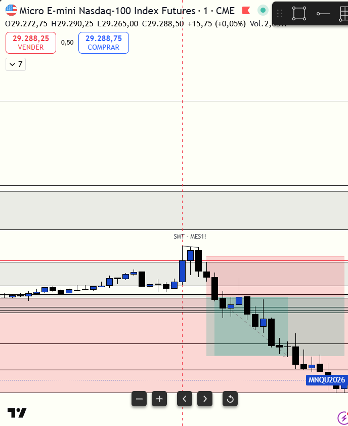

# 📅 BITÁCORA DE TRADING — 16 de Julio de 2026
**Pre-Trade Link:** [[2026-07-16_pre_trade]]

## 📊 RESUMEN GENERAL DE LA SESIÓN
- **Resultado Neto:** `+$860.00 USD`
- **Trades Realizados:** `1`
- **Resultado:** `WIN 🟢`

---

## 🖼️ CAPTURA DE PANTALLA

---

## 🔍 ANÁLISIS ESTRUCTURAL DE TEMPORALIDADES (TOP-DOWN)
### 1. Temporalidades Mayores (HTF: 4h / 1h)
- **Bias:** Bearish 🔴
- **Narrativa:** El mercado Nasdaq venía en una tendencia bajista clara. En la preparación pre-trade identificamos una zona de resistencia clave dada por el FVG de 1H en el rango de `29459.28 - 29502.15`. El plan indicaba esperar que el precio reaccionara a la baja desde esta resistencia institucional.

### 2. Temporalidades Intermedias (30m / 15m)
- **Zonas clave (POIs):** La caja de resistencia macro confluyó con el FVG de 30m y 15m. La liquidez de compra (BSL) descansaba justo por encima del rango de apertura, lista para ser barrida.

### 3. Temporalidad de Ejecución (1m)
- **Gatillo / Desplazamiento:** Al abrir el mercado, el precio realizó un Stop Hunt violento del BSL, mitigando la zona de oferta macro y el FVG 1H. Posterior al barrido, se dio una reacción bajista fuerte en 1m que rompió la estructura local. Aunque el 1m iFVG inicial se formó con una vela muy larga que no permitió entrada directa por el filtro de persecución (Chasing Filter), el precio retrocedió de forma ordenada a testear el FVG bajista de 1m y confirmó la entrada con el CISD (Change In State of Delivery) de cortos.

---

## 📈 REPORTE DETALLADO DE LOS TRADES
### 🔴 TRADE #1: Short en MNQ 09-26
- **Entrada:** `29439.00` (4 contratos a las 08:34:57)
- **Stop Loss:** `29512.50` (73.5 puntos, colocado de forma segura por encima del máximo del stophunt)
- **Take Profit (Objetivo):** `29331.75` (en base al short_position tool en TradingView)
- **Salida Real:** `29331.50` (ejecutada a las 08:43:07)
- **MAE:** `251.0 ticks` (62.75 puntos de retroceso adverso antes de la caída)
- **MFE:** `697.0 ticks` (174.25 puntos de recorrido favorable máximo)
- **Resultado:** `WIN 🟢` (`+107.50 puntos`, `+$860.00 USD netos`)

---

## 🧠 CENTRO DE APRENDIZAJE Y RETROALIMENTACIÓN (MÉTODO STEENBARGER)

> [!TIP]
> **TARJETA DE MEMORIA DE RÁPIDA CONSULTA (Revisar antes de abrir el mercado)**
> - **El Foco de Hoy:** Esperar con paciencia a que el mercado complete el stophunt inicial en la apertura y retestee el FVG en temporalidad baja en lugar de perseguir impulsos (anti-FOMO).
> - **Acción de Éxito a Repetir (Músculo):** Aplicar estrictamente el *Chasing Filter* del plan operativo: rehusar entrar a mercado tras velas largas de desplazamiento y esperar el retroceso ordenado.
> - **Error Crítico a Evitar (Eliminar):** Evitar entrar por pánico o rabia si el precio avanza sin nosotros. Si el precio no retrocede al Equilibrium del FVG, no hay trade.

### ⚖️ Clasificación: Proceso vs. Resultado
*¿Ejecutaste el plan de manera disciplinada, independientemente de ganar o perder dinero?*
- **Trade #1:** [+$860.00 USD] ➔ **Proceso: CORRECTO (Buen Trade)** | *Razón:* Se ejecutó el plan de cortos con una disciplina impecable. Al cerrarse la vela de 1m iFVG con un desplazamiento largo, se aplicó la regla de no entrar a mercado (evitando FOMO y mal R:R). Se colocó la orden límite de manera inteligente en el retesteo del FVG bajista de 1m/CISD, resultando en una entrada limpia y un R:R óptimo.

### 📈 Plan de Acción Inmediato para la Próxima Sesión
- **Qué mantendré:** La espera atenta del Stop Hunt en el open y la paciencia para no perseguir el precio al cierre de velas de expansión largas.
- **Qué corregiré activamente:** Mantener el mismo nivel de autocontrol y respetar las zonas macro del pre-trade sin forzar operaciones en zonas intermedias de ruido.
