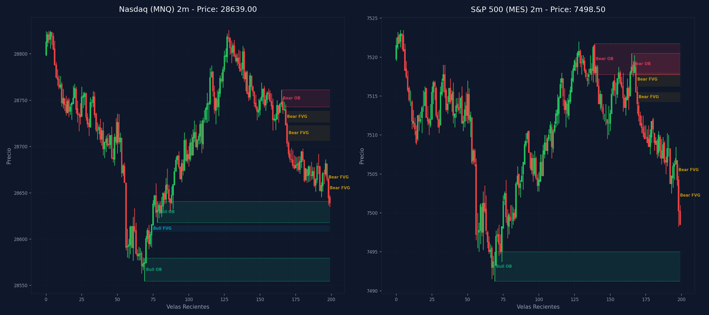

# 🛠️ Reporte Pre-Trade Avanzado: Mapa Dual de Confluencias (MNQ & MES)

Este reporte evalúa la estructura de mercado y dibuja la confluencia entre tus marcas de TradingView recopiladas vía CDP a lo largo de las 9 temporalidades analizadas en Nasdaq (`MNQ`) y S&P 500 (`MES`).

---

## 📅 Información de la Sesión
* **Fecha:** `2026-07-17`
* **Mercados Analizados:** Nasdaq (MNQ) y S&P 500 (MES)
* **Precios de Referencia:** MNQ: `28639.00` | MES: `7498.50`
* **Vinculación Temporal:** 
  * 🔗 [Ver Autopsia y Bitácora Post-Trade de esta Sesión](2026-07-17_session.md) (Se generará al finalizar tu sesión)

---

## ⚖️ Análisis de Bias y Fuerza Relativa
* **Bias Local Dominante:** `Neutral / Sincronía Completa`
* **Mercado Más Alcista (Fuerte):** `Alineados por igual`
* **Mercado Más Bajista (Débil):** `Alineados por igual`
* **Puntuación de Fuerza ESTRUCTURAL:** NQ Score: `-13.5` | ES Score: `-13.5`

---

## 🌊 Confluencias de Order Flow (NinjaTrader 8)
### 📊 Gráfico Activo: `MNQ 09-26` (1 Min Volumetric)
  * **Order Flow Trade Detector**: `null`
  * **Order Flow Cumulative Delta**: `-8466` ➔ **Presión Vendedora a Mercado (Bajista) 🔴**
  * **Oscilador de volumen**: `0`
### 📊 Gráfico Activo: `MES 09-26` (1 Min Volumetric)
  * **Order Flow Trade Detector**: `null`
  * **Order Flow Cumulative Delta**: `-6079` ➔ **Presión Vendedora a Mercado (Bajista) 🔴**
  * **Oscilador de volumen**: `0`

---

## 📈 Tabla Comparativa de Estructura (Multi-Temporalidad)

| Temporalidad | Sesgo MNQ | Rango MNQ | Sesgo MES | Rango MES |
| :--- | :--- | :--- | :--- | :--- |
| **4H** | Bearish 🔴 | Discount (Compras) 🟢 | Bearish 🔴 | Discount (Compras) 🟢 |
| **1H** | Bearish 🔴 | Premium (Ventas) 🔴 | Bearish 🔴 | Premium (Ventas) 🔴 |
| **30m** | Bearish 🔴 | Discount (Compras) 🟢 | Bearish 🔴 | Discount (Compras) 🟢 |
| **15m** | Bearish 🔴 | Discount (Compras) 🟢 | Bearish 🔴 | Discount (Compras) 🟢 |
| **5m** | Bearish 🔴 | Discount (Compras) 🟢 | Bearish 🔴 | Discount (Compras) 🟢 |
| **4m** | Bearish 🔴 | Discount (Compras) 🟢 | Bearish 🔴 | Discount (Compras) 🟢 |
| **3m** | Bearish 🔴 | Discount (Compras) 🟢 | Bearish 🔴 | Discount (Compras) 🟢 |
| **2m** | Bearish 🔴 | Discount (Compras) 🟢 | Bearish 🔴 | Discount (Compras) 🟢 |
| **1m** | Bearish 🔴 | Discount (Compras) 🟢 | Bearish 🔴 | Discount (Compras) 🟢 |

---

## 🛡️ Alerta del Guardia de Riesgo (IA Risk Mentor)

> [!IMPORTANT]
> **Estadísticas de Bitácora:** Sesiones: `26` | PnL Acumulado: `$5990.00 USD` | Win Rate: `57.7%`
> 
> **🚨 TUS ERRORES PSICOLÓGICOS MÁS RECURRENTES A EVITAR HOY:**
> * **Ignorar Resistencia:** presente en el `65.4%` de las sesiones previas.
> * **FOMO:** presente en el `57.7%` de las sesiones previas.
>
> **📝 LECCIONES CLAVE A RECORDAR:**
> * 1. La Disciplina ante el Bias Paga Rentabilidad: Alinearse estrictamente con el HTF Bias (Bullish) en zona de descuento macro y descartar los cortos contra-tendencia es la base de los trades de alta probabilidad.
> * La Espera del Retesteo Reduce el Riesgo: No entrar persiguiendo velas de expansión alcista sino esperar con paciencia el pullback al FVG mitigador es la diferencia entre ser liquidado o lograr una entrada limpia con excelente R:R.
> * El Plan Vence a la Intuición: Ignorar el impulso de tomar shorts discrecionales (incluso cuando otros mentores o el ruido de micro-temporalidades sugerían caídas) y aferrarse a las reglas del manual operativo condujo a una sesión sumamente rentable.

---

## 🎯 Plan Operativo de Sesión (Gatillos Estructurales)

### 🟢 Escenario para LONG (Compras)
1. **Barrida de Liquidez Estructural (Sweep):** El precio de Alineados debe barrer liquidez externa inferior (mínimo de sesión previa o swing low local en 29611.0 o similar) en temporalidad intermedia.
2. **Desplazamiento y Confirmación (iFVG):** Tras barrer liquidez, el precio debe desplazarse fuereña en el gráfico LTF (1m-5m) y cerrar con cuerpo completo por encima de un FVG bajista, convirtiéndolo en un Inverse FVG (iFVG).
3. **Perfil de Entrada Preferente:** Priorizar perfiles G-R-G (Fáciles de Invertir) para validar el orderflow alcista con momentum.

### 🔴 Escenario para SHORT (Ventas)
1. **Barrida de Liquidez Estructural (Sweep):** El precio de Alineados debe barrer liquidez externa superior (máximo de sesión previa o swing high local) y mitigar una zona de resistencia de Oferta.
2. **Desplazamiento y Confirmación (iFVG):** Reacción impulsiva bajista en LTF que rompa y cierre por debajo de un FVG alcista (perfil R-G-R preferente) para validar la inversión institucional a iFVG.
3. **Alineación de Fuerza:** Entrar en short en el mercado más débil para maximizar la velocidad de la caída.

---

## 🚫 Filtros Negativos (Zonas de Peligro)

### ⚠️ Mala Idea Tirar LONGS (No Comprar)
1. **Premium HTF:** Si el precio de MNQ o MES está cotizando dentro de zona Premium del rango de 1H/30m.
2. **Mitigación Hostil:** Si el precio está chocando directamente con una resistencia fuerte o Supply OB de 1H/4H.
3. **Divergencia SMT Bajista:** Si detectamos divergencia SMT Bajista (S&P 500 hace altos más altos pero Nasdaq falla en hacerlos), lo que indica distribución institucional activa.

### ⚠️ Mala Idea Tirar SHORTS (No Vender)
1. **Discount HTF:** Si el precio se encuentra cotizando en zona de descuento estructural (Discount) de 1H/30m.
2. **Soporte Hostil:** Si el precio se apoya en un Demand OB de 1H/4H inmitigado.
3. **Divergencia SMT Alcista:** Si detectamos divergencia SMT Alcista (S&P 500 barre mínimos pero Nasdaq sostiene mínimos más altos), lo que indica acumulación e invalida ventas.

---

## 🌀 Estrategia de VWAP y Nivel de Liquidez (DOL)
* **Estado de Mercado Esperado:** **Día de Tendencia (Expansión) 🚀**
* **Guía Operativa del VWAP:**
  * **El Premium/Discount de altas temporalidades deja de importar y la media del VWAP también.**
  * Concéntrate más en las **Bandas de Desviación Estándar -2 y -3** (en este caso bajista), ya que el precio tenderá a caminar y sostenerse sobre ellas a favor de la tendencia.
  * **⚠️ ADVERTENCIA DE CONTRATENDENCIA:** Está estrictamente prohibido comprar en las bandas externas inferiores de -2 o -3 desviaciones estándar buscando una reversión; la fuerza de la tendencia bajista tenderá a arrastrar el precio a lo largo de ellas.

* **🎯 MAPA DE LIQUIDEZ Y ADVERTENCIA DE DOL (Bookmap/CDP):**
  * **Fuerza del Draw on Liquidity (DOL):** Fuerte atracción magnética hacia el lado vendedor (Downside). La estructura bajista sincronizada en todas las temporalidades (4H a 1m) indica que el precio busca barrer la liquidez acumulada en los mínimos.
  * **Muros y Niveles Institucionales Clave (Mapeados vía CDP/TV):**
    * **En Nasdaq (MNQ):** El DOL principal está en el mínimo de Londres (`28554.75`) y el nivel institucional de Sell Side Liquidity (SSL) en `28520.00`. Estos actúan como imanes de alta probabilidad.
    * **En S&P 500 (MES):** El precio se encuentra sumamente cerca del mínimo local en `7491.25` (London Low). De romperlo, el siguiente muro de liquidez institucional y soporte estructural importante se ubica en el mínimo del Order Block de 4H (`7468.25`).
  * **Recomendación Operativa:** Evita forzar compras (longs) prematuras hasta que estos niveles de alta temporalidad sean completamente barridos y muestren un desplazamiento contundente con cierre de cuerpo por encima de un FVG en microtemporalidad. De lo contrario, prioriza operar la continuación de la tendencia bajista hacia estos objetivos de liquidez.

---

## ⚡ Correlación Inter-Mercado (SMT Divergence)
* **Estado SMT:** `S&P 500 (MES) y Nasdaq (MNQ) alineados de forma regular en el Open (Sin divergencias activas).`

---

## 🧠 Predicciones de Machine Learning (Win Rate Classifier)
### 💻 Predicción Nasdaq (MNQ):
```text
=== PREDICCIÓN DE PROBABILIDAD DE ÉXITO ===

==================================================
SETUP EVALUADO:
 - Instrumento: NQ | Dirección: Short | Sesión: NY AM KZ
 - Confluencias: in kill zone (london / ny am / pm), at htf pd array (ob / fvg / breaker), fair value gap (fvg) on entry tf, order block (ob) alignment, htf market structure bias confirmed
--------------------------------------------------
PROBABILIDAD DE WIN RATE ESTIMADA: 43.0%
❌ SETUP BAJA PROBABILIDAD: Se sugiere estrictamente omitir el trade (No-Trade Zone).
==================================================
```
### 📊 Predicción S&P 500 (MES):
```text
=== PREDICCIÓN DE PROBABILIDAD DE ÉXITO ===

==================================================
SETUP EVALUADO:
 - Instrumento: ES | Dirección: Short | Sesión: NY AM KZ
 - Confluencias: in kill zone (london / ny am / pm), at htf pd array (ob / fvg / breaker), fair value gap (fvg) on entry tf, order block (ob) alignment, htf market structure bias confirmed
--------------------------------------------------
PROBABILIDAD DE WIN RATE ESTIMADA: 44.2%
❌ SETUP BAJA PROBABILIDAD: Se sugiere estrictamente omitir el trade (No-Trade Zone).
==================================================
```

---

## 🎨 Comparación con Marcaciones Manuales (TradingView CDP)

### 💻 Marcaciones en Nasdaq (MNQ) por Temporalidad:
  * **Caja Gris con etiqueta '5m'** en rango `29293.77 - 29312.75` | Estado: 🟡 Fuera del precio | Sin confluencia SMC directa
  * **Caja Gris con etiqueta '5m'** en rango `29287.00 - 29293.57` | Estado: 🟡 Fuera del precio | Sin confluencia SMC directa
  * **Caja Gris** en rango `29315.75 - 29317.73` | Estado: 🟡 Fuera del precio | Sin confluencia SMC directa
  * **Caja Gris** en rango `29480.50 - 29502.21` | Estado: 🟡 Fuera del precio | Sin confluencia SMC directa
  * **Caja Gris** en rango `29583.25 - 29590.19` | Estado: 🟡 Fuera del precio | Sin confluencia SMC directa
  * **Caja Gris** en rango `29768.25 - 29772.53` | Estado: 🟡 Fuera del precio | Confluencias: **OB 1H** (29667.0 - 29796.5), **OB 30m** (29667.0 - 29796.5)
  * **Caja Gris con etiqueta '5m'** en rango `29903.77 - 29922.50` | Estado: 🟡 Fuera del precio | Sin confluencia SMC directa
  * **Caja Gris** en rango `29622.25 - 29639.04` | Estado: 🟡 Fuera del precio | Confluencias: **OB 30m** (29591.8 - 29644.8), **OB 15m** (29611.0 - 29644.8)
  * **Caja Gris con etiqueta '5m'** en rango `29577.50 - 29582.00` | Estado: 🟡 Fuera del precio | Sin confluencia SMC directa
  * **Caja Gris** en rango `29602.63 - 29621.50` | Estado: 🟡 Fuera del precio | Confluencias: **OB 30m** (29591.8 - 29644.8), **OB 15m** (29611.0 - 29644.8)
  * **Caja Gris con etiqueta '4h'** en rango `28825.00 - 28946.25` | Estado: 🟡 Fuera del precio | Confluencias: **FVG 4H** (28879.5 - 29060.5), **FVG 4H** (28826.0 - 28893.8), **FVG 1H** (28879.5 - 28893.8), **FVG 30m** (28841.2 - 28915.0), **OB 5m** (28804.5 - 28841.2), **FVG 5m** (28859.8 - 28861.2), **OB 3m** (28829.0 - 28841.2)
  * **Caja Gris con etiqueta '15m'** en rango `28698.37 - 28718.00` | Estado: 🟡 Fuera del precio | Confluencias: **FVG 1H** (28665.8 - 28717.5), **FVG 30m** (28692.2 - 28717.5), **FVG 15m** (28697.8 - 28718.0), **FVG 5m** (28703.0 - 28735.5), **FVG 4m** (28706.2 - 28735.5), **FVG 4m** (28698.2 - 28699.8)
  * **Caja Gris con etiqueta '15m'** en rango `28769.43 - 28777.00` | Estado: 🟡 Fuera del precio | Confluencias: **FVG 15m** (28769.2 - 28777.0)
  * **Caja Gris con etiqueta '5m'** en rango `29293.77 - 29312.75` | Estado: 🟡 Fuera del precio | Sin confluencia SMC directa
  * **Caja Gris con etiqueta '5m'** en rango `29287.00 - 29293.57` | Estado: 🟡 Fuera del precio | Sin confluencia SMC directa
  * **Caja Gris** en rango `29315.75 - 29317.73` | Estado: 🟡 Fuera del precio | Sin confluencia SMC directa
  * **Caja Gris** en rango `29480.50 - 29502.21` | Estado: 🟡 Fuera del precio | Sin confluencia SMC directa
  * **Caja Gris** en rango `29583.25 - 29590.19` | Estado: 🟡 Fuera del precio | Sin confluencia SMC directa
  * **Caja Gris** en rango `29768.25 - 29772.53` | Estado: 🟡 Fuera del precio | Confluencias: **OB 1H** (29667.0 - 29796.5), **OB 30m** (29667.0 - 29796.5)
  * **Caja Gris con etiqueta '5m'** en rango `29903.77 - 29922.50` | Estado: 🟡 Fuera del precio | Sin confluencia SMC directa
  * **Caja Gris** en rango `29622.25 - 29639.04` | Estado: 🟡 Fuera del precio | Confluencias: **OB 30m** (29591.8 - 29644.8), **OB 15m** (29611.0 - 29644.8)
  * **Caja Gris con etiqueta '5m'** en rango `29577.50 - 29582.00` | Estado: 🟡 Fuera del precio | Sin confluencia SMC directa
  * **Caja Gris** en rango `29602.63 - 29621.50` | Estado: 🟡 Fuera del precio | Confluencias: **OB 30m** (29591.8 - 29644.8), **OB 15m** (29611.0 - 29644.8)
  * **Caja Gris con etiqueta '4h'** en rango `28825.00 - 28946.25` | Estado: 🟡 Fuera del precio | Confluencias: **FVG 4H** (28879.5 - 29060.5), **FVG 4H** (28826.0 - 28893.8), **FVG 1H** (28879.5 - 28893.8), **FVG 30m** (28841.2 - 28915.0), **OB 5m** (28804.5 - 28841.2), **FVG 5m** (28859.8 - 28861.2), **OB 3m** (28829.0 - 28841.2)
  * **Caja Gris con etiqueta '15m'** en rango `28698.37 - 28718.00` | Estado: 🟡 Fuera del precio | Confluencias: **FVG 1H** (28665.8 - 28717.5), **FVG 30m** (28692.2 - 28717.5), **FVG 15m** (28697.8 - 28718.0), **FVG 5m** (28703.0 - 28735.5), **FVG 4m** (28706.2 - 28735.5), **FVG 4m** (28698.2 - 28699.8)
  * **Caja Gris con etiqueta '15m'** en rango `28769.43 - 28777.00` | Estado: 🟡 Fuera del precio | Confluencias: **FVG 15m** (28769.2 - 28777.0)
  * **Caja Gris con etiqueta '5m'** en rango `29293.77 - 29312.75` | Estado: 🟡 Fuera del precio | Sin confluencia SMC directa
  * **Caja Gris con etiqueta '5m'** en rango `29287.00 - 29293.57` | Estado: 🟡 Fuera del precio | Sin confluencia SMC directa
  * **Caja Gris** en rango `29315.75 - 29317.73` | Estado: 🟡 Fuera del precio | Sin confluencia SMC directa
  * **Caja Gris** en rango `29480.50 - 29502.21` | Estado: 🟡 Fuera del precio | Sin confluencia SMC directa
  * **Caja Gris** en rango `29583.25 - 29590.19` | Estado: 🟡 Fuera del precio | Sin confluencia SMC directa
  * **Caja Gris** en rango `29768.25 - 29772.53` | Estado: 🟡 Fuera del precio | Confluencias: **OB 1H** (29667.0 - 29796.5), **OB 30m** (29667.0 - 29796.5)
  * **Caja Gris con etiqueta '5m'** en rango `29903.77 - 29922.50` | Estado: 🟡 Fuera del precio | Sin confluencia SMC directa
  * **Caja Gris** en rango `29622.25 - 29639.04` | Estado: 🟡 Fuera del precio | Confluencias: **OB 30m** (29591.8 - 29644.8), **OB 15m** (29611.0 - 29644.8)
  * **Caja Gris con etiqueta '5m'** en rango `29577.50 - 29582.00` | Estado: 🟡 Fuera del precio | Sin confluencia SMC directa
  * **Caja Gris** en rango `29602.63 - 29621.50` | Estado: 🟡 Fuera del precio | Confluencias: **OB 30m** (29591.8 - 29644.8), **OB 15m** (29611.0 - 29644.8)
  * **Caja Gris con etiqueta '4h'** en rango `28825.00 - 28946.25` | Estado: 🟡 Fuera del precio | Confluencias: **FVG 4H** (28879.5 - 29060.5), **FVG 4H** (28826.0 - 28893.8), **FVG 1H** (28879.5 - 28893.8), **FVG 30m** (28841.2 - 28915.0), **OB 5m** (28804.5 - 28841.2), **FVG 5m** (28859.8 - 28861.2), **OB 3m** (28829.0 - 28841.2)
  * **Caja Gris con etiqueta '15m'** en rango `28698.37 - 28718.00` | Estado: 🟡 Fuera del precio | Confluencias: **FVG 1H** (28665.8 - 28717.5), **FVG 30m** (28692.2 - 28717.5), **FVG 15m** (28697.8 - 28718.0), **FVG 5m** (28703.0 - 28735.5), **FVG 4m** (28706.2 - 28735.5), **FVG 4m** (28698.2 - 28699.8)
  * **Caja Gris con etiqueta '15m'** en rango `28769.43 - 28777.00` | Estado: 🟡 Fuera del precio | Confluencias: **FVG 15m** (28769.2 - 28777.0)
  * **Caja Gris con etiqueta '5m'** en rango `29293.77 - 29312.75` | Estado: 🟡 Fuera del precio | Sin confluencia SMC directa
  * **Caja Gris con etiqueta '5m'** en rango `29287.00 - 29293.57` | Estado: 🟡 Fuera del precio | Sin confluencia SMC directa
  * **Caja Gris** en rango `29315.75 - 29317.73` | Estado: 🟡 Fuera del precio | Sin confluencia SMC directa
  * **Caja Gris** en rango `29480.50 - 29502.21` | Estado: 🟡 Fuera del precio | Sin confluencia SMC directa
  * **Caja Gris** en rango `29583.25 - 29590.19` | Estado: 🟡 Fuera del precio | Sin confluencia SMC directa
  * **Caja Gris** en rango `29768.25 - 29772.53` | Estado: 🟡 Fuera del precio | Confluencias: **OB 1H** (29667.0 - 29796.5), **OB 30m** (29667.0 - 29796.5)
  * **Caja Gris con etiqueta '5m'** en rango `29903.77 - 29922.50` | Estado: 🟡 Fuera del precio | Sin confluencia SMC directa
  * **Caja Gris** en rango `29622.25 - 29639.04` | Estado: 🟡 Fuera del precio | Confluencias: **OB 30m** (29591.8 - 29644.8), **OB 15m** (29611.0 - 29644.8)
  * **Caja Gris con etiqueta '5m'** en rango `29577.50 - 29582.00` | Estado: 🟡 Fuera del precio | Sin confluencia SMC directa
  * **Caja Gris** en rango `29602.63 - 29621.50` | Estado: 🟡 Fuera del precio | Confluencias: **OB 30m** (29591.8 - 29644.8), **OB 15m** (29611.0 - 29644.8)
  * **Caja Gris con etiqueta '4h'** en rango `28825.00 - 28946.25` | Estado: 🟡 Fuera del precio | Confluencias: **FVG 4H** (28879.5 - 29060.5), **FVG 4H** (28826.0 - 28893.8), **FVG 1H** (28879.5 - 28893.8), **FVG 30m** (28841.2 - 28915.0), **OB 5m** (28804.5 - 28841.2), **FVG 5m** (28859.8 - 28861.2), **OB 3m** (28829.0 - 28841.2)
  * **Caja Gris con etiqueta '15m'** en rango `28698.37 - 28718.00` | Estado: 🟡 Fuera del precio | Confluencias: **FVG 1H** (28665.8 - 28717.5), **FVG 30m** (28692.2 - 28717.5), **FVG 15m** (28697.8 - 28718.0), **FVG 5m** (28703.0 - 28735.5), **FVG 4m** (28706.2 - 28735.5), **FVG 4m** (28698.2 - 28699.8)
  * **Caja Gris con etiqueta '15m'** en rango `28769.43 - 28777.00` | Estado: 🟡 Fuera del precio | Confluencias: **FVG 15m** (28769.2 - 28777.0)
  * **Caja Gris con etiqueta '5m'** en rango `29293.77 - 29312.75` | Estado: 🟡 Fuera del precio | Sin confluencia SMC directa
  * **Caja Gris con etiqueta '5m'** en rango `29287.00 - 29293.57` | Estado: 🟡 Fuera del precio | Sin confluencia SMC directa
  * **Caja Gris** en rango `29315.75 - 29317.73` | Estado: 🟡 Fuera del precio | Sin confluencia SMC directa
  * **Caja Gris** en rango `29480.50 - 29502.21` | Estado: 🟡 Fuera del precio | Sin confluencia SMC directa
  * **Caja Gris** en rango `29583.25 - 29590.19` | Estado: 🟡 Fuera del precio | Sin confluencia SMC directa
  * **Caja Gris** en rango `29768.25 - 29772.53` | Estado: 🟡 Fuera del precio | Confluencias: **OB 1H** (29667.0 - 29796.5), **OB 30m** (29667.0 - 29796.5)
  * **Caja Gris con etiqueta '5m'** en rango `29903.77 - 29922.50` | Estado: 🟡 Fuera del precio | Sin confluencia SMC directa
  * **Caja Gris** en rango `29622.25 - 29639.04` | Estado: 🟡 Fuera del precio | Confluencias: **OB 30m** (29591.8 - 29644.8), **OB 15m** (29611.0 - 29644.8)
  * **Caja Gris con etiqueta '5m'** en rango `29577.50 - 29582.00` | Estado: 🟡 Fuera del precio | Sin confluencia SMC directa
  * **Caja Gris** en rango `29602.63 - 29621.50` | Estado: 🟡 Fuera del precio | Confluencias: **OB 30m** (29591.8 - 29644.8), **OB 15m** (29611.0 - 29644.8)
  * **Caja Gris con etiqueta '4h'** en rango `28825.00 - 28946.25` | Estado: 🟡 Fuera del precio | Confluencias: **FVG 4H** (28879.5 - 29060.5), **FVG 4H** (28826.0 - 28893.8), **FVG 1H** (28879.5 - 28893.8), **FVG 30m** (28841.2 - 28915.0), **OB 5m** (28804.5 - 28841.2), **FVG 5m** (28859.8 - 28861.2), **OB 3m** (28829.0 - 28841.2)
  * **Caja Gris con etiqueta '15m'** en rango `28698.37 - 28718.00` | Estado: 🟡 Fuera del precio | Confluencias: **FVG 1H** (28665.8 - 28717.5), **FVG 30m** (28692.2 - 28717.5), **FVG 15m** (28697.8 - 28718.0), **FVG 5m** (28703.0 - 28735.5), **FVG 4m** (28706.2 - 28735.5), **FVG 4m** (28698.2 - 28699.8)
  * **Caja Gris con etiqueta '15m'** en rango `28769.43 - 28777.00` | Estado: 🟡 Fuera del precio | Confluencias: **FVG 15m** (28769.2 - 28777.0)
  * **Caja Gris con etiqueta '5m'** en rango `29293.77 - 29312.75` | Estado: 🟡 Fuera del precio | Sin confluencia SMC directa
  * **Caja Gris con etiqueta '5m'** en rango `29287.00 - 29293.57` | Estado: 🟡 Fuera del precio | Sin confluencia SMC directa
  * **Caja Gris** en rango `29315.75 - 29317.73` | Estado: 🟡 Fuera del precio | Sin confluencia SMC directa
  * **Caja Gris** en rango `29480.50 - 29502.21` | Estado: 🟡 Fuera del precio | Sin confluencia SMC directa
  * **Caja Gris** en rango `29583.25 - 29590.19` | Estado: 🟡 Fuera del precio | Sin confluencia SMC directa
  * **Caja Gris** en rango `29768.25 - 29772.53` | Estado: 🟡 Fuera del precio | Confluencias: **OB 1H** (29667.0 - 29796.5), **OB 30m** (29667.0 - 29796.5)
  * **Caja Gris con etiqueta '5m'** en rango `29903.77 - 29922.50` | Estado: 🟡 Fuera del precio | Sin confluencia SMC directa
  * **Caja Gris** en rango `29622.25 - 29639.04` | Estado: 🟡 Fuera del precio | Confluencias: **OB 30m** (29591.8 - 29644.8), **OB 15m** (29611.0 - 29644.8)
  * **Caja Gris con etiqueta '5m'** en rango `29577.50 - 29582.00` | Estado: 🟡 Fuera del precio | Sin confluencia SMC directa
  * **Caja Gris** en rango `29602.63 - 29621.50` | Estado: 🟡 Fuera del precio | Confluencias: **OB 30m** (29591.8 - 29644.8), **OB 15m** (29611.0 - 29644.8)
  * **Caja Gris con etiqueta '4h'** en rango `28825.00 - 28946.25` | Estado: 🟡 Fuera del precio | Confluencias: **FVG 4H** (28879.5 - 29060.5), **FVG 4H** (28826.0 - 28893.8), **FVG 1H** (28879.5 - 28893.8), **FVG 30m** (28841.2 - 28915.0), **OB 5m** (28804.5 - 28841.2), **FVG 5m** (28859.8 - 28861.2), **OB 3m** (28829.0 - 28841.2)
  * **Caja Gris con etiqueta '15m'** en rango `28698.37 - 28718.00` | Estado: 🟡 Fuera del precio | Confluencias: **FVG 1H** (28665.8 - 28717.5), **FVG 30m** (28692.2 - 28717.5), **FVG 15m** (28697.8 - 28718.0), **FVG 5m** (28703.0 - 28735.5), **FVG 4m** (28706.2 - 28735.5), **FVG 4m** (28698.2 - 28699.8)
  * **Caja Gris con etiqueta '15m'** en rango `28769.43 - 28777.00` | Estado: 🟡 Fuera del precio | Confluencias: **FVG 15m** (28769.2 - 28777.0)
  * **Caja Gris con etiqueta '5m'** en rango `29293.77 - 29312.75` | Estado: 🟡 Fuera del precio | Sin confluencia SMC directa
  * **Caja Gris con etiqueta '5m'** en rango `29287.00 - 29293.57` | Estado: 🟡 Fuera del precio | Sin confluencia SMC directa
  * **Caja Gris** en rango `29315.75 - 29317.73` | Estado: 🟡 Fuera del precio | Sin confluencia SMC directa
  * **Caja Gris** en rango `29480.50 - 29502.21` | Estado: 🟡 Fuera del precio | Sin confluencia SMC directa
  * **Caja Gris** en rango `29583.25 - 29590.19` | Estado: 🟡 Fuera del precio | Sin confluencia SMC directa
  * **Caja Gris** en rango `29768.25 - 29772.53` | Estado: 🟡 Fuera del precio | Confluencias: **OB 1H** (29667.0 - 29796.5), **OB 30m** (29667.0 - 29796.5)
  * **Caja Gris con etiqueta '5m'** en rango `29903.77 - 29922.50` | Estado: 🟡 Fuera del precio | Sin confluencia SMC directa
  * **Caja Gris** en rango `29622.25 - 29639.04` | Estado: 🟡 Fuera del precio | Confluencias: **OB 30m** (29591.8 - 29644.8), **OB 15m** (29611.0 - 29644.8)
  * **Caja Gris con etiqueta '5m'** en rango `29577.50 - 29582.00` | Estado: 🟡 Fuera del precio | Sin confluencia SMC directa
  * **Caja Gris** en rango `29602.63 - 29621.50` | Estado: 🟡 Fuera del precio | Confluencias: **OB 30m** (29591.8 - 29644.8), **OB 15m** (29611.0 - 29644.8)
  * **Caja Gris con etiqueta '4h'** en rango `28825.00 - 28946.25` | Estado: 🟡 Fuera del precio | Confluencias: **FVG 4H** (28879.5 - 29060.5), **FVG 4H** (28826.0 - 28893.8), **FVG 1H** (28879.5 - 28893.8), **FVG 30m** (28841.2 - 28915.0), **OB 5m** (28804.5 - 28841.2), **FVG 5m** (28859.8 - 28861.2), **OB 3m** (28829.0 - 28841.2)
  * **Caja Gris con etiqueta '15m'** en rango `28698.37 - 28718.00` | Estado: 🟡 Fuera del precio | Confluencias: **FVG 1H** (28665.8 - 28717.5), **FVG 30m** (28692.2 - 28717.5), **FVG 15m** (28697.8 - 28718.0), **FVG 5m** (28703.0 - 28735.5), **FVG 4m** (28706.2 - 28735.5), **FVG 4m** (28698.2 - 28699.8)
  * **Caja Gris con etiqueta '15m'** en rango `28769.43 - 28777.00` | Estado: 🟡 Fuera del precio | Confluencias: **FVG 15m** (28769.2 - 28777.0)
  * **Caja Gris con etiqueta '5m'** en rango `29293.77 - 29312.75` | Estado: 🟡 Fuera del precio | Sin confluencia SMC directa
  * **Caja Gris con etiqueta '5m'** en rango `29287.00 - 29293.57` | Estado: 🟡 Fuera del precio | Sin confluencia SMC directa
  * **Caja Gris** en rango `29315.75 - 29317.73` | Estado: 🟡 Fuera del precio | Sin confluencia SMC directa
  * **Caja Gris** en rango `29480.50 - 29502.21` | Estado: 🟡 Fuera del precio | Sin confluencia SMC directa
  * **Caja Gris** en rango `29583.25 - 29590.19` | Estado: 🟡 Fuera del precio | Sin confluencia SMC directa
  * **Caja Gris** en rango `29768.25 - 29772.53` | Estado: 🟡 Fuera del precio | Confluencias: **OB 1H** (29667.0 - 29796.5), **OB 30m** (29667.0 - 29796.5)
  * **Caja Gris con etiqueta '5m'** en rango `29903.77 - 29922.50` | Estado: 🟡 Fuera del precio | Sin confluencia SMC directa
  * **Caja Gris** en rango `29622.25 - 29639.04` | Estado: 🟡 Fuera del precio | Confluencias: **OB 30m** (29591.8 - 29644.8), **OB 15m** (29611.0 - 29644.8)
  * **Caja Gris con etiqueta '5m'** en rango `29577.50 - 29582.00` | Estado: 🟡 Fuera del precio | Sin confluencia SMC directa
  * **Caja Gris** en rango `29602.63 - 29621.50` | Estado: 🟡 Fuera del precio | Confluencias: **OB 30m** (29591.8 - 29644.8), **OB 15m** (29611.0 - 29644.8)
  * **Caja Gris con etiqueta '4h'** en rango `28825.00 - 28946.25` | Estado: 🟡 Fuera del precio | Confluencias: **FVG 4H** (28879.5 - 29060.5), **FVG 4H** (28826.0 - 28893.8), **FVG 1H** (28879.5 - 28893.8), **FVG 30m** (28841.2 - 28915.0), **OB 5m** (28804.5 - 28841.2), **FVG 5m** (28859.8 - 28861.2), **OB 3m** (28829.0 - 28841.2)
  * **Caja Gris con etiqueta '15m'** en rango `28698.37 - 28718.00` | Estado: 🟡 Fuera del precio | Confluencias: **FVG 1H** (28665.8 - 28717.5), **FVG 30m** (28692.2 - 28717.5), **FVG 15m** (28697.8 - 28718.0), **FVG 5m** (28703.0 - 28735.5), **FVG 4m** (28706.2 - 28735.5), **FVG 4m** (28698.2 - 28699.8)
  * **Caja Gris con etiqueta '15m'** en rango `28769.43 - 28777.00` | Estado: 🟡 Fuera del precio | Confluencias: **FVG 15m** (28769.2 - 28777.0)
  * **Caja Gris con etiqueta '5m'** en rango `29293.77 - 29312.75` | Estado: 🟡 Fuera del precio | Sin confluencia SMC directa
  * **Caja Gris con etiqueta '5m'** en rango `29287.00 - 29293.57` | Estado: 🟡 Fuera del precio | Sin confluencia SMC directa
  * **Caja Gris** en rango `29315.75 - 29317.73` | Estado: 🟡 Fuera del precio | Sin confluencia SMC directa
  * **Caja Gris** en rango `29480.50 - 29502.21` | Estado: 🟡 Fuera del precio | Sin confluencia SMC directa
  * **Caja Gris** en rango `29583.25 - 29590.19` | Estado: 🟡 Fuera del precio | Sin confluencia SMC directa
  * **Caja Gris** en rango `29768.25 - 29772.53` | Estado: 🟡 Fuera del precio | Confluencias: **OB 1H** (29667.0 - 29796.5), **OB 30m** (29667.0 - 29796.5)
  * **Caja Gris con etiqueta '5m'** en rango `29903.77 - 29922.50` | Estado: 🟡 Fuera del precio | Sin confluencia SMC directa
  * **Caja Gris** en rango `29622.25 - 29639.04` | Estado: 🟡 Fuera del precio | Confluencias: **OB 30m** (29591.8 - 29644.8), **OB 15m** (29611.0 - 29644.8)
  * **Caja Gris con etiqueta '5m'** en rango `29577.50 - 29582.00` | Estado: 🟡 Fuera del precio | Sin confluencia SMC directa
  * **Caja Gris** en rango `29602.63 - 29621.50` | Estado: 🟡 Fuera del precio | Confluencias: **OB 30m** (29591.8 - 29644.8), **OB 15m** (29611.0 - 29644.8)
  * **Caja Gris con etiqueta '4h'** en rango `28825.00 - 28946.25` | Estado: 🟡 Fuera del precio | Confluencias: **FVG 4H** (28879.5 - 29060.5), **FVG 4H** (28826.0 - 28893.8), **FVG 1H** (28879.5 - 28893.8), **FVG 30m** (28841.2 - 28915.0), **OB 5m** (28804.5 - 28841.2), **FVG 5m** (28859.8 - 28861.2), **OB 3m** (28829.0 - 28841.2)
  * **Caja Gris con etiqueta '15m'** en rango `28698.37 - 28718.00` | Estado: 🟡 Fuera del precio | Confluencias: **FVG 1H** (28665.8 - 28717.5), **FVG 30m** (28692.2 - 28717.5), **FVG 15m** (28697.8 - 28718.0), **FVG 5m** (28703.0 - 28735.5), **FVG 4m** (28706.2 - 28735.5), **FVG 4m** (28698.2 - 28699.8)
  * **Caja Gris con etiqueta '15m'** en rango `28769.43 - 28777.00` | Estado: 🟡 Fuera del precio | Confluencias: **FVG 15m** (28769.2 - 28777.0)
  * **Línea Manual con etiqueta 'ssl'** en nivel `28520.00` | Estado: Fuera de rango
  * **Línea Manual con etiqueta 'ifl 4h'** en nivel `30699.75` | Estado: Fuera de rango
  * **Línea Manual con etiqueta 'ifl 1h-lh'** en nivel `30435.50` | Estado: Fuera de rango
  * **Línea Manual con etiqueta 'ifl 1h'** en nivel `30477.25` | Estado: Fuera de rango
  * **Línea Manual con etiqueta 'ah'** en nivel `30555.75` | Estado: Fuera de rango
  * **Línea Manual con etiqueta 'lh'** en nivel `30004.53` | Estado: Fuera de rango | Ubicación: dentro de **OB 4H** (29928.2 - 30062.5), dentro de **OB 1H** (29928.2 - 30062.5)
  * **Línea Manual con etiqueta 'bsl'** en nivel `30073.55` | Estado: Fuera de rango
  * **Línea Manual con etiqueta 'ah'** en nivel `29796.80` | Estado: Fuera de rango
  * **Línea Manual con etiqueta 'eqh'** en nivel `28825.00` | Estado: Fuera de rango | Ubicación: dentro de **OB 5m** (28804.5 - 28841.2)
  * **Línea Manual con etiqueta 'll'** en nivel `28554.75` | Estado: Fuera de rango
  * **Línea Manual con etiqueta 'ah'** en nivel `29026.50` | Estado: Fuera de rango | Ubicación: dentro de **FVG 4H** (28879.5 - 29060.5)
  * **Línea Manual con etiqueta 'ssl'** en nivel `28520.00` | Estado: Fuera de rango
  * **Línea Manual con etiqueta 'ifl 4h'** en nivel `30699.75` | Estado: Fuera de rango
  * **Línea Manual con etiqueta 'ifl 1h-lh'** en nivel `30435.50` | Estado: Fuera de rango
  * **Línea Manual con etiqueta 'ifl 1h'** en nivel `30477.25` | Estado: Fuera de rango
  * **Línea Manual con etiqueta 'ah'** en nivel `30555.75` | Estado: Fuera de rango
  * **Línea Manual con etiqueta 'lh'** en nivel `30004.53` | Estado: Fuera de rango | Ubicación: dentro de **OB 4H** (29928.2 - 30062.5), dentro de **OB 1H** (29928.2 - 30062.5)
  * **Línea Manual con etiqueta 'bsl'** en nivel `30073.55` | Estado: Fuera de rango
  * **Línea Manual con etiqueta 'ah'** en nivel `29796.80` | Estado: Fuera de rango
  * **Línea Manual con etiqueta 'eqh'** en nivel `28825.00` | Estado: Fuera de rango | Ubicación: dentro de **OB 5m** (28804.5 - 28841.2)
  * **Línea Manual con etiqueta 'll'** en nivel `28554.75` | Estado: Fuera de rango
  * **Línea Manual con etiqueta 'ah'** en nivel `29026.50` | Estado: Fuera de rango | Ubicación: dentro de **FVG 4H** (28879.5 - 29060.5)
  * **Línea Manual con etiqueta 'ssl'** en nivel `28520.00` | Estado: Fuera de rango
  * **Línea Manual con etiqueta 'ifl 4h'** en nivel `30699.75` | Estado: Fuera de rango
  * **Línea Manual con etiqueta 'ifl 1h-lh'** en nivel `30435.50` | Estado: Fuera de rango
  * **Línea Manual con etiqueta 'ifl 1h'** en nivel `30477.25` | Estado: Fuera de rango
  * **Línea Manual con etiqueta 'ah'** en nivel `30555.75` | Estado: Fuera de rango
  * **Línea Manual con etiqueta 'lh'** en nivel `30004.53` | Estado: Fuera de rango | Ubicación: dentro de **OB 4H** (29928.2 - 30062.5), dentro de **OB 1H** (29928.2 - 30062.5)
  * **Línea Manual con etiqueta 'bsl'** en nivel `30073.55` | Estado: Fuera de rango
  * **Línea Manual con etiqueta 'ah'** en nivel `29796.80` | Estado: Fuera de rango
  * **Línea Manual con etiqueta 'eqh'** en nivel `28825.00` | Estado: Fuera de rango | Ubicación: dentro de **OB 5m** (28804.5 - 28841.2)
  * **Línea Manual con etiqueta 'll'** en nivel `28554.75` | Estado: Fuera de rango
  * **Línea Manual con etiqueta 'ah'** en nivel `29026.50` | Estado: Fuera de rango | Ubicación: dentro de **FVG 4H** (28879.5 - 29060.5)
  * **Línea Manual con etiqueta 'ssl'** en nivel `28520.00` | Estado: Fuera de rango
  * **Línea Manual con etiqueta 'ifl 4h'** en nivel `30699.75` | Estado: Fuera de rango
  * **Línea Manual con etiqueta 'ifl 1h-lh'** en nivel `30435.50` | Estado: Fuera de rango
  * **Línea Manual con etiqueta 'ifl 1h'** en nivel `30477.25` | Estado: Fuera de rango
  * **Línea Manual con etiqueta 'ah'** en nivel `30555.75` | Estado: Fuera de rango
  * **Línea Manual con etiqueta 'lh'** en nivel `30004.53` | Estado: Fuera de rango | Ubicación: dentro de **OB 4H** (29928.2 - 30062.5), dentro de **OB 1H** (29928.2 - 30062.5)
  * **Línea Manual con etiqueta 'bsl'** en nivel `30073.55` | Estado: Fuera de rango
  * **Línea Manual con etiqueta 'ah'** en nivel `29796.80` | Estado: Fuera de rango
  * **Línea Manual con etiqueta 'eqh'** en nivel `28825.00` | Estado: Fuera de rango | Ubicación: dentro de **OB 5m** (28804.5 - 28841.2)
  * **Línea Manual con etiqueta 'll'** en nivel `28554.75` | Estado: Fuera de rango
  * **Línea Manual con etiqueta 'ah'** en nivel `29026.50` | Estado: Fuera de rango | Ubicación: dentro de **FVG 4H** (28879.5 - 29060.5)
  * **Línea Manual con etiqueta 'ssl'** en nivel `28520.00` | Estado: Fuera de rango
  * **Línea Manual con etiqueta 'ifl 4h'** en nivel `30699.75` | Estado: Fuera de rango
  * **Línea Manual con etiqueta 'ifl 1h-lh'** en nivel `30435.50` | Estado: Fuera de rango
  * **Línea Manual con etiqueta 'ifl 1h'** en nivel `30477.25` | Estado: Fuera de rango
  * **Línea Manual con etiqueta 'ah'** en nivel `30555.75` | Estado: Fuera de rango
  * **Línea Manual con etiqueta 'lh'** en nivel `30004.53` | Estado: Fuera de rango | Ubicación: dentro de **OB 4H** (29928.2 - 30062.5), dentro de **OB 1H** (29928.2 - 30062.5)
  * **Línea Manual con etiqueta 'bsl'** en nivel `30073.55` | Estado: Fuera de rango
  * **Línea Manual con etiqueta 'ah'** en nivel `29796.80` | Estado: Fuera de rango
  * **Línea Manual con etiqueta 'eqh'** en nivel `28825.00` | Estado: Fuera de rango | Ubicación: dentro de **OB 5m** (28804.5 - 28841.2)
  * **Línea Manual con etiqueta 'll'** en nivel `28554.75` | Estado: Fuera de rango
  * **Línea Manual con etiqueta 'ah'** en nivel `29026.50` | Estado: Fuera de rango | Ubicación: dentro de **FVG 4H** (28879.5 - 29060.5)
  * **Línea Manual con etiqueta 'ssl'** en nivel `28520.00` | Estado: Fuera de rango
  * **Línea Manual con etiqueta 'ifl 4h'** en nivel `30699.75` | Estado: Fuera de rango
  * **Línea Manual con etiqueta 'ifl 1h-lh'** en nivel `30435.50` | Estado: Fuera de rango
  * **Línea Manual con etiqueta 'ifl 1h'** en nivel `30477.25` | Estado: Fuera de rango
  * **Línea Manual con etiqueta 'ah'** en nivel `30555.75` | Estado: Fuera de rango
  * **Línea Manual con etiqueta 'lh'** en nivel `30004.53` | Estado: Fuera de rango | Ubicación: dentro de **OB 4H** (29928.2 - 30062.5), dentro de **OB 1H** (29928.2 - 30062.5)
  * **Línea Manual con etiqueta 'bsl'** en nivel `30073.55` | Estado: Fuera de rango
  * **Línea Manual con etiqueta 'ah'** en nivel `29796.80` | Estado: Fuera de rango
  * **Línea Manual con etiqueta 'eqh'** en nivel `28825.00` | Estado: Fuera de rango | Ubicación: dentro de **OB 5m** (28804.5 - 28841.2)
  * **Línea Manual con etiqueta 'll'** en nivel `28554.75` | Estado: Fuera de rango
  * **Línea Manual con etiqueta 'ah'** en nivel `29026.50` | Estado: Fuera de rango | Ubicación: dentro de **FVG 4H** (28879.5 - 29060.5)
  * **Línea Manual con etiqueta 'ssl'** en nivel `28520.00` | Estado: Fuera de rango
  * **Línea Manual con etiqueta 'ifl 4h'** en nivel `30699.75` | Estado: Fuera de rango
  * **Línea Manual con etiqueta 'ifl 1h-lh'** en nivel `30435.50` | Estado: Fuera de rango
  * **Línea Manual con etiqueta 'ifl 1h'** en nivel `30477.25` | Estado: Fuera de rango
  * **Línea Manual con etiqueta 'ah'** en nivel `30555.75` | Estado: Fuera de rango
  * **Línea Manual con etiqueta 'lh'** en nivel `30004.53` | Estado: Fuera de rango | Ubicación: dentro de **OB 4H** (29928.2 - 30062.5), dentro de **OB 1H** (29928.2 - 30062.5)
  * **Línea Manual con etiqueta 'bsl'** en nivel `30073.55` | Estado: Fuera de rango
  * **Línea Manual con etiqueta 'ah'** en nivel `29796.80` | Estado: Fuera de rango
  * **Línea Manual con etiqueta 'eqh'** en nivel `28825.00` | Estado: Fuera de rango | Ubicación: dentro de **OB 5m** (28804.5 - 28841.2)
  * **Línea Manual con etiqueta 'll'** en nivel `28554.75` | Estado: Fuera de rango
  * **Línea Manual con etiqueta 'ah'** en nivel `29026.50` | Estado: Fuera de rango | Ubicación: dentro de **FVG 4H** (28879.5 - 29060.5)
  * **Línea Manual con etiqueta 'ssl'** en nivel `28520.00` | Estado: Fuera de rango
  * **Línea Manual con etiqueta 'ifl 4h'** en nivel `30699.75` | Estado: Fuera de rango
  * **Línea Manual con etiqueta 'ifl 1h-lh'** en nivel `30435.50` | Estado: Fuera de rango
  * **Línea Manual con etiqueta 'ifl 1h'** en nivel `30477.25` | Estado: Fuera de rango
  * **Línea Manual con etiqueta 'ah'** en nivel `30555.75` | Estado: Fuera de rango
  * **Línea Manual con etiqueta 'lh'** en nivel `30004.53` | Estado: Fuera de rango | Ubicación: dentro de **OB 4H** (29928.2 - 30062.5), dentro de **OB 1H** (29928.2 - 30062.5)
  * **Línea Manual con etiqueta 'bsl'** en nivel `30073.55` | Estado: Fuera de rango
  * **Línea Manual con etiqueta 'ah'** en nivel `29796.80` | Estado: Fuera de rango
  * **Línea Manual con etiqueta 'eqh'** en nivel `28825.00` | Estado: Fuera de rango | Ubicación: dentro de **OB 5m** (28804.5 - 28841.2)
  * **Línea Manual con etiqueta 'll'** en nivel `28554.75` | Estado: Fuera de rango
  * **Línea Manual con etiqueta 'ah'** en nivel `29026.50` | Estado: Fuera de rango | Ubicación: dentro de **FVG 4H** (28879.5 - 29060.5)
  * **Línea Manual con etiqueta 'ssl'** en nivel `28520.00` | Estado: Fuera de rango
  * **Línea Manual con etiqueta 'ifl 4h'** en nivel `30699.75` | Estado: Fuera de rango
  * **Línea Manual con etiqueta 'ifl 1h-lh'** en nivel `30435.50` | Estado: Fuera de rango
  * **Línea Manual con etiqueta 'ifl 1h'** en nivel `30477.25` | Estado: Fuera de rango
  * **Línea Manual con etiqueta 'ah'** en nivel `30555.75` | Estado: Fuera de rango
  * **Línea Manual con etiqueta 'lh'** en nivel `30004.53` | Estado: Fuera de rango | Ubicación: dentro de **OB 4H** (29928.2 - 30062.5), dentro de **OB 1H** (29928.2 - 30062.5)
  * **Línea Manual con etiqueta 'bsl'** en nivel `30073.55` | Estado: Fuera de rango
  * **Línea Manual con etiqueta 'ah'** en nivel `29796.80` | Estado: Fuera de rango
  * **Línea Manual con etiqueta 'eqh'** en nivel `28825.00` | Estado: Fuera de rango | Ubicación: dentro de **OB 5m** (28804.5 - 28841.2)
  * **Línea Manual con etiqueta 'll'** en nivel `28554.75` | Estado: Fuera de rango
  * **Línea Manual con etiqueta 'ah'** en nivel `29026.50` | Estado: Fuera de rango | Ubicación: dentro de **FVG 4H** (28879.5 - 29060.5)

### 📊 Marcaciones en S&P 500 (MES) por Temporalidad:
  * **Caja Gris** en rango `7548.72 - 7553.00` | Estado: 🟡 Fuera del precio | Confluencias: **FVG 4H** (7523.5 - 7556.8)
  * **Caja Gris** en rango `7558.50 - 7558.50` | Estado: 🟡 Fuera del precio | Sin confluencia SMC directa
  * **Caja Gris** en rango `7560.50 - 7560.50` | Estado: 🟡 Fuera del precio | Sin confluencia SMC directa
  * **Caja Gris con etiqueta '4h'** en rango `7523.83 - 7535.25` | Estado: 🟡 Fuera del precio | Confluencias: **OB 4H** (7468.2 - 7547.0), **FVG 4H** (7523.5 - 7556.8), **FVG 4H** (7522.0 - 7524.5)
  * **Caja Gris con etiqueta '1h'** en rango `7515.75 - 7524.25` | Estado: 🟡 Fuera del precio | Confluencias: **OB 4H** (7468.2 - 7547.0), **FVG 4H** (7523.5 - 7556.8), **FVG 4H** (7522.0 - 7524.5), **OB 15m** (7514.2 - 7523.5), **OB 5m** (7517.5 - 7520.5), **FVG 5m** (7513.8 - 7517.5), **OB 4m** (7515.0 - 7520.5), **FVG 4m** (7514.2 - 7517.5), **OB 3m** (7517.8 - 7520.5), **OB 2m** (7517.8 - 7521.8), **OB 2m** (7517.8 - 7520.5)
  * **Caja Gris con etiqueta '30m'** en rango `7510.56 - 7512.50` | Estado: 🟡 Fuera del precio | Confluencias: **OB 4H** (7468.2 - 7547.0), **FVG 30m** (7510.5 - 7512.5), **FVG 15m** (7512.2 - 7512.5)
  * **Caja Gris** en rango `7442.05 - 7475.02` | Estado: 🟡 Fuera del precio | Confluencias: **OB 4H** (7468.2 - 7547.0)
  * **Caja Gris** en rango `7548.72 - 7553.00` | Estado: 🟡 Fuera del precio | Confluencias: **FVG 4H** (7523.5 - 7556.8)
  * **Caja Gris** en rango `7558.50 - 7558.50` | Estado: 🟡 Fuera del precio | Sin confluencia SMC directa
  * **Caja Gris** en rango `7560.50 - 7560.50` | Estado: 🟡 Fuera del precio | Sin confluencia SMC directa
  * **Caja Gris con etiqueta '4h'** en rango `7523.83 - 7535.25` | Estado: 🟡 Fuera del precio | Confluencias: **OB 4H** (7468.2 - 7547.0), **FVG 4H** (7523.5 - 7556.8), **FVG 4H** (7522.0 - 7524.5)
  * **Caja Gris con etiqueta '1h'** en rango `7515.75 - 7524.25` | Estado: 🟡 Fuera del precio | Confluencias: **OB 4H** (7468.2 - 7547.0), **FVG 4H** (7523.5 - 7556.8), **FVG 4H** (7522.0 - 7524.5), **OB 15m** (7514.2 - 7523.5), **OB 5m** (7517.5 - 7520.5), **FVG 5m** (7513.8 - 7517.5), **OB 4m** (7515.0 - 7520.5), **FVG 4m** (7514.2 - 7517.5), **OB 3m** (7517.8 - 7520.5), **OB 2m** (7517.8 - 7521.8), **OB 2m** (7517.8 - 7520.5)
  * **Caja Gris con etiqueta '30m'** en rango `7510.56 - 7512.50` | Estado: 🟡 Fuera del precio | Confluencias: **OB 4H** (7468.2 - 7547.0), **FVG 30m** (7510.5 - 7512.5), **FVG 15m** (7512.2 - 7512.5)
  * **Caja Gris** en rango `7442.05 - 7475.02` | Estado: 🟡 Fuera del precio | Confluencias: **OB 4H** (7468.2 - 7547.0)
  * **Caja Gris** en rango `7548.72 - 7553.00` | Estado: 🟡 Fuera del precio | Confluencias: **FVG 4H** (7523.5 - 7556.8)
  * **Caja Gris** en rango `7558.50 - 7558.50` | Estado: 🟡 Fuera del precio | Sin confluencia SMC directa
  * **Caja Gris** en rango `7560.50 - 7560.50` | Estado: 🟡 Fuera del precio | Sin confluencia SMC directa
  * **Caja Gris con etiqueta '4h'** en rango `7523.83 - 7535.25` | Estado: 🟡 Fuera del precio | Confluencias: **OB 4H** (7468.2 - 7547.0), **FVG 4H** (7523.5 - 7556.8), **FVG 4H** (7522.0 - 7524.5)
  * **Caja Gris con etiqueta '1h'** en rango `7515.75 - 7524.25` | Estado: 🟡 Fuera del precio | Confluencias: **OB 4H** (7468.2 - 7547.0), **FVG 4H** (7523.5 - 7556.8), **FVG 4H** (7522.0 - 7524.5), **OB 15m** (7514.2 - 7523.5), **OB 5m** (7517.5 - 7520.5), **FVG 5m** (7513.8 - 7517.5), **OB 4m** (7515.0 - 7520.5), **FVG 4m** (7514.2 - 7517.5), **OB 3m** (7517.8 - 7520.5), **OB 2m** (7517.8 - 7521.8), **OB 2m** (7517.8 - 7520.5)
  * **Caja Gris con etiqueta '30m'** en rango `7510.56 - 7512.50` | Estado: 🟡 Fuera del precio | Confluencias: **OB 4H** (7468.2 - 7547.0), **FVG 30m** (7510.5 - 7512.5), **FVG 15m** (7512.2 - 7512.5)
  * **Caja Gris** en rango `7442.05 - 7475.02` | Estado: 🟡 Fuera del precio | Confluencias: **OB 4H** (7468.2 - 7547.0)
  * **Caja Gris** en rango `7548.72 - 7553.00` | Estado: 🟡 Fuera del precio | Confluencias: **FVG 4H** (7523.5 - 7556.8)
  * **Caja Gris** en rango `7558.50 - 7558.50` | Estado: 🟡 Fuera del precio | Sin confluencia SMC directa
  * **Caja Gris** en rango `7560.50 - 7560.50` | Estado: 🟡 Fuera del precio | Sin confluencia SMC directa
  * **Caja Gris con etiqueta '4h'** en rango `7523.83 - 7535.25` | Estado: 🟡 Fuera del precio | Confluencias: **OB 4H** (7468.2 - 7547.0), **FVG 4H** (7523.5 - 7556.8), **FVG 4H** (7522.0 - 7524.5)
  * **Caja Gris con etiqueta '1h'** en rango `7515.75 - 7524.25` | Estado: 🟡 Fuera del precio | Confluencias: **OB 4H** (7468.2 - 7547.0), **FVG 4H** (7523.5 - 7556.8), **FVG 4H** (7522.0 - 7524.5), **OB 15m** (7514.2 - 7523.5), **OB 5m** (7517.5 - 7520.5), **FVG 5m** (7513.8 - 7517.5), **OB 4m** (7515.0 - 7520.5), **FVG 4m** (7514.2 - 7517.5), **OB 3m** (7517.8 - 7520.5), **OB 2m** (7517.8 - 7521.8), **OB 2m** (7517.8 - 7520.5)
  * **Caja Gris con etiqueta '30m'** en rango `7510.56 - 7512.50` | Estado: 🟡 Fuera del precio | Confluencias: **OB 4H** (7468.2 - 7547.0), **FVG 30m** (7510.5 - 7512.5), **FVG 15m** (7512.2 - 7512.5)
  * **Caja Gris** en rango `7442.05 - 7475.02` | Estado: 🟡 Fuera del precio | Confluencias: **OB 4H** (7468.2 - 7547.0)
  * **Caja Gris** en rango `7548.72 - 7553.00` | Estado: 🟡 Fuera del precio | Confluencias: **FVG 4H** (7523.5 - 7556.8)
  * **Caja Gris** en rango `7558.50 - 7558.50` | Estado: 🟡 Fuera del precio | Sin confluencia SMC directa
  * **Caja Gris** en rango `7560.50 - 7560.50` | Estado: 🟡 Fuera del precio | Sin confluencia SMC directa
  * **Caja Gris con etiqueta '4h'** en rango `7523.83 - 7535.25` | Estado: 🟡 Fuera del precio | Confluencias: **OB 4H** (7468.2 - 7547.0), **FVG 4H** (7523.5 - 7556.8), **FVG 4H** (7522.0 - 7524.5)
  * **Caja Gris con etiqueta '1h'** en rango `7515.75 - 7524.25` | Estado: 🟡 Fuera del precio | Confluencias: **OB 4H** (7468.2 - 7547.0), **FVG 4H** (7523.5 - 7556.8), **FVG 4H** (7522.0 - 7524.5), **OB 15m** (7514.2 - 7523.5), **OB 5m** (7517.5 - 7520.5), **FVG 5m** (7513.8 - 7517.5), **OB 4m** (7515.0 - 7520.5), **FVG 4m** (7514.2 - 7517.5), **OB 3m** (7517.8 - 7520.5), **OB 2m** (7517.8 - 7521.8), **OB 2m** (7517.8 - 7520.5)
  * **Caja Gris con etiqueta '30m'** en rango `7510.56 - 7512.50` | Estado: 🟡 Fuera del precio | Confluencias: **OB 4H** (7468.2 - 7547.0), **FVG 30m** (7510.5 - 7512.5), **FVG 15m** (7512.2 - 7512.5)
  * **Caja Gris** en rango `7442.05 - 7475.02` | Estado: 🟡 Fuera del precio | Confluencias: **OB 4H** (7468.2 - 7547.0)
  * **Caja Gris** en rango `7548.72 - 7553.00` | Estado: 🟡 Fuera del precio | Confluencias: **FVG 4H** (7523.5 - 7556.8)
  * **Caja Gris** en rango `7558.50 - 7558.50` | Estado: 🟡 Fuera del precio | Sin confluencia SMC directa
  * **Caja Gris** en rango `7560.50 - 7560.50` | Estado: 🟡 Fuera del precio | Sin confluencia SMC directa
  * **Caja Gris con etiqueta '4h'** en rango `7523.83 - 7535.25` | Estado: 🟡 Fuera del precio | Confluencias: **OB 4H** (7468.2 - 7547.0), **FVG 4H** (7523.5 - 7556.8), **FVG 4H** (7522.0 - 7524.5)
  * **Caja Gris con etiqueta '1h'** en rango `7515.75 - 7524.25` | Estado: 🟡 Fuera del precio | Confluencias: **OB 4H** (7468.2 - 7547.0), **FVG 4H** (7523.5 - 7556.8), **FVG 4H** (7522.0 - 7524.5), **OB 15m** (7514.2 - 7523.5), **OB 5m** (7517.5 - 7520.5), **FVG 5m** (7513.8 - 7517.5), **OB 4m** (7515.0 - 7520.5), **FVG 4m** (7514.2 - 7517.5), **OB 3m** (7517.8 - 7520.5), **OB 2m** (7517.8 - 7521.8), **OB 2m** (7517.8 - 7520.5)
  * **Caja Gris con etiqueta '30m'** en rango `7510.56 - 7512.50` | Estado: 🟡 Fuera del precio | Confluencias: **OB 4H** (7468.2 - 7547.0), **FVG 30m** (7510.5 - 7512.5), **FVG 15m** (7512.2 - 7512.5)
  * **Caja Gris** en rango `7442.05 - 7475.02` | Estado: 🟡 Fuera del precio | Confluencias: **OB 4H** (7468.2 - 7547.0)
  * **Caja Gris** en rango `7548.72 - 7553.00` | Estado: 🟡 Fuera del precio | Confluencias: **FVG 4H** (7523.5 - 7556.8)
  * **Caja Gris** en rango `7558.50 - 7558.50` | Estado: 🟡 Fuera del precio | Sin confluencia SMC directa
  * **Caja Gris** en rango `7560.50 - 7560.50` | Estado: 🟡 Fuera del precio | Sin confluencia SMC directa
  * **Caja Gris con etiqueta '4h'** en rango `7523.83 - 7535.25` | Estado: 🟡 Fuera del precio | Confluencias: **OB 4H** (7468.2 - 7547.0), **FVG 4H** (7523.5 - 7556.8), **FVG 4H** (7522.0 - 7524.5)
  * **Caja Gris con etiqueta '1h'** en rango `7515.75 - 7524.25` | Estado: 🟡 Fuera del precio | Confluencias: **OB 4H** (7468.2 - 7547.0), **FVG 4H** (7523.5 - 7556.8), **FVG 4H** (7522.0 - 7524.5), **OB 15m** (7514.2 - 7523.5), **OB 5m** (7517.5 - 7520.5), **FVG 5m** (7513.8 - 7517.5), **OB 4m** (7515.0 - 7520.5), **FVG 4m** (7514.2 - 7517.5), **OB 3m** (7517.8 - 7520.5), **OB 2m** (7517.8 - 7521.8), **OB 2m** (7517.8 - 7520.5)
  * **Caja Gris con etiqueta '30m'** en rango `7510.56 - 7512.50` | Estado: 🟡 Fuera del precio | Confluencias: **OB 4H** (7468.2 - 7547.0), **FVG 30m** (7510.5 - 7512.5), **FVG 15m** (7512.2 - 7512.5)
  * **Caja Gris** en rango `7442.05 - 7475.02` | Estado: 🟡 Fuera del precio | Confluencias: **OB 4H** (7468.2 - 7547.0)
  * **Caja Gris** en rango `7548.72 - 7553.00` | Estado: 🟡 Fuera del precio | Confluencias: **FVG 4H** (7523.5 - 7556.8)
  * **Caja Gris** en rango `7558.50 - 7558.50` | Estado: 🟡 Fuera del precio | Sin confluencia SMC directa
  * **Caja Gris** en rango `7560.50 - 7560.50` | Estado: 🟡 Fuera del precio | Sin confluencia SMC directa
  * **Caja Gris con etiqueta '4h'** en rango `7523.83 - 7535.25` | Estado: 🟡 Fuera del precio | Confluencias: **OB 4H** (7468.2 - 7547.0), **FVG 4H** (7523.5 - 7556.8), **FVG 4H** (7522.0 - 7524.5)
  * **Caja Gris con etiqueta '1h'** en rango `7515.75 - 7524.25` | Estado: 🟡 Fuera del precio | Confluencias: **OB 4H** (7468.2 - 7547.0), **FVG 4H** (7523.5 - 7556.8), **FVG 4H** (7522.0 - 7524.5), **OB 15m** (7514.2 - 7523.5), **OB 5m** (7517.5 - 7520.5), **FVG 5m** (7513.8 - 7517.5), **OB 4m** (7515.0 - 7520.5), **FVG 4m** (7514.2 - 7517.5), **OB 3m** (7517.8 - 7520.5), **OB 2m** (7517.8 - 7521.8), **OB 2m** (7517.8 - 7520.5)
  * **Caja Gris con etiqueta '30m'** en rango `7510.56 - 7512.50` | Estado: 🟡 Fuera del precio | Confluencias: **OB 4H** (7468.2 - 7547.0), **FVG 30m** (7510.5 - 7512.5), **FVG 15m** (7512.2 - 7512.5)
  * **Caja Gris** en rango `7442.05 - 7475.02` | Estado: 🟡 Fuera del precio | Confluencias: **OB 4H** (7468.2 - 7547.0)
  * **Caja Gris** en rango `7548.72 - 7553.00` | Estado: 🟡 Fuera del precio | Confluencias: **FVG 4H** (7523.5 - 7556.8)
  * **Caja Gris** en rango `7558.50 - 7558.50` | Estado: 🟡 Fuera del precio | Sin confluencia SMC directa
  * **Caja Gris** en rango `7560.50 - 7560.50` | Estado: 🟡 Fuera del precio | Sin confluencia SMC directa
  * **Caja Gris con etiqueta '4h'** en rango `7523.83 - 7535.25` | Estado: 🟡 Fuera del precio | Confluencias: **OB 4H** (7468.2 - 7547.0), **FVG 4H** (7523.5 - 7556.8), **FVG 4H** (7522.0 - 7524.5)
  * **Caja Gris con etiqueta '1h'** en rango `7515.75 - 7524.25` | Estado: 🟡 Fuera del precio | Confluencias: **OB 4H** (7468.2 - 7547.0), **FVG 4H** (7523.5 - 7556.8), **FVG 4H** (7522.0 - 7524.5), **OB 15m** (7514.2 - 7523.5), **OB 5m** (7517.5 - 7520.5), **FVG 5m** (7513.8 - 7517.5), **OB 4m** (7515.0 - 7520.5), **FVG 4m** (7514.2 - 7517.5), **OB 3m** (7517.8 - 7520.5), **OB 2m** (7517.8 - 7521.8), **OB 2m** (7517.8 - 7520.5)
  * **Caja Gris con etiqueta '30m'** en rango `7510.56 - 7512.50` | Estado: 🟡 Fuera del precio | Confluencias: **OB 4H** (7468.2 - 7547.0), **FVG 30m** (7510.5 - 7512.5), **FVG 15m** (7512.2 - 7512.5)
  * **Caja Gris** en rango `7442.05 - 7475.02` | Estado: 🟡 Fuera del precio | Confluencias: **OB 4H** (7468.2 - 7547.0)
  * **Línea Manual con etiqueta 'ssl'** en nivel `7295.00` | Estado: Fuera de rango
  * **Línea Manual con etiqueta 'al'** en nivel `7357.25` | Estado: Fuera de rango
  * **Línea Manual con etiqueta 'll'** en nivel `7468.25` | Estado: Fuera de rango | Ubicación: dentro de **OB 4H** (7468.2 - 7547.0)
  * **Línea Manual con etiqueta 'ah'** en nivel `7632.11` | Estado: Fuera de rango
  * **Línea Manual con etiqueta 'll'** en nivel `7491.25` | Estado: 🎯 PRECIO CERCA | Ubicación: dentro de **OB 4H** (7468.2 - 7547.0)
  * **Línea Manual con etiqueta 'lh'** en nivel `7521.75` | Estado: 🎯 PRECIO CERCA | Ubicación: dentro de **OB 4H** (7468.2 - 7547.0), dentro de **OB 15m** (7514.2 - 7523.5), dentro de **OB 2m** (7517.8 - 7521.8)
  * **Línea Manual con etiqueta 'lh'** en nivel `7574.75` | Estado: Fuera de rango | Ubicación: dentro de **OB 30m** (7566.2 - 7577.8)
  * **Línea Manual con etiqueta 'ssl'** en nivel `7295.00` | Estado: Fuera de rango
  * **Línea Manual con etiqueta 'al'** en nivel `7357.25` | Estado: Fuera de rango
  * **Línea Manual con etiqueta 'll'** en nivel `7468.25` | Estado: Fuera de rango | Ubicación: dentro de **OB 4H** (7468.2 - 7547.0)
  * **Línea Manual con etiqueta 'ah'** en nivel `7632.11` | Estado: Fuera de rango
  * **Línea Manual con etiqueta 'll'** en nivel `7491.25` | Estado: 🎯 PRECIO CERCA | Ubicación: dentro de **OB 4H** (7468.2 - 7547.0)
  * **Línea Manual con etiqueta 'lh'** en nivel `7521.75` | Estado: 🎯 PRECIO CERCA | Ubicación: dentro de **OB 4H** (7468.2 - 7547.0), dentro de **OB 15m** (7514.2 - 7523.5), dentro de **OB 2m** (7517.8 - 7521.8)
  * **Línea Manual con etiqueta 'lh'** en nivel `7574.75` | Estado: Fuera de rango | Ubicación: dentro de **OB 30m** (7566.2 - 7577.8)
  * **Línea Manual con etiqueta 'ssl'** en nivel `7295.00` | Estado: Fuera de rango
  * **Línea Manual con etiqueta 'al'** en nivel `7357.25` | Estado: Fuera de rango
  * **Línea Manual con etiqueta 'll'** en nivel `7468.25` | Estado: Fuera de rango | Ubicación: dentro de **OB 4H** (7468.2 - 7547.0)
  * **Línea Manual con etiqueta 'ah'** en nivel `7632.11` | Estado: Fuera de rango
  * **Línea Manual con etiqueta 'll'** en nivel `7491.25` | Estado: 🎯 PRECIO CERCA | Ubicación: dentro de **OB 4H** (7468.2 - 7547.0)
  * **Línea Manual con etiqueta 'lh'** en nivel `7521.75` | Estado: 🎯 PRECIO CERCA | Ubicación: dentro de **OB 4H** (7468.2 - 7547.0), dentro de **OB 15m** (7514.2 - 7523.5), dentro de **OB 2m** (7517.8 - 7521.8)
  * **Línea Manual con etiqueta 'lh'** en nivel `7574.75` | Estado: Fuera de rango | Ubicación: dentro de **OB 30m** (7566.2 - 7577.8)
  * **Línea Manual con etiqueta 'ssl'** en nivel `7295.00` | Estado: Fuera de rango
  * **Línea Manual con etiqueta 'al'** en nivel `7357.25` | Estado: Fuera de rango
  * **Línea Manual con etiqueta 'll'** en nivel `7468.25` | Estado: Fuera de rango | Ubicación: dentro de **OB 4H** (7468.2 - 7547.0)
  * **Línea Manual con etiqueta 'ah'** en nivel `7632.11` | Estado: Fuera de rango
  * **Línea Manual con etiqueta 'll'** en nivel `7491.25` | Estado: 🎯 PRECIO CERCA | Ubicación: dentro de **OB 4H** (7468.2 - 7547.0)
  * **Línea Manual con etiqueta 'lh'** en nivel `7521.75` | Estado: 🎯 PRECIO CERCA | Ubicación: dentro de **OB 4H** (7468.2 - 7547.0), dentro de **OB 15m** (7514.2 - 7523.5), dentro de **OB 2m** (7517.8 - 7521.8)
  * **Línea Manual con etiqueta 'lh'** en nivel `7574.75` | Estado: Fuera de rango | Ubicación: dentro de **OB 30m** (7566.2 - 7577.8)
  * **Línea Manual con etiqueta 'ssl'** en nivel `7295.00` | Estado: Fuera de rango
  * **Línea Manual con etiqueta 'al'** en nivel `7357.25` | Estado: Fuera de rango
  * **Línea Manual con etiqueta 'll'** en nivel `7468.25` | Estado: Fuera de rango | Ubicación: dentro de **OB 4H** (7468.2 - 7547.0)
  * **Línea Manual con etiqueta 'ah'** en nivel `7632.11` | Estado: Fuera de rango
  * **Línea Manual con etiqueta 'll'** en nivel `7491.25` | Estado: 🎯 PRECIO CERCA | Ubicación: dentro de **OB 4H** (7468.2 - 7547.0)
  * **Línea Manual con etiqueta 'lh'** en nivel `7521.75` | Estado: 🎯 PRECIO CERCA | Ubicación: dentro de **OB 4H** (7468.2 - 7547.0), dentro de **OB 15m** (7514.2 - 7523.5), dentro de **OB 2m** (7517.8 - 7521.8)
  * **Línea Manual con etiqueta 'lh'** en nivel `7574.75` | Estado: Fuera de rango | Ubicación: dentro de **OB 30m** (7566.2 - 7577.8)
  * **Línea Manual con etiqueta 'ssl'** en nivel `7295.00` | Estado: Fuera de rango
  * **Línea Manual con etiqueta 'al'** en nivel `7357.25` | Estado: Fuera de rango
  * **Línea Manual con etiqueta 'll'** en nivel `7468.25` | Estado: Fuera de rango | Ubicación: dentro de **OB 4H** (7468.2 - 7547.0)
  * **Línea Manual con etiqueta 'ah'** en nivel `7632.11` | Estado: Fuera de rango
  * **Línea Manual con etiqueta 'll'** en nivel `7491.25` | Estado: 🎯 PRECIO CERCA | Ubicación: dentro de **OB 4H** (7468.2 - 7547.0)
  * **Línea Manual con etiqueta 'lh'** en nivel `7521.75` | Estado: 🎯 PRECIO CERCA | Ubicación: dentro de **OB 4H** (7468.2 - 7547.0), dentro de **OB 15m** (7514.2 - 7523.5), dentro de **OB 2m** (7517.8 - 7521.8)
  * **Línea Manual con etiqueta 'lh'** en nivel `7574.75` | Estado: Fuera de rango | Ubicación: dentro de **OB 30m** (7566.2 - 7577.8)
  * **Línea Manual con etiqueta 'ssl'** en nivel `7295.00` | Estado: Fuera de rango
  * **Línea Manual con etiqueta 'al'** en nivel `7357.25` | Estado: Fuera de rango
  * **Línea Manual con etiqueta 'll'** en nivel `7468.25` | Estado: Fuera de rango | Ubicación: dentro de **OB 4H** (7468.2 - 7547.0)
  * **Línea Manual con etiqueta 'ah'** en nivel `7632.11` | Estado: Fuera de rango
  * **Línea Manual con etiqueta 'll'** en nivel `7491.25` | Estado: 🎯 PRECIO CERCA | Ubicación: dentro de **OB 4H** (7468.2 - 7547.0)
  * **Línea Manual con etiqueta 'lh'** en nivel `7521.75` | Estado: 🎯 PRECIO CERCA | Ubicación: dentro de **OB 4H** (7468.2 - 7547.0), dentro de **OB 15m** (7514.2 - 7523.5), dentro de **OB 2m** (7517.8 - 7521.8)
  * **Línea Manual con etiqueta 'lh'** en nivel `7574.75` | Estado: Fuera de rango | Ubicación: dentro de **OB 30m** (7566.2 - 7577.8)
  * **Línea Manual con etiqueta 'ssl'** en nivel `7295.00` | Estado: Fuera de rango
  * **Línea Manual con etiqueta 'al'** en nivel `7357.25` | Estado: Fuera de rango
  * **Línea Manual con etiqueta 'll'** en nivel `7468.25` | Estado: Fuera de rango | Ubicación: dentro de **OB 4H** (7468.2 - 7547.0)
  * **Línea Manual con etiqueta 'ah'** en nivel `7632.11` | Estado: Fuera de rango
  * **Línea Manual con etiqueta 'll'** en nivel `7491.25` | Estado: 🎯 PRECIO CERCA | Ubicación: dentro de **OB 4H** (7468.2 - 7547.0)
  * **Línea Manual con etiqueta 'lh'** en nivel `7521.75` | Estado: 🎯 PRECIO CERCA | Ubicación: dentro de **OB 4H** (7468.2 - 7547.0), dentro de **OB 15m** (7514.2 - 7523.5), dentro de **OB 2m** (7517.8 - 7521.8)
  * **Línea Manual con etiqueta 'lh'** en nivel `7574.75` | Estado: Fuera de rango | Ubicación: dentro de **OB 30m** (7566.2 - 7577.8)
  * **Línea Manual con etiqueta 'ssl'** en nivel `7295.00` | Estado: Fuera de rango
  * **Línea Manual con etiqueta 'al'** en nivel `7357.25` | Estado: Fuera de rango
  * **Línea Manual con etiqueta 'll'** en nivel `7468.25` | Estado: Fuera de rango | Ubicación: dentro de **OB 4H** (7468.2 - 7547.0)
  * **Línea Manual con etiqueta 'ah'** en nivel `7632.11` | Estado: Fuera de rango
  * **Línea Manual con etiqueta 'll'** en nivel `7491.25` | Estado: 🎯 PRECIO CERCA | Ubicación: dentro de **OB 4H** (7468.2 - 7547.0)
  * **Línea Manual con etiqueta 'lh'** en nivel `7521.75` | Estado: 🎯 PRECIO CERCA | Ubicación: dentro de **OB 4H** (7468.2 - 7547.0), dentro de **OB 15m** (7514.2 - 7523.5), dentro de **OB 2m** (7517.8 - 7521.8)
  * **Línea Manual con etiqueta 'lh'** en nivel `7574.75` | Estado: Fuera de rango | Ubicación: dentro de **OB 30m** (7566.2 - 7577.8)

---

## 🖼️ Mapa Visual de Estructuras (2m)


