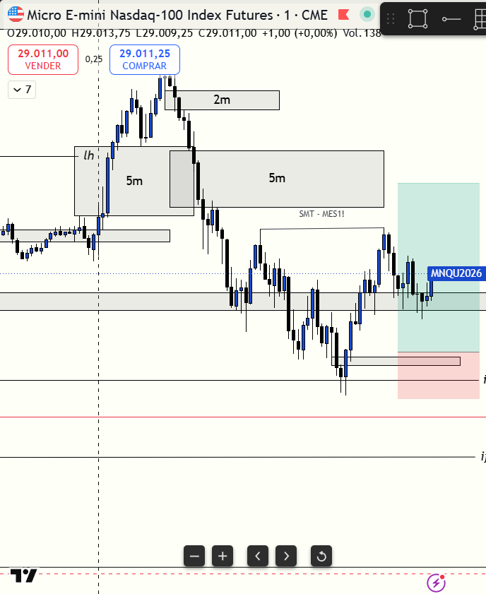

# 📅 BITÁCORA DE TRADING — 20 de Julio de 2026
**Pre-Trade Link:** [[2026-07-20_pre_trade]]

## 📊 RESUMEN GENERAL DE LA SESIÓN
- **Resultado Neto:** `+$289.50 USD` (3 contratos en cuenta Apex PAAPEX5465670000001)
- **Trades Realizados:** `1`
- **Resultado:** `WIN` 🟢

---

## 🖼️ CAPTURA DE PANTALLA

*(Captura enfocada en la temporalidad de 1m del iFVG de tu entrada)*

---

## 🔍 ANÁLISIS ESTRUCTURAL DE TEMPORALIDADES (TOP-DOWN)
### 1. Temporalidades Mayores (HTF: 4h / 1h)
- **Bias:** Bullish local 🟢 (Nasdaq liderando)
- **Narrativa:** El bias proyectado desde el pre-trade era alcista debido a la fuerza relativa de Nasdaq sobre S&P 500 y la presencia del SMT Alcista. El mercado macro se encontraba cotizando dentro de la caja de demanda de 4H (`29026.50 - 29079.00`).

### 2. Temporalidades Intermedias (30m / 15m)
- **Zonas clave (POIs):** El precio de Nasdaq defendió con fuerza el soporte macro de 4H y no permitió que la caída barriera más allá del rango de descuento de 30m, marcando una acumulación limpia frente a S&P.

### 3. Temporalidad de Ejecución (5m / 2m / 1m)
- **Gatillo / Desplazamiento:** Reacción inmediata tras la barrida de mínimos de Londres en S&P 500 (`MES`). Se formó un **iFVG de 1m** en Nasdaq (`MNQ`) con fuerte desplazamiento y volumen de absorción institucional.

---

## 📈 REPORTE DETALLADO DE LOS TRADES
### 🟢 TRADE #1: Long en MNQ (3 contratos)
- **Entrada:** `28946.00` (09:23:01 AM)
- **Salida:** `28994.25` (09:32:36 AM)
- **Stop Loss:** `28921.00` (Riesgo: 25.00 puntos)
- **R:R Realizado:** `1.93`
- **MAE:** `22.50 puntos` (90 ticks)
- **MFE:** `69.50 puntos` (278 ticks)
- **PnL Neto:** `+$289.50 USD` (48.25 puntos)
- **Resultado:** WIN 🟢

---

## 🧠 CENTRO DE APRENDIZAJE Y RETROALIMENTACIÓN (MÉTODO STEENBARGER)

> [!TIP]
> **TARJETA DE MEMORIA DE RÁPIDA CONSULTA (Revisar antes de abrir el mercado)**
> - **El Foco de Hoy:** La Sincronización Inter-Mercado por SMT en London Low te dio la entrada en el activo más fuerte (MNQ) mientras MES barría la liquidez.
> - **Acción de Éxito a Repetir (Músculo):** Respetar la fuerza relativa para comprar el activo líder en zona de descuento macro.
> - **Error Crítico a Evitar (Eliminar):** Perseguir velas tardías y no esperar la absorción institucional y confirmación iFVG de 1m.

### ⚖️ Clasificación: Proceso vs. Resultado
- **Trade #1:** [+$289.50 USD] ➔ **Proceso:** CORRECTO (Buen Trade) \| *Razón:* Entrada completamente planificada desde el pre-trade utilizando el filtro de fuerza relativa (operar long en el activo más fuerte, MNQ) en total sincronía con el SMT en el London Low de MES, respetando las reglas de gatillo por iFVG de 1m y absorción de volumen.

### 📈 Plan de Acción Inmediato para la Próxima Sesión
- **Qué mantendré:** El escaneo sistemático multitemporal de premarket y el filtrado por SMT de fuerza relativa para entrar solo en el activo líder.
- **Qué corregiré activamente:** Monitorear el nivel de Stop Loss en vivo mediante la herramienta de TradingView CDP para automatizar el cálculo del R:R exacto en el diario.
