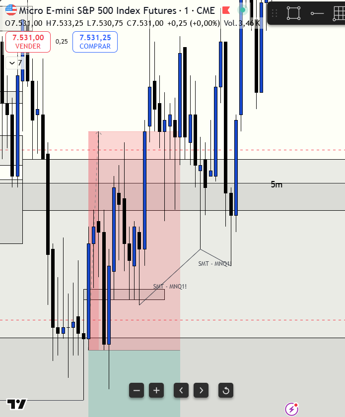
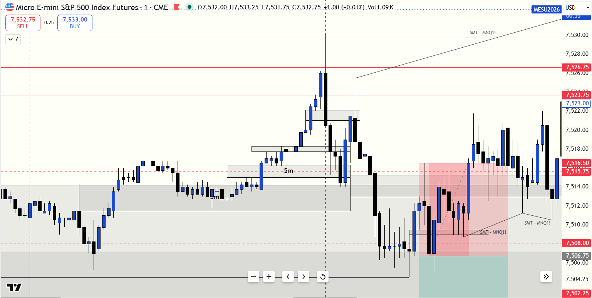

# 📅 BITÁCORA DE TRADING — 21 de Julio de 2026
**Pre-Trade Link:** [[2026-07-21_pre_trade]]

## 📊 RESUMEN GENERAL DE LA SESIÓN
- **Resultado Neto:** `-$315.00 USD` (6 contratos en cuenta Apex PAAPEX5465670000001)
- **Trades Realizados:** `1`
- **Resultado:** `LOSS` 🔴

---

## 🖼️ CAPTURA DE PANTALLA

---

## 🔍 ANÁLISIS ESTRUCTURAL DE TEMPORALIDADES (TOP-DOWN)
### 1. Temporalidades Mayores (HTF: 4h / 1h)
- **Bias:** Rango / Consolidación 🟡
- **Narrativa:** A nivel macro, el precio venía consolidando en un rango lateral establecido desde la sesión asiática. Al abrir Nueva York, el precio de Nasdaq (MNQ) subió y mitigó el inicio del **Daily Bearish FVG** (`29218.25 - 29396.75`) en la zona de `29225.00`, donde reaccionó a la baja. Sin embargo, no hubo quiebre ni cierre con cuerpo por debajo del London Low (`29087.75`), lo que confirmó que el contexto seguía siendo de Consolidación (Día de Rango) y no de Expansión bajista.

### 2. Temporalidades Intermedias (30m / 15m)
- **Zonas clave (POIs):** El soporte principal fue el **5m Bullish FVG** (`7506.00 - 7507.00` en MES) y el bloque de demanda local de 15m. La resistencia fue el Daily FVG mitigado arriba.

### 3. Temporalidad de Ejecución (5m / 2m / 1m)
- **Gatillo / Desplazamiento:** El gatillo de entrada fue muy bueno: un **5m Bearish FVG** y la posterior invalidación de un **1m Bullish FVG** (iFVG de 1m). El precio cayó con fuerza a `7506.75` en la vela de las 08:52 GYE. Sin embargo, la entrada ocurrió en la parte baja del rango local de consolidación (Discount), lo que la invalidaba estructuralmente.

---

## 📈 REPORTE DETALLADO DE LOS TRADES
### 🔴 TRADE #1: Short en ES (MES 09-26)
- **Entrada:** `7506.75` (08:52 AM)
- **Salida:** `7517.25` (09:00 AM)
- **Stop Loss:** `7517.25` (Riesgo: 10.50 puntos)
- **Take Profit:** `7485.75`
- **R:R Realizado:** `0.0`
- **MAE:** `10.50 puntos` (42 ticks)
- **MFE:** `0.00 puntos` (0 ticks)
- **Resultado:** LOSS 🔴 (`-$315.00 USD` aprox. más comisiones)

### ⚪ TRADE #2 (NO TOMADO): Short en ES (MES 09-26)
- **Entrada Proyectada:** `7515.75 - 7516.50` (Retesteo de BPR / iFVG en Premium)
- **Stop Loss Proyectado:** `7523.75` (Riesgo: ~7.25 a 8.00 puntos)
- **Take Profit Proyectado:** `7508.00` (Objetivo de liquidez local)
- **R:R Proyectado:** `1:1.06`
- **Resultado Proyectado:** WIN 🟢 (El precio alcanzó y barrió el objetivo en `7508.00`)
- **Tipo de Error:** Desconcentración y pérdida de foco tras stop loss inicial (sesgo psicológico de frustración).
- **Confluencias Técnicas:**
  * **Absorción en Heatmap:** Órdenes limitadas de venta en el ask resistiendo y deteniendo el precio.
  * **Estructura y POI:** Retesteo de un **BPR (Balanced Price Range)** que no era el FVG más grande del leg bajista (alta probabilidad de respeto en 1m).
  * **Ubicación:** Cotizando en la **Zona Premium** del rango intradía.
  * **SMT Divergence:** SMT bajista activo con MNQ en los máximos de la oscilación (MES barriendo máximos locales mientras MNQ sostenía máximos más bajos).
  * **CISD (Change in Status of Delivery):** Confirmado en MNQ en el gráfico de 1m antes de la caída.
- **Gráfico del Setup Missed:** 

---

## 🧠 CENTRO DE APRENDIZAJE Y RETROALIMENTACIÓN (MÉTODO STEENBARGER)

> [!TIP]
> **TARJETA DE MEMORIA DE RÁPIDA CONSULTA (Revisar antes de abrir el mercado)**
> - **El Foco de Hoy:** En días de rango/consolidación post-expansión, las reglas de Premium y Discount son estrictas: vender únicamente en Premium y comprar en Discount, ignorando gatillos de continuación de 1m en las partes bajas.
> - **Acción de Éxito a Repetir (Músculo):** Identificación precisa del gatillo de entrada (5m Bearish FVG + invalidación de 1m Bullish FVG).
> - **Error Crítico a Evitar (Eliminar):** Operar continuación en la parte baja del rango (Discount) sin LRLR a favor, ignorando que el ciclo del día era Consolidación (Rango) tras la Expansión de ayer.
> - **Error Conductual Adicional:** Perder la concentración post-stop. El trade del día se dio perfectamente en el retesteo del BPR en Premium con SMT y absorción del Heatmap, pero el ruido mental por el stop anterior impidió su ejecución.

### ⚖️ Clasificación: Proceso vs. Resultado
- **Trade #1:** [-$315.00 USD] ➔ **Proceso:** INCORRECTO (Mal Trade) \| *Razón:* Aunque el gatillo técnico de entrada fue perfecto (iFVG de 1m), se ejecutó sin contexto estructural (falta de Low Resistance Liquidity y venta en Discount dentro de un rango lateral). El spread rebalanceó a favor del Nasdaq fuerte, barriendo el stop.
- **Trade #2 (No Tomado):** [+$0.00 USD] ➔ **Proceso:** INCORRECTO (Error de Omisión por Desconcentración) \| *Razón:* El setup era excelente, completamente alineado al sesgo bajista inicial y en zona Premium con SMT y absorción en el ask. Se dejó pasar por falta de foco tras el primer stop.

### 📈 Plan de Acción Inmediato para la Próxima Sesión
- **Qué mantendré:** La precisión técnica en la búsqueda de gatillos (iFVG/FVG).
- **Qué corregiré activamente:** 
  1. Clasificar el tipo de día rigurosamente basándome en la estructura y ciclos (ayer expansión = hoy rango), esperando que el precio esté en la zona Premium (para shorts) y confirmando con el índice fuerte (MNQ) antes de operar en el débil.
  2. **Disciplina Post-Stop:** Si toco un stop, debo tomar una respiración de 2 minutos para limpiar la mente, reactivar mi concentración y seguir buscando activamente setups de alta probabilidad en zonas Premium/Discount válidas en lugar de desconectarme o frustrarme.
