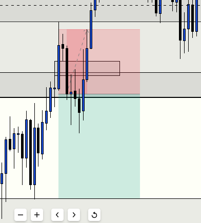
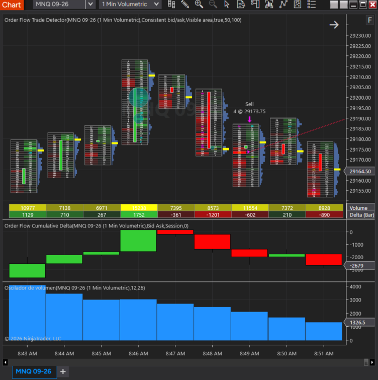
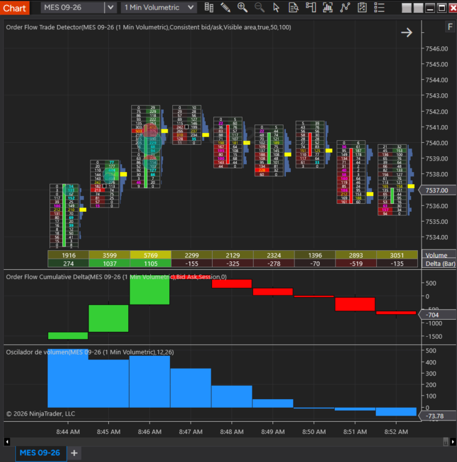
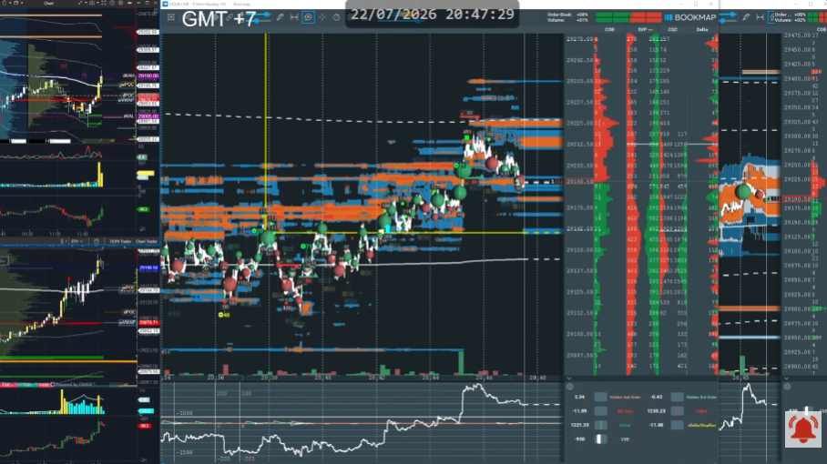
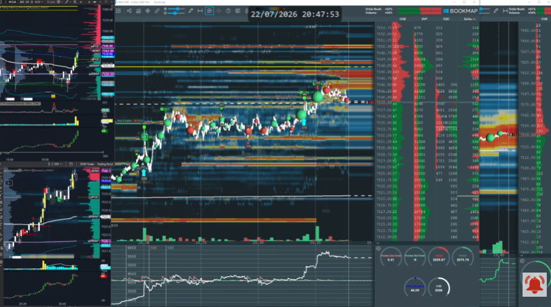
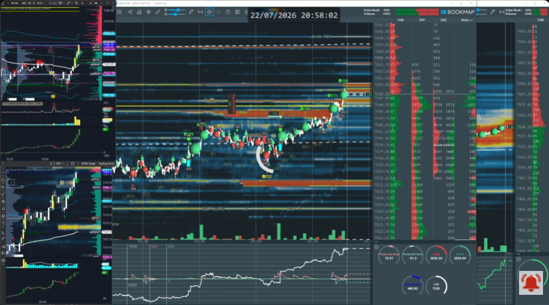
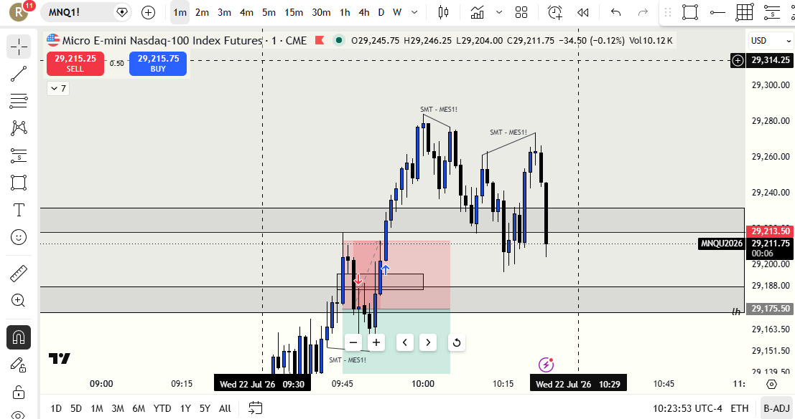
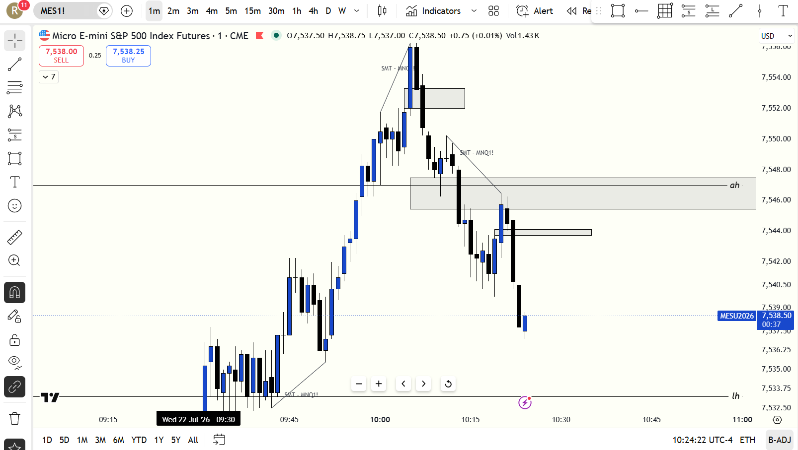

# 📅 BITÁCORA DE TRADING — 22 de Julio de 2026
**Pre-Trade Link:** [[2026-07-22_pre_trade]]

## 📊 RESUMEN GENERAL DE LA SESIÓN
- **Resultado Neto:** `-246.00 USD`
- **Trades Realizados:** `1`
- **Resultado:** `LOSS`

---

## 🖼️ CAPTURAS DE PANTALLA
### 1. Ejecución Real del Trade (Detalle de Entrada y Salida)

### 2. Entrada y Ejecución (MNQ 1m Volumetric)

### 3. Flujo de Órdenes y Libro de S&P 500 (MES 1m Volumetric)

### 4. Mapas de Liquidez en Bookmap (Heatmaps)
* **Nasdaq (MNQ) Liquidez:**

* **S&P 500 (MES) Muro de Venta (8:47 AM):** Muro inicial en `7542.50 - 7547.00`:

* **S&P 500 (MES) Absorción y Breakout (8:58 AM):** Burbujas verdes consumiendo el muro. *Nota: Esta rotura del muro de venta institucional fue el catalizador que invalidó la idea bajista y motivó la salida del trade (Stop Loss) para evitar una pérdida mayor:*

### 5. Desarrollo Posterior y Desplazamientos (09:24 AM)
* **Nasdaq (MNQ 1m):** Divergencia SMT y Squeeze tardío a Asia High:

* **S&P 500 (MES 1m):** Toma de Asia High (`7547.00`) y Desplazamiento Bajista Limpio:

---

## 🔍 ANÁLISIS ESTRUCTURAL DE TEMPORALIDADES (TOP-DOWN)
### 1. Temporalidades Mayores (HTF: 4h / 1h)
- **Bias:** Alcista 🟢 en MNQ (sosteniendo Grey Box de 4H y FVG 1H) | Bajista 🔴 en MES.
- **Narrativa:** MNQ cotizaba en zona de descuento macro (Discount) muy defendida tras la mecha de las 09:30 AM, mientras que MES mostraba una estructura macro bajista presionando hacia abajo en el premarket.

### 2. Temporalidades Intermedias (30m / 15m)
- **Zonas clave (POIs):** Línea institucional `ifl 1h` en `29016.75` actuando como soporte principal en MNQ. Resistencia de venta (muro de limitadas) en ES Bookmap en `7542.50 - 7547.00`.

### 3. Temporalidad de Ejecución (5m / 2m / 1m)
- **Gatillo / Desplazamiento:** Rebotó fuertemente en el Open con una mecha de 30 puntos en la vela de 1m de las 09:30 AM. Generó un desplazamiento alcista consecutivo rápido que rompió máximos locales con flujo LRL (Low Resistance Liquidity).

---

## 📈 REPORTE DETALLADO DE LOS TRADES
### 🔴 TRADE #1: Short en MNQ 09-26
- **Entrada:** `29173.75` (Short) a las 08:48:00
- **Stop Loss:** `29204.50`
- **Take Profit (Planificado):** `29043.25`
- **Exit Price:** `29204.50` (Stop Loss Fill) a las 08:53:03
- **MAE:** `30.75` puntos
- **MFE:** `21.75` puntos
- **Resultado:** `Loss (-$246.00 USD)`

---

## 🧠 CENTRO DE APRENDIZAJE Y RETROALIMENTACIÓN (DEBATE DE PROCESO)

### ⚖️ El Debate de la Fuerza Relativa (Líder vs. Rezagado y Objetivos de Liquidez)

#### 1. La Idea de Entrada y la Hipótesis del Usuario (Lógica Discrecional):
*   **Confluencias del Setup:** El trade se basó en una confluencia de factores técnicos en la apertura de Nueva York:
    *   Tanto Nasdaq (MNQ) como S&P 500 (MES) estaban cotizando muy cerca del máximo de la sesión de Londres (**London High**), aproximándose a esa liquidez.
    *   El precio se encontraba mitigando la zona de resistencia del FVG bajista de 4H y 1H en MNQ.
    *   En las temporalidades de 1m y 3m, tras la reacción bajista inicial en la resistencia, se formó un **iFVG bajista** (el precio cerró por debajo de un FVG alcista previo).
*   **Estructura de LRL (Low Resistance Liquidity) a favor:** El usuario identificó que tras el movimiento vertical alcista inicial, la estructura interna en 1m había dejado ineficiencias de compra desprotegidas. Al momento del gatillo (08:48 AM), el gráfico presentaba un camino de baja resistencia (LRL) a favor de la caída.
*   **El FVG de 5m como Objetivo:** Existía un FVG de 5m inmitigado ubicado más abajo del precio, el cual actuaba como el imán principal de liquidez y objetivo lógico para el trade, ofreciendo una excelente relación Riesgo/Beneficio (R:R) debido a la distancia amplia desde el punto de entrada (`29173.75`).
*   **Distancia al Objetivo (Lógica de Mentores PB & TJR):** El usuario fundamenta su análisis de fuerza relativa en la teoría de sus mentores:
    *   **MES** estaba cotizando extremadamente cerca de su objetivo alcista principal del premarket (su **Asia High**).
    *   **MNQ** estaba significativamente más lejos de su propio Asia High.
    *   *Lógica:* El activo que está más cerca de su objetivo de liquidez (MES) es el que ya consumió su impulso y se quedó sin "gasolina" de compra, estando listo para distribuir o revertir primero (fuerza vendedora latente). Por el contrario, el activo que está lejos (MNQ) es el rezagado (*laggard*) y, en teoría, el más débil en el momentum inmediato porque tiene más espacio para caer si el mercado gira.

#### 2. La Validación de la Narrativa de Caída (¿Quién tenía la razón?):
*   **La confirmación posterior le da la razón al usuario:** Alrededor de las 10:00 AM NYT, una vez que MES barrió formalmente su Asia High (`7547.00`) y se quedó sin liquidez alcista inmediata (toma de BSL completada):
    *   **MES experimentó el desplazamiento bajista más limpio, fuerte y violento** de la mañana, desplomándose de `7556.00` a `7537.50` (-18.5 puntos).
    *   **MNQ** (el activo fuerte macro) resistió la caída, retrocediendo con mucha fricción y de forma sucia.
*   Esto confirma que la lectura del usuario sobre MES siendo el activo ideal para shortear (y el que poseía la verdadera fuerza vendedora de fondo una vez mitigado su objetivo HTF) era **100% correcta**.

#### 3. ¿Por qué falló el trade en el momento de la ejecución? (La Trampa del Breakout y Absorción):
A pesar de la validez del análisis macro del usuario, el trade falló en el micro-timing debido a la dinámica de subasta en tiempo real:
*   **Absorción del Muro de ES:** El short se apoyaba en el gran muro de órdenes limitadas de venta en ES (`7542.50 - 7547.00`). Sin embargo, en Bookmap se observó que el precio no rechazó el muro; por el contrario, los compradores agresivos inyectaron un volumen inmenso (**burbujas verdes gigantes** en `shot_085825.png`) y devoraron por completo la liquidez del muro.
*   **Desaparición del Techo:** Al absorberse todas las órdenes limitadas de venta, la resistencia desapareció y el precio en ES se disparó hacia arriba en un breakout / short squeeze.
*   **Catch-Up Squeeze en MNQ:** La explosión alcista de ES (líder) obligó a MNQ (rezagado) a experimentar un *catch-up squeeze* violento para ponerse al día y cerrar la brecha con el líder antes de la reversión real de las 10:00 AM. Esto barrió tu Stop Loss en `29204.50`.
*   **Absorción Oculta en MNQ Volumetric:** En la vela de las 08:50 AM (un minuto después de tu entrada), el precio de MNQ cerró en una vela roja, pero su delta cerró en **positivo (`+210`)** con `7372` de volumen. Esto indicaba que compradores institucionales pasivos estaban absorbiendo todas las ventas a mercado, frenando el retroceso hacia tu objetivo de FVG de 5m.
*   **Rotación del Cumulative Delta:** El delta de la sesión en NT8 rotó agresivamente de `-5868` a `+2421`, confirmando que el mercado estaba en un día de expansión de tendencia alcista local, donde los FVGs bajistas macros se invalidan temporalmente en lugar de sostener el precio.

---

### 🎙️ Feedback del Mentor Blake (pbblake) & Análisis del Segundo Short (MES vs. MNQ)
He analizado la grabación de pantalla del mentor Blake (`ScreenRecording_07-22-2026 09-34-19_1.mp4`) contrastándola con tu perspectiva de scalping rápido en MES:

#### 1. La Postura de Blake (Análisis Narrativo vs. Mecánico):
*   **La trampa de los imbalances vacíos:** Blake advierte que muchos traders shortean de forma puramente mecánica en temporalidades micro (1m iFVG) simplemente porque ven "imbalances inmitigados" abajo (como el 5m FVG y el 15m FVG). Explica que **el mercado no tiene la obligación de mitigar esos imbalances de forma inmediata**.
*   **Bajo HTF Protegido (Protected Low):** Al hacer zoom out al gráfico de 1H, el mínimo que se intenta targetear con el short es un **mínimo protegido**, ya que barrió liquidez previa en una zona de descuento macro y reaccionó con fuerte momentum de compra (el rechazo masivo de las 09:30 AM). Vender en contra de esta reacción alcista tan violenta es intentar ir contra la corriente ("never fade this trend").
*   **Rebote en el Breaker:** En lugar de rellenar los imbalances de 5m/15m, el precio suele mitigar únicamente el breaker block local para luego continuar expandiendo con fuerza hacia arriba, atrapando a los shorts mecánicos en un squeeze ("flush up").

#### 2. Tu Perspectiva de Scalping ("Tomar tu porción de la torta"):
*   Reconoces la veracidad de lo que dice Blake (el precio no caería a rellenar los gaps macros). Sin embargo, argumentas que **el segundo short en MES era atractivo para un scalp rápido** debido a que MES mostró un desplazamiento bajista significativamente más fuerte y limpio que MNQ tras barrer el Asia High. Tu objetivo no era esperar la mitigación de los FVGs de 5m/15m, sino simplemente capturar una "porción de la torta" en el retroceso del líder.

#### 3. Síntesis y Veredicto de Riesgo (IA Risk Mentor):
*   La idea de tomar un "scalp rápido" en el activo débil (MES) tiene lógica técnica debido al desplazamiento limpio, pero **el riesgo conductual sigue siendo extremadamente alto en un día de Expansión (Trend Day)**. 
*   En días con Cumulative Delta en expansión positiva (+2421 en NT8), los deltas de retroceso suelen ser muy pequeños y efímeros. Shortear aquí es de alto riesgo porque los compradores institucionales están listos para reanudar la subida a la primera señal (por ejemplo, al tocar el breaker block del que habla Blake).

---

## 🛡️ TARJETA DE MEMORIA DE RÁPIDA CONSULTA
> [!IMPORTANT]
> **TARJETA DE MEMORIA DE RÁPIDA CONSULTA**
> - **El Foco de Hoy:** Confirmar la subasta (absorción vs rechazo) en Bookmap y el Cumulative Delta de NT8 antes de shortear resistencias.
> - **Acción de Éxito a Repetir (Músculo):** Esperar pacientemente el retroceso al iFVG y evaluar el R:R mínimo de 1:2.
> - **Error Crítico a Evitar (Eliminar):** Shortear el activo fuerte (MNQ) y jugar en contra del delta positivo acumulado en una sesión de tendencia alcista local.

### ⚖️ Clasificación: Proceso vs. Resultado
- **Trade #1:** Loss (-$246.00 USD) ➔ **Proceso:** **INCORRECTO (Mal Trade / Gestión Correcta)** | *Razón:* Entrada no válida debido al contexto general del mercado (operar contratendencia en un día de expansión alcista contra el activo fuerte MNQ). No obstante, el análisis de tu setup (LRL a favor, FVG 5m como imán y lógica de TJR/PB de distancia al objetivo) fue correcto y se validó con la fuerte caída de MES posterior. El trade falló en el timing por una absorción agresiva del muro en Bookmap post-entrada. Tu salida (Stop Loss) fue disciplinada y correcta al invalidarse el muro de MES.

### 📈 Plan de Acción Inmediato para la Próxima Sesión
- **Qué mantendré:** El marcado de POIs macro, iFVGs y la lógica de distancia al objetivo para seleccionar el activo a operar.
- **Qué corregiré activamente:** Validar que el líder (MES) confirme el rechazo real del objetivo (burbujas rojas y delta negativo) antes de ejecutar el short en el laggard (MNQ), y monitorear la rotación del Cumulative Delta en NT8 para no operar contra flujos masivos de absorción.
