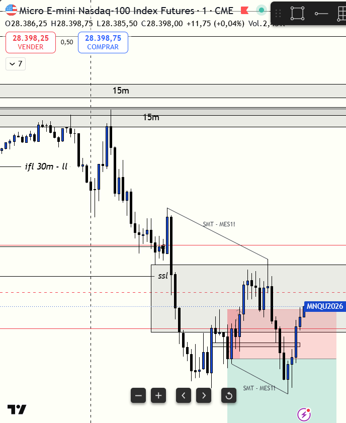

# 📅 BITÁCORA DE TRADING — 24 de Julio de 2026
**Pre-Trade Link:** [[2026-07-24_pre_trade]]

## 📊 RESUMEN GENERAL DE LA SESIÓN
- **Resultado Neto:** `-197.00 USD`
- **Trades Realizados:** `3`
- **Resultado:** `LOSS`

---

## 🖼️ CAPTURA DE PANTALLA


---

## 🔍 ANÁLISIS ESTRUCTURAL DE TEMPORALIDADES (TOP-DOWN)
### 1. Temporalidades Mayores (HTF: 4h / 1h)
- **Bias:** Alcista local (S&P 500 liderando) 🟢 | Nasdaq en rango/bajista local 🔴.
- **Narrativa:** MES abrió cotizando en el descuento del FVG de 4H y del Asian Range. Nasdaq se mostró pesado estructuralmente. El Asian Low (`al`) de MES en `7433.50` funcionó como el imán magnético de liquidez (DOL) macro y soporte institucional del día.

### 2. Temporalidades Intermedias (30m / 15m)
- **Zonas clave (POIs):** A las 09:02 AM, `MES` barrió el Asian Low (`7433.50`) ingresando en zona de descuento profundo (Discount OB de 30m/15m) e inició una reversión alcista violenta que arrastró al mercado en contra de cualquier posición corta secundaria.

### 3. Temporalidad de Ejecución (5m / 2m / 1m)
- **Gatillo / Desplazamiento:** Trades 1 y 2 en MES basados en el retesteo del iFVG de 2m. Trade 3 en MNQ ejecutado en el iFVG de 1m, pero operado mecánicamente de forma aislada y sin contexto, chocando contra el rebote del Asian Low de MES.

---

## 📈 REPORTE DETALLADO DE LOS TRADES
### 🔴/🟢 TRADE #1: Long en ES (MES 09-26) - Temporalidad 2m
- **Entrada:** `7452.50` (08:47:07)
- **MAE:** `4.0 ticks` (1.0 punto)
- **MFE:** `20.0 ticks` (5.0 puntos)
- **Resultado:** `BE` (+0.25 puntos / +$7.50 USD). 
- **Lógica:** Entrada por retesteo de iFVG de 2m. Salida defensiva y manual en BE a los 18 segundos de iniciar la vela de las 08:50 AM, la cual colapsó 16 puntos. Excelente gestión del riesgo que evitó el drawdown.

### 🔴/🟢 TRADE #2: Long en ES (MES 09-26) - Temporalidad 2m
- **Entrada:** `7446.50` (08:50:29)
- **MAE:** `0.0 ticks`
- **MFE:** `1.0 tick` (0.25 puntos)
- **Resultado:** `BE` (+0.25 puntos / +$7.50 USD). 
- **Lógica:** Re-entrada en el retesteo del FVG anterior tras la caída. El usuario se salió a los 9 segundos en BE accidentalmente por retraso de ejecución en plataforma. Este error actuó a favor, salvándolo de un drawdown posterior a los `7431.25`.

### 🔴 TRADE #3: Short en MNQ (MNQ 09-26) - Temporalidad 1m
- **Entrada:** `28342.50` (09:05:00)
- **MAE:** `221.0 ticks` (55.25 puntos)
- **MFE:** `36.0 ticks` (9.0 puntos)
- **Resultado:** `Loss` (-53.0 puntos / -$212.00 USD).
- **Lógica:** Entrada en corto por iFVG de 1m (Mech Model). Operación completamente impulsiva y reactiva (FOMO/venganza) al haber dudado en un trade ganador previo. Entrada sin Draw on Liquidity abajo y en contra de la acumulación de MES que acababa de barrer su Asian Low, generando una expansión alcista rápida.

---

## 🧠 CENTRO DE APRENDIZAJE Y RETROALIMENTACIÓN (MÉTODO STEENBARGER)

> [!TIP]
> **TARJETA DE MEMORIA DE RÁPIDA CONSULTA (Revisar antes de abrir el mercado)**
> - **El Foco de Hoy:** El *Gatillo Mecánico* (iFVG de 1m) es un filtro de ejecución de 20% de peso; no puede imponerse al *Contexto de Liquidez* (Asian Low / Reversión macro de MES) de 80% de peso.
> - **Acción de Éxito a Repetir (Músculo):** Salida defensiva manual rápida (Trade 1 @ BE) al leer la fuerza del orderflow contrario.
> - **Error Crítico a Evitar (Eliminar):** Compensar la culpa. Dudar de un trade ganador y luego forzar un trade perdedor "para no quedarte fuera" es un bucle de autosabotaje financiero.

### ⚖️ Clasificación: Proceso vs. Resultado
- **Trade #1:** [+$7.50 USD] ➔ **Proceso: CORRECTO (Buen Trade)** | *Razón:* Entrada alineada a la estructura de 2m de MES y salida defensiva inmediata en BE al detectar el colapso masivo de orderflow de las 08:50 AM.
- **Trade #2:** [+$7.50 USD] ➔ **Proceso: CORRECTO (Buen Trade)** | *Razón:* La hipótesis de re-entrada en zona de descuento era válida. La salida en 0 por error de lag del bróker terminó funcionando a favor, pero el proceso técnico original respetó los niveles.
- **Trade #3:** [-$212.00 USD] ➔ **Proceso: INCORRECTO (Mal Trade)** | *Razón:* Entrada impulsiva por FOMO compensatorio y venganza del viernes. Violación directa del filtro de soportes (Asian Low en MES) y del filtro matemático de ML (44.7% WR).

---

### 🔍 ANÁLISIS DE PSICOLOGÍA OPERATIVA EN PROFUNDIDAD (EL BUCLE DE LA CULPA)

Hoy caíste en una de las trampas más sutiles y devastadoras del trading discrecional: **El Bucle del FOMO Compensatorio**. Esta es la autopsia psicológica de por qué tu cerebro decidió presionar el gatillo sabiendo que el trade era erróneo.

#### 1. La Presión del Historial Semanal (El Ego Amenazado)
*   **El Estado Mental Inicial:** Llegaste al viernes arrastrando un balance de `1 Win, 3 Losses y 1 No-Trade Day`. En la neurociencia del trading, esto genera un estado latente de **"hambre de dopamina"** y una urgencia subconsciente por *recuperar* la cuenta antes del cierre semanal para salvaguardar tu ego.
*   **La Tasa de Dolor por Omisión:** Temprano en la sesión, dudaste y dejaste pasar un setup de alta probabilidad que funcionó perfectamente. Esto disparó en tu córtex prefrontal la **culpa por omisión** ("lo vi, era bueno y no lo tomé"). 

#### 2. La Adicción al Mech Model como Anestésico
*   **El Gatillo Reactivo:** Cuando apareció el iFVG de 1m en `MNQ` a las 09:05 AM, tu cerebro no lo procesó de forma racional. Lo interpretó como una **"segunda oportunidad de rescate"** para aliviar la culpa previa y cerrar la semana en positivo.
*   **Por qué el Mech Model es Adictivo:** Un modelo puramente mecánico (ej. iFVG cerrado) reduce la carga cognitiva. El cerebro adora las reglas que requieren cero pensamiento discrecional ("si cruza A, presiono B"). Usaste el *Mech Model* como una excusa técnica y un escudo moral ("estoy siguiendo mi modelo") para justificar una entrada emocional que sabías que no tenía contexto de liquidez.

#### 3. El Error de Desconexión Inter-Mercado
*   **Ignorar al Líder:** El short de `MNQ` se ejecutó al segundo exacto en que `MES` (el mercado líder de la sesión con Score +3.5) acababa de barrer su Asian Low en `7433.50` y tocaba un Demand OB de 15m/30m. Era el punto de máxima probabilidad de rebote alcista. Tu adicción al *Mech Model* en `MNQ` te cegó de la barrida de liquidez del soporte líder en `MES`.

---

### 🎓 GUÍA DE APRENDIZAJE: CÓMO DISTINGUIR EL CONTEXTO EN EL FUTURO

Para desprogramar esta adicción, a partir de la próxima sesión debes implementar la **Fórmula Secuencial de Aprobación en Dos Niveles (Contexto ➔ Gatillo)**:

```text
               +-------------------------------------------+
               |  ¿DÓNDE ESTÁ EL IMÁN DE LIQUIDEZ (DOL)?   |
               |  (¿El precio tiene espacio libre de 15pt? |
               |   ¿Hay soportes/resistencias en contra?)   |
               +---------------------++--------------------+
                                     ||
                              [SI]   ||   [NO]
                                     \/   \/
               +---------------------+    +--------------------+
               | NIVEL 1 APROBADO:   |    |    ❌ NO TRADE     |
               |  Evaluar el Gatillo |    | (El Mech Model no  |
               |  Mecánico (iFVG/OB) |    |  existe sin espacio|
               +----------++---------+    +--------------------+
                          ||
                   [SI]   ||   [NO]
                          \/   \/
               +----------+    +--------------------+
               | EXECUTE  |    |    ❌ NO TRADE     |
               |  TRADE   |    | (Espera retroceso) |
               +----------+    +--------------------+
```

#### 🛡️ Regla de Interconexión Semanal:
*   Si dejas pasar un trade ganador, **bloquea la terminal por 15 minutos**. Sal a caminar o toma agua. Ese espacio de tiempo es crucial para que los niveles de cortisol y dopamina en tu cerebro se estabilicen, impidiendo la ejecución de "trades de venganza" o FOMO compensatorio.

