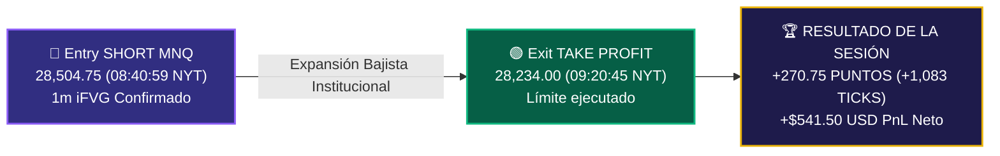

# 🩸 Autopsia de Sesión: 2026-07-27

🔗 **Enlaces de la Red Neuronal:**
* 🔗 [Ver Reporte Pre-Trade y Escáner de Confluencias de hoy](2026-07-27_pre_trade.md)
* 🧠 [Ground Truth — Verdades Absolutas del Sistema](../ground_truth.md)

---

## 📊 Resumen Ejecutivo y Métricas Monetarias
* **Resultado de la Sesión:** `WIN` 🏆
* **PnL Neto:** **`+$541.50 USD`**
* **Recorrido Total Capturado:** **`+270.75 Puntos` (`+1,083 Ticks`)**
* **Tasa de Acierto de la Sesión:** `100%` (1 de 1 operaciones ganadas)
* **Cuenta Operada:** `PAAPEX5465670000001` (NinjaTrader 8)

---

## 📈 Captura y Registro de la Operación

### 📋 Detalle Oficial de Ejecuciones (NinjaTrader 8 API)
| Id Ejecución | Instrumento | Acción | Precio | Hora NYT | Estado |
| :--- | :--- | :--- | :--- | :--- | :--- |
| `548454102200_1` | `MNQ 09-26` | **SHORT (1 Contrato)** | **`28,504.75`** | `08:40:59` | Filled |
| `548454102318_1` | `MNQ 09-26` | **LONG / TP (1 Contrato)** | **`28,234.00`** | `09:20:45` | Filled (Limit) |

---

## 🔍 Análisis Técnico & Confluencias de Entrada (Bookmap + Order Flow NT8)

### 1. Lectura del Order Flow en Bookmap (Heatmap en Vivo)
* **Confirmación Pasiva (Ask Limit Wall):** Al momento de evaluar el recap visual (`09:41 NYT`), el precio de NQ retesteó la franja entre **`28,507.50` y `28,512.50`**, donde Bookmap mostraba un muro de órdenes límite de venta (94 a 129 contratos pasivos) y un pico del perfil de volumen (SVP) de **4,131 contratos**.
* **Absorción Institucional:** Múltiples mechas verdes de compra chocaron contra el muro pasivo y fueron instantáneamente absorbidas por ventas institucionales, colapsando el CVD de `-500` a `-1360`.

### 2. Footprint y Order Flow Volumetric (NinjaTrader 8 Trade Detector)
* 📊 **En S&P 500 (`MES 09-26` 1 Min Volumetric) — [Screenshot 100005.png](file:///C:/Users/rsama/Downloads/Screenshot%202026-07-27%20100005.png):**
  * **Clara Absorción Compradora:** En la cima del movimiento (`7513.00 - 7514.00`), el Order Flow Trade Detector registró un **círculo cyan gigante** con un volumen masivo de **6,866 contratos** y un Delta comprador de **+922**. La oferta pasiva absorbió el 100% de la compra a mercado, frenando el precio en seco y generando la reversión.
* 💻 **En Nasdaq (`MNQ 09-26` 1 Min Volumetric) — [Screenshot 100025.png](file:///C:/Users/rsama/Downloads/Screenshot%202026-07-27%20100025.png):**
  * **Absorción y Giro de Delta (Flecha `Sell 1 @ 28504.75`):** Muestra una absorción menos vistosa en círculos pero **extremadamente violenta en el giro del Delta**: tras una vela alcista previa con volumen de 18,628 y Delta `+1848`, el mercado giró inmediatamente a Delta `-882`, `-1320` y `-1341` en la vela de entrada (`28,504.75`), validando la entrada en el iFVG de 1m en el mercado más débil.

### 2. Fuerza Relativa e Inferencia SMT
* **Regla de Selección del Mercado Débil:** En la preparación pre-trade, Nasdaq (`MNQ`) fue clasificado como el mercado **más débil (Score -2.5)** en comparación con S&P 500 (`MES`, Score -0.5).
* **Sincronía SMT:** Al observar la confirmación de FVG bajista de 5m en `MES`, el trader seleccionó correctamente ejecutar la venta en `MNQ` utilizando el **iFVG de 1m**, maximizando la velocidad y amplitud de la caída bajista hacia los mínimos de 1H (`28,234.00`).

---

## ⚖️ Proceso vs. Resultado (Neurociencia Cognitive Rating)

* **Calificación Técnica del Proceso:** **`A+ (Excelente)`**
* **Apego al Plan Operativo:** `100%`
* **Control Emocional (FOMO / Revenge):** `0% Errores` (No hubo entradas por impulso ni persecución de precio).

---

## 📌 Tarjeta de Memoria de Rápida Consulta (Callout)

> [!TIP]
> **LECCIÓN DE RETENCIÓN DE HOY:**
> * **Alineación con la Fuerza Relativa Paga con Creces:** Cuando se busca un Short, elegir el mercado más débil (`MNQ`) frente al más fuerte (`MES`) garantiza recorridos explosivos y limpios.
> * **El Heatmap Confirma la Inserción de Oferta:** La presencia de muros pasivos en Bookmap (4,131 contratos acumulados) combinada con el iFVG de 1m ofrece la máxima confluencia para definir el Stop Loss con riesgo mínimo.
