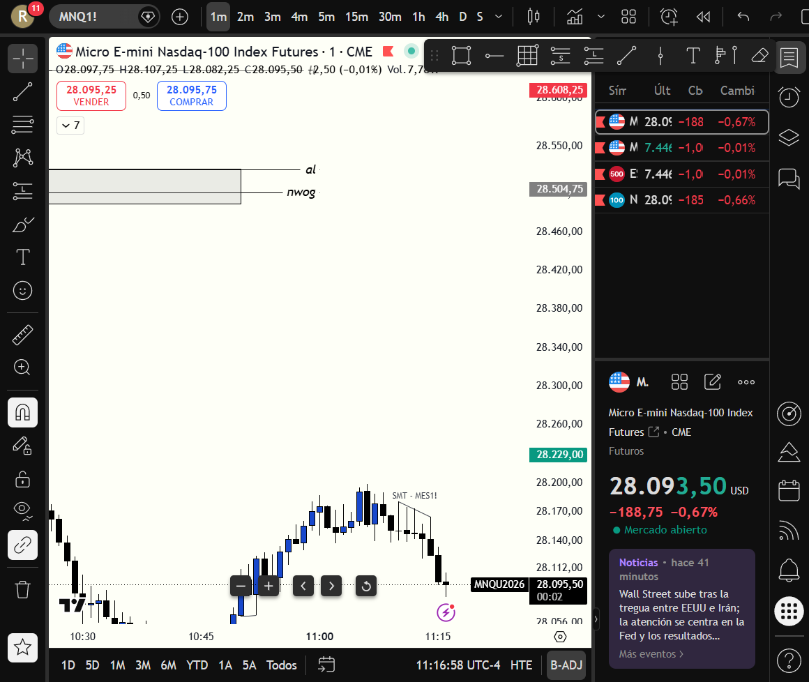
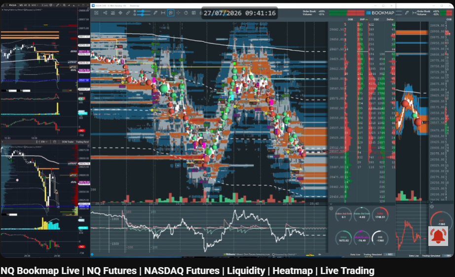
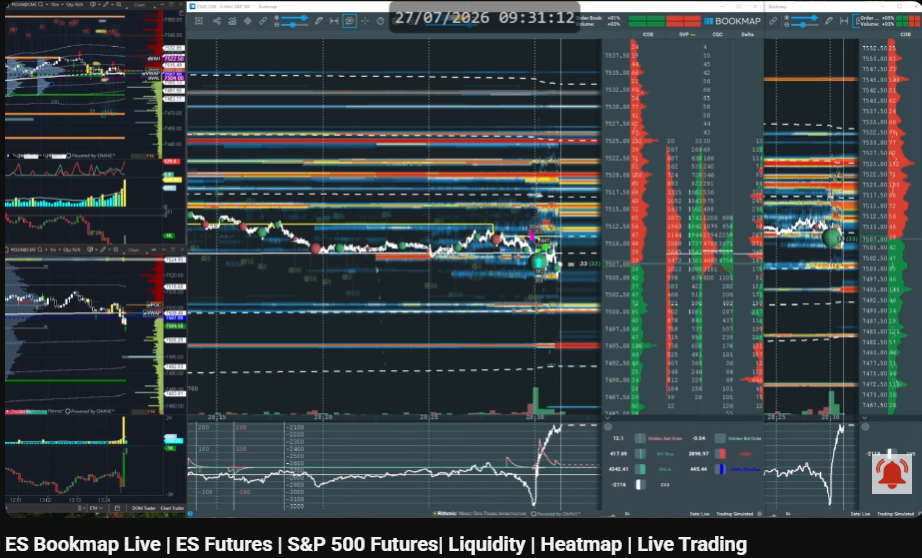
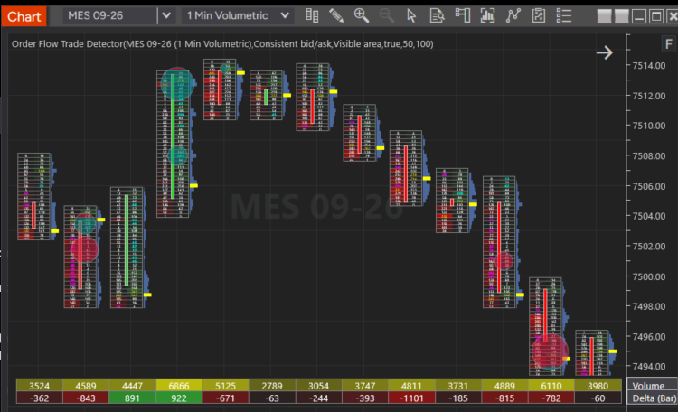
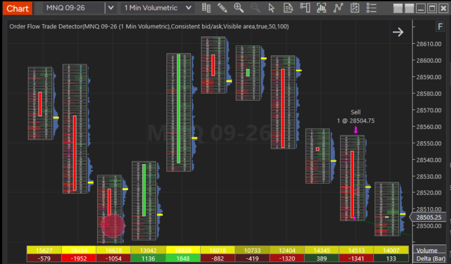

# 🩸 Autopsia de Sesión: 2026-07-27

🔗 **Enlaces de la Red Neuronal:**
* 🔗 [Ver Reporte Pre-Trade y Escáner de Confluencias de hoy](2026-07-27_pre_trade.md)
* 🧠 [Ground Truth — Verdades Absolutas del Sistema](../ground_truth.md)

---

## 📊 Resumen Ejecutivo y Métricas Monetarias
* **Resultado de la Sesión:** `WIN` 🏆
* **PnL Neto:** **`+$541.50 USD`**
* **Recorrido Total Capturado:** **`+270.75 Puntos` (`+1,083 Ticks`)**
* **Tasa de Acierto de la Sesión:** `100%` (1 de 1 operaciones ganadas)
* **Cuenta Operada:** `PAAPEX5465670000001` (NinjaTrader 8)

---

## 📸 Gráfico de la Operación en TradingView (MNQ 1 Minuto)

* 🔗 [Ver archivo de imagen original del gráfico MNQ 1m](file:///C:/Users/rsama/Documents/proyecto-geminicli/trading-journal/imagenes/2026-07-27_chart.png)

---

## 💭 Proceso de Pensamiento & Explicación del Trader

> [!IMPORTANT]
> **HIPÓTESIS Y SELECCIÓN DEL MERCADO (EXPLICACIÓN DEL TRADER):**
> 
> *"Al monitorear TradingView en la Killzone, observaba en S&P 500 (`MES`) una estructura de **continuación bajista en 5m (5m Bearish FVG)** con una confirmación de **1m iFVG**.*
> 
> *Sin embargo, aplicando estrictamente la regla del sistema que me indicaste (donde el escáner premarket clasificó a Nasdaq `MNQ` como el **mercado más débil y bajista**, NQ Score `-2.5` vs ES Score `-0.5`), decidí **ejecutar el trade en MNQ en su iFVG de 1m a `28,504.75`**.*
> 
> *Aunque vi el movimiento de continuación en MES, preferí tomar MNQ porque al haber también un iFVG de 1m y ser el índice más débil, ofrecía la mayor velocidad de aceleración en el desplome hasta el TP en `28,234.00` (+270.75 pts)."*

---

## 📉 Capturas de Bookmap Heatmap (09:41 NYT)

### 💻 Nasdaq 100 (`MNQ`) Bookmap Heatmap

* 🔗 [Ver archivo de imagen Bookmap NQ](file:///C:/Users/rsama/Documents/proyecto-geminicli/trading-journal/imagenes/2026-07-27_heatmap_nq.png)

### 📊 S&P 500 (`MES`) Bookmap Heatmap

* 🔗 [Ver archivo de imagen Bookmap ES](file:///C:/Users/rsama/Documents/proyecto-geminicli/trading-journal/imagenes/2026-07-27_heatmap_es.png)

---

## 🌊 Capturas de Order Flow Footprint (NinjaTrader 8)

### 📊 S&P 500 (`MES`) 1 Min Volumetric (Trade Detector)

* 🔗 [Ver archivo de imagen Order Flow MES](file:///C:/Users/rsama/Documents/proyecto-geminicli/trading-journal/imagenes/2026-07-27_orderflow_es.png)

* **Absorción Compradora Masiva:** En la cima del movimiento (`7513.00 - 7514.00`), el *Trade Detector* registró un **círculo cyan gigante** con un volumen masivo de **6,866 contratos** y un Delta comprador de **`+922`**. Toda la compra a mercado fue absorbida por la oferta pasiva institucional, frenando el precio e iniciando la reversión bajista.

### 💻 Nasdaq (`MNQ`) 1 Min Volumetric (Trade Detector & Execution Arrow)

* 🔗 [Ver archivo de imagen Order Flow MNQ](file:///C:/Users/rsama/Documents/proyecto-geminicli/trading-journal/imagenes/2026-07-27_orderflow_mnq.png)

* **Giro de Delta Violento (`Sell 1 @ 28504.75`):** Muestra una absorción menos vistosa en círculos pero extremadamente agresiva en el giro del Delta: la vela alcista previa registró un volumen de 18,628 con Delta `+1,848`, e inmediatamente la vela de entrada (`28,504.75`) giró a Delta **`-1,341`** con **14,513 contratos**, confirmando el gatillo en el iFVG de 1m.

---

## 📋 Detalle Oficial de Ejecuciones (NinjaTrader 8 API)
| Id Ejecución | Instrumento | Acción | Precio | Hora NYT | Estado |
| :--- | :--- | :--- | :--- | :--- | :--- |
| `548454102200_1` | `MNQ 09-26` | **SHORT (1 Contrato)** | **`28,504.75`** | `08:40:59` | Filled |
| `548454102318_1` | `MNQ 09-26` | **LONG / TP (1 Contrato)** | **`28,234.00`** | `09:20:45` | Filled (Limit) |

---

## 📌 Tarjeta de Memoria de Rápida Consulta (Callout)

> [!TIP]
> **LECCIÓN DE RETENCIÓN DE HOY:**
> * **Alineación con la Fuerza Relativa Paga con Creces:** Cuando se observa una continuación bajista en `MES` (5m FVG), la mejor decisión operativa es vender el mercado **más débil (`MNQ`)**, ya que ofrece el mayor recorrido (+270.75 pts).
> * **La Combinación iFVG 1m + Order Flow / Bookmap:** La absorción pasiva en Bookmap y el giro de Delta en Footprint confirmaron la validez del gatillo iFVG de 1m, logrando un trade sin drawdown significativo.
