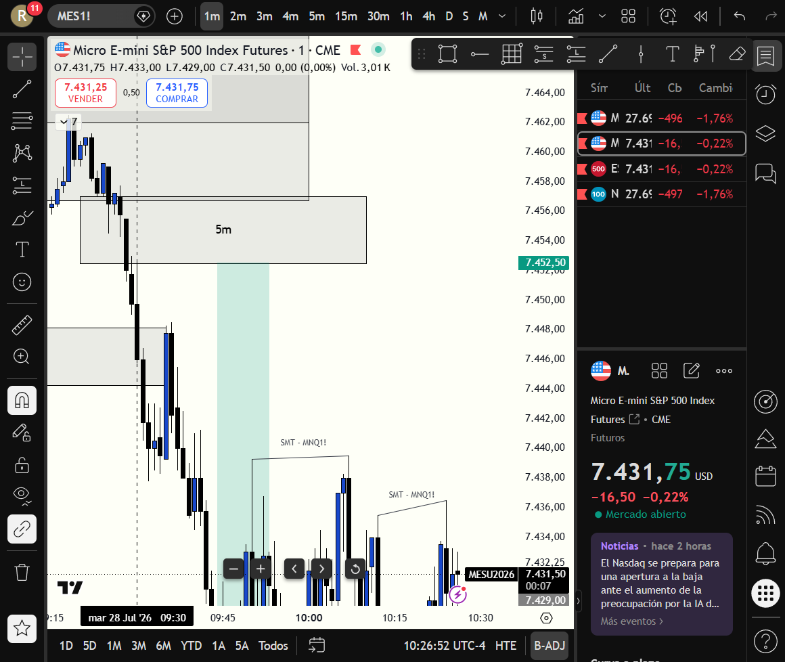
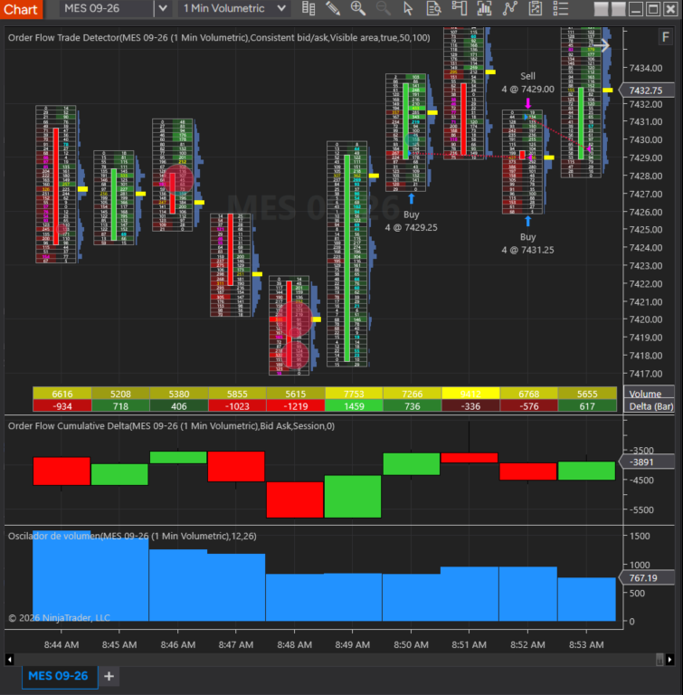
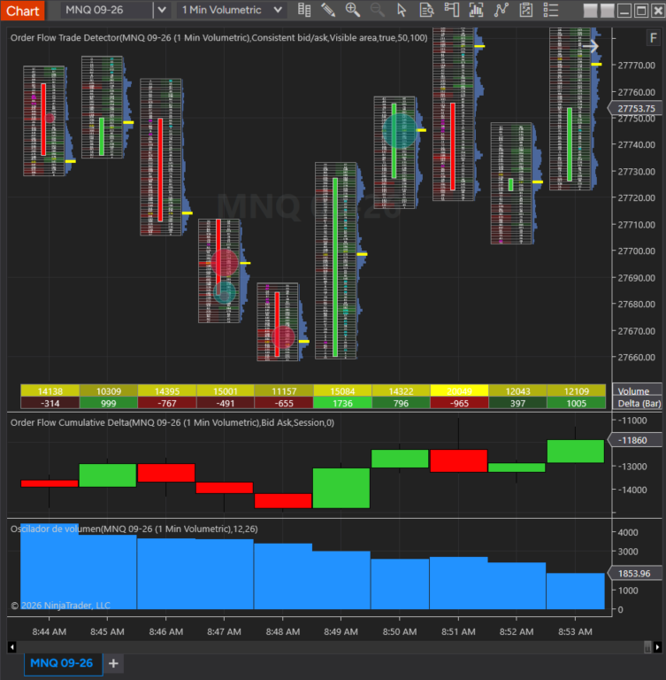
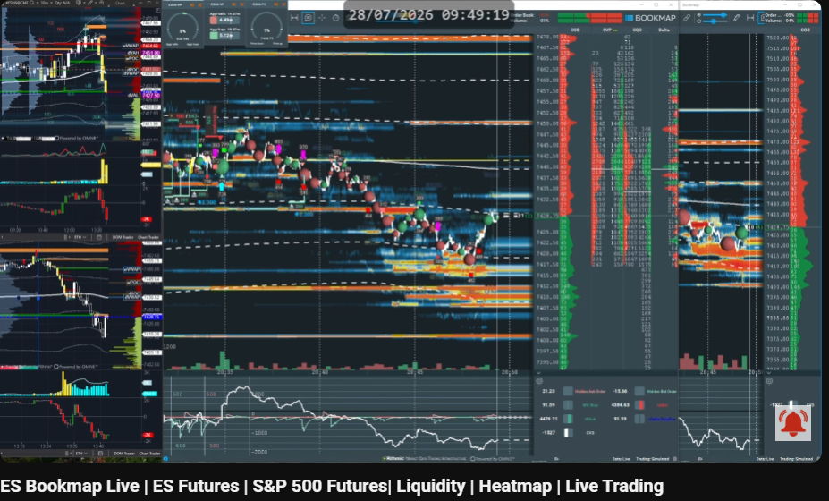
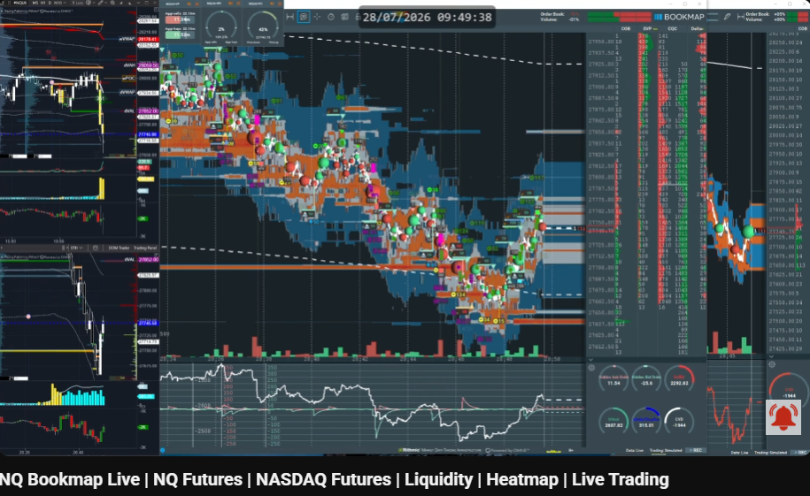
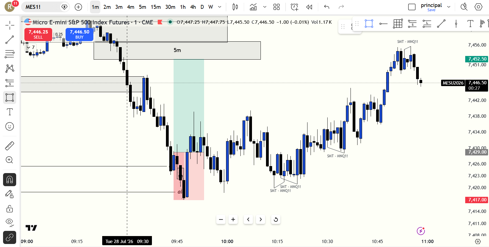

# 📅 BITÁCORA DE TRADING — 28 de Julio de 2026
**Pre-Trade Link:** [[2026-07-28_pre_trade]]

## 📊 RESUMEN GENERAL DE LA SESIÓN
- **Resultado Neto:** `-46.00 USD`
- **Trades Realizados:** `2`
- **Resultado:** `LOSS`

---

## 🖼️ CAPTURAS DE PANTALLA, TRADINGVIEW Y ORDER FLOW (MOMENTO DE ENTRADA)

### 📈 Gráfico Estructural en TradingView (1m — Entrada a las 09:47 NYT @ 7429.00)

* **TradingView 1m (MES1!):** Captura del momento de la entrada Long a las 09:47 NYT (08:47 GYE) en `7,429.00` sobre el iFVG de 1m, mostrando el bloque de resistencia Supply FVG de `5m` formado directamente por encima (`7,453.00 - 7,457.00`).

### 📊 Order Flow & Volumetría en NinjaTrader 8

* **MES 09-26 (1 Min Volumetric):** Muestra las ejecuciones exactas en NinjaTrader: `Buy 4 @ 7429.25` (08:50 AM) -> `Sell 4 @ 7429.00` (Salida defensiva manual en BE a las 08:52 AM al abrirse el FVG bajista de 5m); y `Buy 4 @ 7431.25` (Re-entrada por FOMO a las 08:52 AM).


* **MNQ 09-26 (1 Min Volumetric):** Cumulative Delta masivamente bajista (`-11,860`) confirmando la debilidad y presión vendedora en Nasdaq.

### 🌐 Heatmaps de Liquidez (Bookmap)

* **ES Bookmap Live (09:49 NYT):** Acción del precio reaccionando en el rango de soporte `7,428.75 - 7,425.00` (dVAL).


* **NQ Bookmap Live (09:49 NYT):** Desplazamiento bajista hacia `27,740.00` con CVD de `-1,944`.

### 🌐 Resolución Final del Mercado & Expansión Tardía

* **Resolución del Gráfico (10:00 - 11:00 NYT):** Demuestra que el análisis direccional Long en MES era **correcto en el marco macro** (el precio expandió finalmente hasta `7,456.00`). Sin embargo, antes de la expansión alcista, a las 09:48 NYT el mercado realizó un **sweep profundo hacia 7,417.00** para barrer la liquidez del Asian Low (`al`), imprimiendo múltiples divergencias SMT (`SMT - MNQ1!`) antes de despegar.

---

## 🔍 ANÁLISIS ESTRUCTURAL DE TEMPORALIDADES (TOP-DOWN)
### 1. Temporalidades Mayores (HTF: 4h / 1h)
- **Bias:** Bullish local en MES (S&P 500 liderando) 🟢 | Nasdaq pesado / bajista local 🔴.
- **Narrativa:** MES abrió cotizando cerca de zona de soporte, mientras Nasdaq mostró fuerte delta vendedor acumulado. La divergencia SMT premarket anticipaba distribución en NQ y soporte en MES.

### 2. Temporalidades Intermedias (30m / 15m)
- **Zonas clave (POIs):** En MES, el precio intentaba reaccionar desde el área de descuento en `7,429.00`. Sin embargo, en la temporalidad de 5m se estaba gestando una resistencia de Supply FVG bajista.

### 3. Temporalidad de Ejecución (5m / 2m / 1m)
- **Gatillo / Fuga Estructural:**
  - **Trade #1:** Entrada Long en MES (1m iFVG) a las 08:50 AM en `7,429.25`. A los 2 minutos (08:52 AM), se abrió un FVG bajista de 5m directamente arriba. El trader reconoció correctamente la jerarquía estructural (5m > 1m) y cerró de inmediato a mercado en BE (-0.25 pts / -$1.00 USD).
  - **Trade #2:** Inmediatamente después de salir del Trade 1, el precio retrocedió a retestear un FVG alcista de 1m. Impulsado por FOMO ("dije bueno es un retesteo"), el trader re-entró Long a las 08:52 AM en `7,431.25`. Sin embargo, al segundo recapacitó al ver que el FVG de 5m bajista bloqueaba la expansión, saliéndose inmediatamente (-2.25 pts / -$45.00 USD).

---

## 📈 REPORTE DETALLADO DE LOS TRADES
### 🔴/🟢 TRADE #1: Long en ES (MES 09-26) - Temporalidad 1m
- **Entrada:** `7429.25` (08:50:18)
- **Salida:** `7429.00` (08:52:10)
- **MAE:** `1.0 tick` (0.25 puntos)
- **MFE:** `4.5 ticks` (1.12 puntos)
- **Resultado:** `BE` (-0.25 puntos / -$1.00 USD PnL / BE).
- **Lógica:** Entrada Long basada en el iFVG de 1m. A los 2 minutos (08:52 AM) se abrió un FVG bajista en la temporalidad de 5m directamente por encima. El trader aplicó correctamente la regla de jerarquía de temporalidades (5m manda sobre 1m) y ejecutó una salida defensiva inmediata a mercado en BE. Excelente disciplina en la lectura del mapa superior.

### 🔴 TRADE #2: Long en ES (MES 09-26) - Temporalidad 1m
- **Entrada:** `7431.25` (08:52:25)
- **Salida:** `7429.00` (08:52:45)
- **MAE:** `3.0 ticks` (0.75 puntos)
- **MFE:** `0.5 ticks` (0.12 puntos)
- **Resultado:** `Loss` (-2.25 puntos / -$45.00 USD).
- **Lógica:** Re-entrada impulsiva por **FOMO** al ver el retroceso al FVG alcista de 1m. El trader pensó "es un retesteo", pero ignoró que la resistencia del FVG de 5m bajista acababa de nacer arriba. Al instante recapacitó, reconoció el sesgo impulsivo y cerró a mercado para cortar la pérdida rápido.

---

## 🧠 CENTRO DE APRENDIZAJE Y RETROALIMENTACIÓN (MÉTODO STEENBARGER)

> [!TIP]
> **TARJETA DE MEMORIA DE RÁPIDA CONSULTA (Revisar antes de la próxima sesión)**
> - **El Foco de Hoy:** Jerarquía de Temporalidades (5m FVG > 1m iFVG) & Respeto al Filtro de Desplazamiento. Un FVG recién abierto en 5m junto a un desplazamiento lento (*Displacement Failure*) exige salir defensivamente sin caer en el sesgo de apego.
> - **Acción de Éxito a Repetir (Músculo):** La salida defensiva en BE del Trade 1. Evitó una caída adversa de 12 puntos (48 ticks) hacia `7,417.00` que habría liquidado el Stop Loss.
> - **Error Crítico a Evitar (Eliminar):** El Micro-FOMO post-salida y la ilusión del "Retesteo Prematuro". No re-entrar en 1m si en 5m hay un veto estructural activo.

### ⚖️ Clasificación: Proceso vs. Resultado
- **Trade #1:** [-$1.00 USD / BE] ➔ **Proceso: CORRECTO (Excelente Gestión Defensiva)** | *Razón:* La hipótesis macro Long era válida, pero al formarse el FVG bajista de 5m y ver un desplazamiento lento (*Displacement Failure*), la salida en BE previno la liquidación en el sweep posterior de `7,417.00`.
- **Trade #2:** [-$45.00 USD] ➔ **Proceso: INCORRECTO (Mal Trade con Rápida Recapacitación)** | *Razón:* Entrada impulsiva por FOMO al retesteo de 1m violando la resistencia de 5m recién formada. La recapacitación inmediata a los 20 segundos evitó un drawdown mayor.

---

### 🔍 ANÁLISIS DE PSICOLOGÍA OPERATIVA Y CAUSA RAÍZ (DEBATE TÉCNICO VIRTUD VS. MECANICISMO)

#### 1. Perspectiva del Trader (Contexto Subjetivo & Emocional)
* **La Intención Macro:** El análisis direccional estuvo correcto desde el inicio: el soporte de Bookmap sostuvo y el mercado terminó expandiendo a `7,456.00`.
* **Motivo de la Salida:** La decisión de no sostener (*holdear*) el trade se fundamentó en tres factores reales:
  1. La aparición de la resistencia del FVG bajista de 5m directamente arriba.
  2. El desplazamiento lento y sin momentum (*Displacement Failure* de la regla de exclusión C del manual).
  3. El factor psicológico de venir de una racha difícil previa, lo que redujo la tolerancia cognitiva para aguantar casi 1 hora de consolidación y chop en la zona de entrada.

#### 2. Análisis de Antigravity (La Verdad Objetiva del Gráfico & Anti-Sesgo Post-Hoc)
* **La Salida en BE Salvó la Cuenta de Stop Out:** Mirando la gráfica completa (`2026-07-28_expansion_resolution.png`), a las 09:48 NYT el mercado cayó a **`7,417.00`** para barrer el Asian Low (`al`) antes de subir. Si hubieras sostenido el trade de `7,429.00`, habrías sufrido una caída de **12 puntos enteros (48 ticks)** que habría destruido la posición y tocado el Stop Loss. Tu salida defensiva en BE fue **la decisión técnicamente correcta que protegió la cuenta**.
* **El Error de Timing, No de Bias:** La dirección alcista era correcta, pero la entrada en `7,429.00` fue prematura (ocurrió antes de la barrida final del Asian Low en `7,417.00`). La verdadera entrada A+ ocurrió a las 10:15 - 10:30 NYT tras confirmarse las múltiples divergencias SMT (`SMT - MNQ1!`) en la zona de `7,417.00`.
* **Cuidado con el Sesgo de Resultados Post-Hoc:** Es vital no racionalizar *"debí haberlo holdeado porque al final llegó a 7,456"*. El mercado expandió **después** de liquidar a todos los compradores prematuros en `7,417.00`. Romper el plan para sostener un trade con un FVG de 5m en contra en medio de un *Displacement Failure* habría sido un error metodológico gravísimo. Salir defensivamente fue una virtud.

---

### 🎓 GUÍA DE APRENDIZAJE: REGLA DE JERARQUÍA EN DOS NIVELES

```text
               +-------------------------------------------+
               |  ¿EXISTE RESISTENCIA DE 5M/15M ARRIBA?    |
               |  (¿Un FVG/OB bajista recién abierto?)    |
               +---------------------++--------------------+
                                     ||
                              [SI]   ||   [NO]
                                     \/   \/
               +---------------------+    +--------------------+
               | ❌ NO LONG IN 1M    |    |  ✅ PERMITIDO LONG |
               | (La TF de 5m domina |    |  (Vía libre para   |
               |  sobre el 1m iFVG)  |    |   expandir a TP)   |
               +---------------------+    +--------------------+
```
