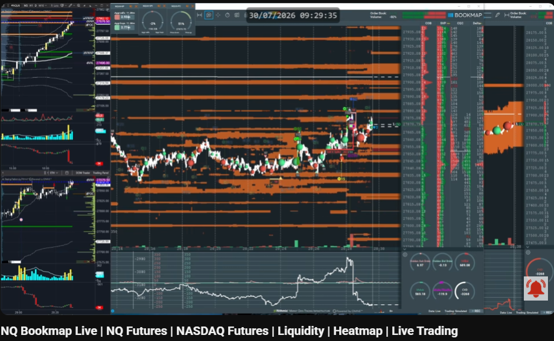
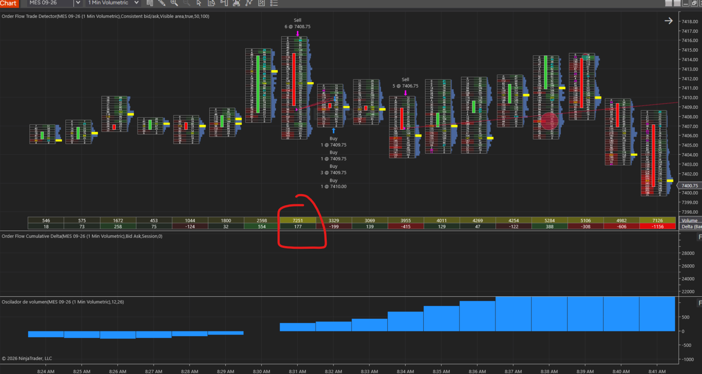
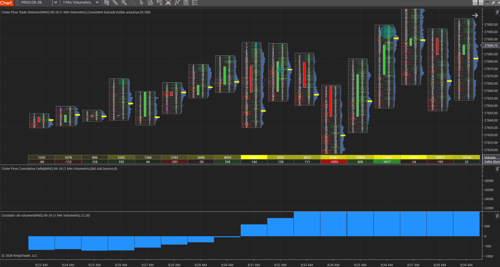
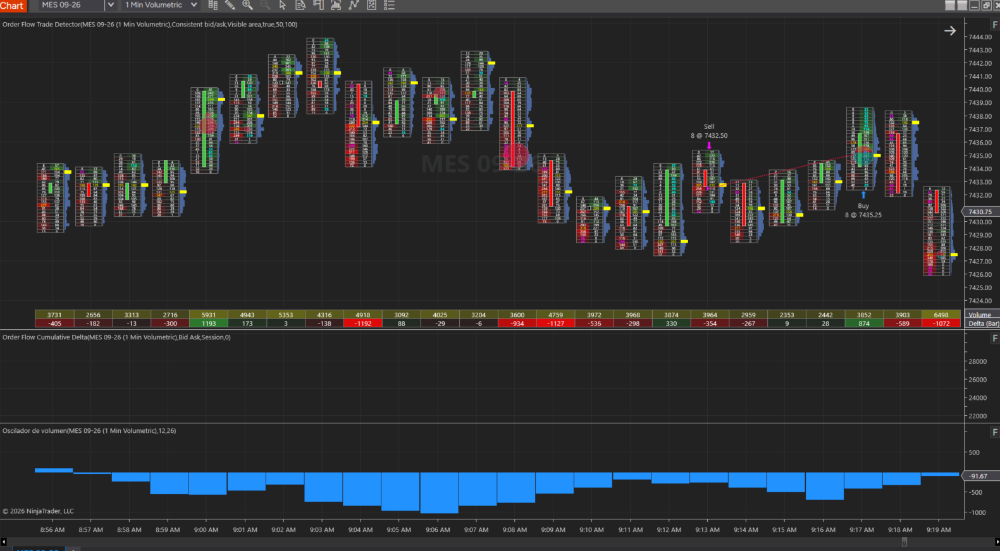
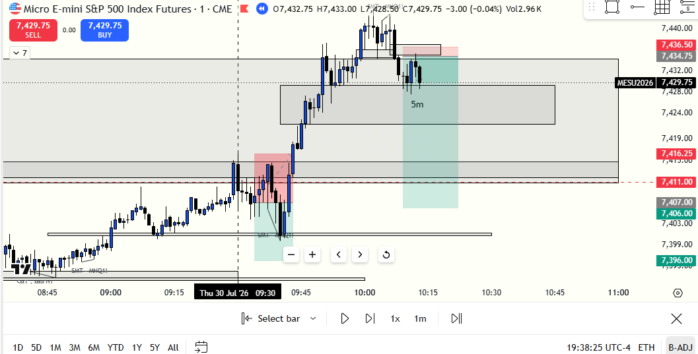
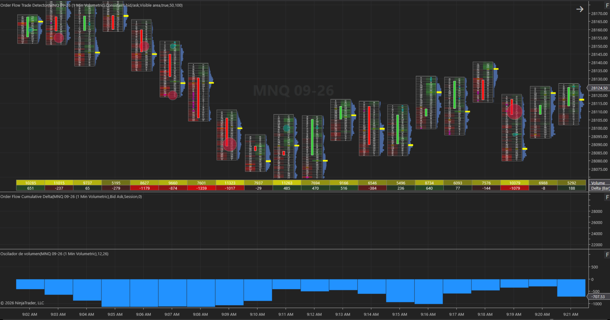

# 📅 BITÁCORA DE TRADING — 30 de Julio de 2026
**Pre-Trade Link:** [[2026-07-30_pre_trade]]

## 📊 RESUMEN GENERAL DE LA SESIÓN
- **Resultado Neto:** `-225.00 USD`
- **Trades Realizados:** `3`
- **Resultado:** `LOSS`

---

## 🖼️ CAPTURAS DE PANTALLA Y ANÁLISIS VISUAL EXTRAÍDOS DEL PDF DE LA SESIÓN

### 🌐 1. Mapa de Liquidez en el Open (Bookmap Live 09:29:35 NYT)

* **Bookmap NQ Live (09:29 NYT):** Mapeo pre-apertura mostrando el bloque denso de órdenes de venta pasivas (*Limit Sell Orders*) acumuladas en la parte alta entre `27,900` y `27,935`.

### 📊 2. Volumetría & Order Flow de Entrada — Trade #1 (NinjaTrader 8 @ 09:30 NYT)

* **MES 1 Min Volumetric (09:30:23 NYT):** Muestra la entrada `Sell 6 @ 7408.75`. La vela registró un volumen masivo de **`7,251 contratos`** con **Cumulative Delta POSITIVO (+177)**. El trader interpretó la mecha como absorción compradora, pero el delta positivo revelaba inyección de iniciativa compradora barriendo los bloques de venta pasiva.

### 📈 3. Ejecución & Desarrollo del Trade #2 (NinjaTrader 8 @ 09:33 NYT)

* **MES 1 Min Volumetric (09:33:59 NYT):** Muestra la re-entrada `Sell 5 @ 7406.75` al amague de CISD en 1m. La inercia alcista rompió la resistencia de 15m y sacó el Stop Loss a `7,410.00`.

### 🌐 4. Visualización del Trade #3 & Interpretación de Bolas Rojas (Bookmap Live 10:12 NYT)

* **Bookmap Live Trade #3:** Muestra la formación de "bolas rojas" en el nuevo máximo. El trader lo interpretó como *"compradores cerrando posiciones para caer"*, pero en la mecánica de subasta (Fabio/Supreme), las bolas rojas en máximos representan **ventas a mercado siendo absorbidas por compradores pasivos institucionales** para sostener la expansión alcista.

### 📈 5. Mapa Global de Ejecuciones en TradingView (MES 1m)

* **TradingView MES 1m:** Registro completo de los 3 trades. Muestra el quiebre impulsivo del Supply FVG de 15m y el despegue alcista hacia `7,435.00` y `7,489.50`.

### 🌐 6. Expansión Alcista Post-Trade (PattySwing en Contra)

* **Resolución Post-Trade en NQ:** Demuestra que el toque al Demand FVG inferior en el Open activó un **PattySwing Alcista Masivo** en lugar de bajista, impulsando a NQ +507 puntos (+1.85%) a favor del SMT Alcista premarket.

---

## 🔍 ANÁLISIS ESTRUCTURAL DE TEMPORALIDADES (TOP-DOWN)
### 1. Temporalidades Mayores (HTF: 4h / 1h)
- **Bias Real de la Sesión:** Bullish Sincronizado en 1H/30m/15m 🟢 | Premarket con **`+5,228` CVD en NQ y SMT Alcista activo**.
- **Narrativa Real del Mercado:** El mercado no estaba distribuyendo para caer; estaba realizando un retesteo de descuento en el Open para lanzar un **PattySwing Alcista de Expansión** que barrió todos los niveles de resistencia de 15m/30m hacia `7,489.50`.

### 2. Temporalidades Intermedias (30m / 15m)
- **Zonas clave (POIs):** Las cajas de Supply FVG de 15m (`7,411.00 – 7,436.00` en MES) actuaron como imanes de liquidez de atracción alcista en lugar de techos infranqueables.

### 3. Temporalidad de Ejecución (5m / 2m / 1m)
- **Gatillo / Fuga Estructural:**
  - **Trade #1:** Entrada Short en MES (6 contratos) a las 08:30:23 AM en `7,408.75` al toque de apertura. Salida en pánico por dudar de la mecha a los 50 segundos (-$33.75 USD).
  - **Trade #2:** Re-entrada Short en MES (5 contratos) a las 08:33:59 AM en `7,406.75` intentando vender un 1m CISD. La vela de expansión alcista perforó la resistencia hasta `7,427.25` sacando el Stop Loss (-$81.25 USD).
  - **Trade #3:** 3er Trade fuera de plan por sobreloteo y desesperación emocional (8 contratos) a las 09:12 AM en `7,432.50`. El trader buscó recuperar lo perdido entrando en Short en el BPR de 1m. Salida en Stop Loss a `7,435.25` (-$110.00 USD).

---

## 📈 REPORTE DETALLADO DE LOS TRADES
### 🔴 TRADE #1: Short en ES (MES 09-26) - Temporalidad 1m
- **Entrada:** `7408.75` (08:30:23)
- **Salida:** `7409.75` (08:31:14)
- **MAE:** `1.0 tick` (0.25 puntos)
- **MFE:** `0.5 ticks` (0.12 puntos)
- **Resultado:** `Loss` (-1.00 puntos / -$33.75 USD PnL).
- **Lógica en PDF:** Entrada discrecional al ver bolas verdes en Bookmap pensando que era absorción vendedora. Sin embargo, el Footprint mostró un delta positivo (+177) con volumen de 7,251 contratos, revelando iniciativa compradora. Salida en pánico por duda emocional.

### 🔴 TRADE #2: Short en ES (MES 09-26) - Temporalidad 1m
- **Entrada:** `7406.75` (08:33:59)
- **Salida:** `7410.00` (08:42:13)
- **MAE:** `3.25 puntos` (13 ticks)
- **MFE:** `0.25 puntos` (1 tick)
- **Resultado:** `Loss` (-3.25 puntos / -$81.25 USD PnL).
- **Lógica en PDF:** Re-entrada al ver un CISD de 1m con desplazamiento. El trader no se fue a BE por ansiedad de recuperar la pérdida anterior. El precio continuó la expansión alcista del SMT y sacó el Stop Loss.

### 🔴 TRADE #3: Short en ES (MES 09-26) - Temporalidad 1m
- **Entrada:** `7432.50` (09:12:20)
- **Salida:** `7435.25` (09:16:13)
- **MAE:** `2.75 puntos` (11 ticks)
- **MFE:** `0.0 puntos` (0 ticks)
- **Resultado:** `Loss` (-2.75 puntos / -$110.00 USD PnL).
- **Lógica en PDF:** 3er Trade por desesperación psicológica (*Revenge Trading*) arriesgando 8 contratos. El trader vendió el retesteo del 1m FVG + BPR creyendo que las "bolas rojas" en el máximo eran ventas para caer. La mecánica de subasta reveló que eran compras pasivas absorbiendo ventas a mercado. Sacado en Stop Loss.

---

## 🧠 CENTRO DE APRENDIZAJE Y RETROALIMENTACIÓN (MÉTODO STEENBARGER & MENTORES)

> [!TIP]
> **TARJETA DE MEMORIA DE RÁPIDA CONSULTA (Revisar antes de la próxima sesión)**
> - **El Foco de Hoy:** Corrección de la Interpretación del Order Flow & Eliminación del Revenge Trading.
> - **Lectura Correcta de Delta y Bolas:** Un delta positivo (+177) con 7,200+ contratos en la apertura NO es absorción vendedora; es agresión compradora. Bolas rojas en un nuevo máximo representan ventas absorbidas por compradores pasivos.
> - **Acción de Éxito a Repetir (Músculo):** El desglose transparente del PDF. Traer la autopsia emocional y técnica sin filtros es el camino del trader profesional.

### ⚖️ Clasificación: Proceso vs. Resultado
- **Trade #1:** [-$33.75 USD] ➔ **Proceso: INCORRECTO (Error de Interpretación de Delta & Entrada Prematura)** | *Razón:* Entrada a mercado sin cierre de vela de 1m por debajo de un iFVG y confusión entre absorción pasiva e iniciativa activa.
- **Trade #2:** [-$81.25 USD] ➔ **Proceso: INCORRECTO (Choque contra la Expansión SMT)** | *Razón:* Operar un CISD de 1m contra el flujo comprador de +5,228 CVD de Nasdaq.
- **Trade #3:** [-$110.00 USD] ➔ **Proceso: INCORRECTO (Overtrading / Sobreloteo / Revenge Trading)** | *Razón:* Violación del límite diario de pérdidas aumentando la posición a 8 contratos en un intento desesperado de recuperar capital.

---

### 🔍 ANÁLISIS DE PSICOLOGÍA OPERATIVA Y CAUSA RAÍZ (EVALUACIÓN INTEGRAL DEL PDF)

#### 1. Lo que Estuvo BIEN en tu Análisis
* **Mapeo de Niveles Estructurales:** Identificaste con precisión los FVGs de 15m/30m, el POC de la sesión anterior y los puntos de liquidez externa (`Asia Low` y `London Low`).
* **Sinceridad y Autopsia Emocional:** El desglose de tus 13 páginas en el PDF revela que estás comprendiendo cómo tus emociones (ansiedad, prisa por recuperar, sesgo de apego) influyen en tu toma de decisiones.

#### 2. Lo que Estuvo MAL y Debes Corregir (Lecciones de Mentores)
* **Confusión entre Absorción Pasiva e Iniciativa Activa (Fabio Valentini / Supreme):**
  * Pensaste que las bolas verdes en el bloque limit eran absorción vendedora. Pero el delta de **`+177`** con **`7,251` contratos** demostró que los compradores a mercado arrasaron el muro de venta pasivo.
  * En el Trade #3, pensaste que las bolas rojas en el máximo eran "ventas para caer". Las bolas rojas en un nuevo máximo son **ventas a mercado siendo absorbidas por Limit Buys institucionales** para continuar la tendencia alcista.
* **El Sesgo de Confirmación y la Falsa "Protección" de los Highs:**
  * Creíste que los máximos estaban "protegidos" porque había FVGs de 15m arriba. En la teoría de **Cramz e ICT**, los FVGs no son muros infranqueables; si el premarket arrastra un **SMT Alcista activo**, los FVGs de resistencia actúan como **imanes de liquidez para ser perforados**.
* **El Sobreloteo por Desesperación (Steenbarger / TJR):**
  * Pasar de 5 a 8 contratos en el Trade #3 es la manifestación clásica del secuestro de la amígdala. Creer que *"el precio no tiene por qué volver ahí"* llevó a poner un SL mental o desproporcionado que costó -$110 USD.

---

### 🎓 GUÍA DE APRENDIZAJE: CORRECCIÓN DE LECTURA DE ORDER FLOW

```text
               +-------------------------------------------------+
               | ¿QUÉ INDICA EL FOOTPRINT EN UN NIVEL DE OFERTA? |
               +-----------------------++------------------------+
                                       ||
                                       \/
       +-------------------------------+-------------------------------+
       |                                                               |
 [DELTA NEGATIVO + RECHAZO]                                [DELTA POSITIVO + VOLUMEN ALTO]
 (Vendedores absorbieron compras)                          (Compradores destruyeron la oferta)
       |                                                               |
       \/                                                              \/
  ✅ SHORTS PERMITIDOS                                            ❌ PROHIBIDO SHORTEAR
  (Confirmar iFVG 1m)                                             (El mercado expandirá arriba)
```
