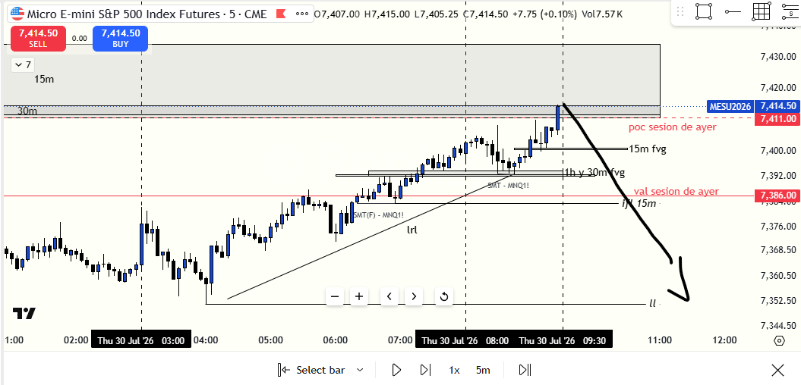
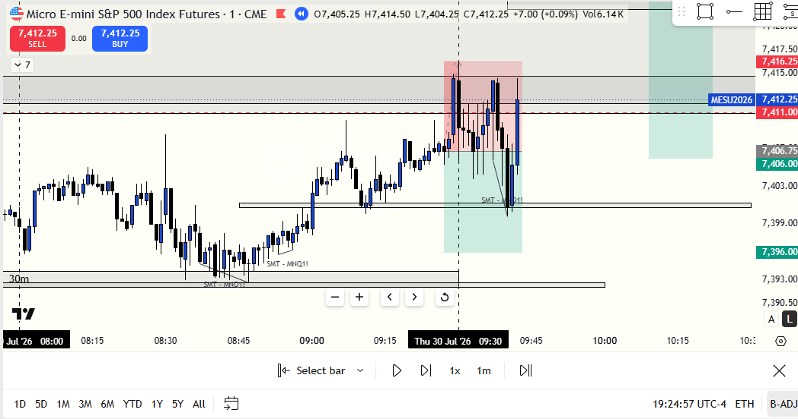
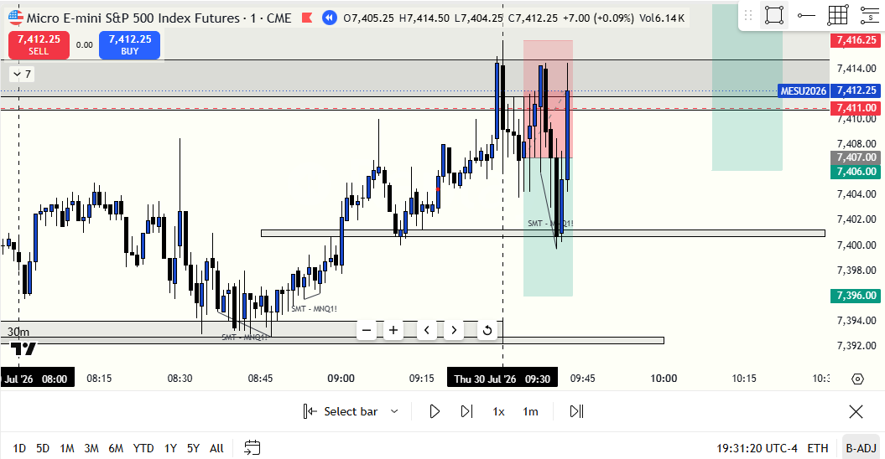
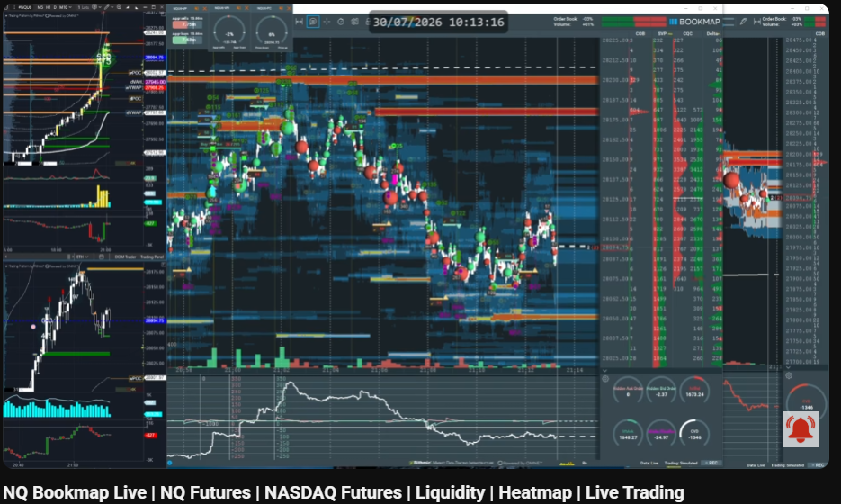
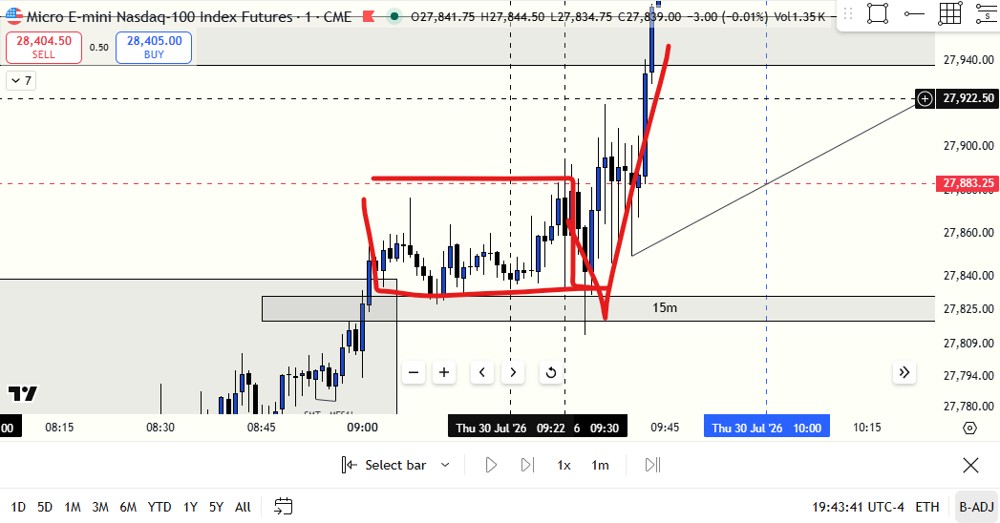

# 📅 BITÁCORA DE TRADING — 30 de Julio de 2026
**Pre-Trade Link:** [[2026-07-30_pre_trade]]

## 📊 RESUMEN GENERAL DE LA SESIÓN
- **Resultado Neto:** `-225.00 USD`
- **Trades Realizados:** `3`
- **Resultado:** `LOSS`

---

## 🗺️ CONTEXTO PREMARKET & HIPÓTESIS INICIAL (ANTES DE LAS 09:30 AM NYT)




### 🧠 Narrativa y Pensamiento del Trader Antes del Open
* **El Bias Concebido:** El trader construyó un sesgo vendedor (*Short Bias*), fundamentando su plan en que S&P 500 (`MES`) era el mercado más débil.
* **Mapa de Liquidez en Bookmap (`page_4_img_7.png`):** Se observó un bloque denso de órdenes limit de venta en la parte alta entre `27,900` y `27,935`, junto a dos FVGs bajistas de 15m/30m sin mitigar y el POC de la sesión previa.
* **El Objetivo Esperado:** El trader proyectaba que el precio tocaría esas resistencias y lanzaría un *PattySwing Bajista* a buscar el *Asia Low*, *London Low* y la liquidez de mínimos (*Sell-Side LRLR*). El trader asumió que los máximos estaban "protegidos" por los FVGs bajistas superiores.

---

## 🔴 TRADE #1: Short en ES (MES 09-26) - 08:30:23 AM GYE / 09:30:23 NYT @ 7,408.75




* **Entrada:** `Sell 6 @ 7408.75` (08:30:23 AM)
* **Salida:** `Buy 6 @ 7409.75 - 7410.00` (08:31:14 AM)
* **Resultado:** `Loss` (-1.00 puntos / -$33.75 USD PnL).

### 🔍 Desglose Técnico en 4 Niveles — Trade #1

#### 1. 💭 Qué creí que vi (Pensamiento del Trader en Vivo):
Vi en el heatmap de Bookmap una bola verde gigante al chocar con las órdenes de venta y que el precio empezó a bajar en la vela de 1m de las 09:30 NYT. Dije: *"¡Es absorción compradora, va a caer!"* y disparé el Short a mercado con 6 contratos en el primer segundo del Open.

#### 2. 📊 En realidad qué estaba viendo (La Verdad del Gráfico & Orderflow):
En el chart Volumétrico de NinjaTrader 8 (`page_5_img_10.png`), la vela registró un volumen masivo de **`7,251 contratos`** con un **Cumulative Delta POSITIVO (+177)**. Un delta positivo alto en el primer minuto del Open con 7,200+ contratos no es absorción vendedora pasiva; representa **iniciativa compradora a mercado devorándose el bloque limit de venta**.

#### 3. 🎯 Qué tenía que verse para que el trade fuera válido:
El manual de mentores exige **esperar a que la vela de 1m cierre con cuerpo completo por debajo de un FVG alcista** (convirtiéndolo en iFVG bajista) y que el delta en NinjaTrader sea marcadamente **negativo**. Disparar a mercado en el segundo 23 del Open sin cierre de vela es una entrada imprecisa por impulso.

#### 4. 🎓 Fundamentación en Notas de Mentores:
* **Fabio Valentini & Supreme Trading (Mecánica de Subasta):** *"Una bola verde grande en Bookmap contra un muro limit solo indica que hubo compras a mercado ejecutadas. Si el delta de la vela cierra positivo (+177), los compradores pasaron a través de la oferta. No asumas absorción a menos que veas delta negativo y mecha de rechazo."*
* **TJR:** *"Los primeros 3 minutos de la apertura (09:30 - 09:33 NYT) son de manipulación y alta volatilidad. Espera el cierre de la vela de confirmación."*

---

## 🔴 TRADE #2: Short en ES (MES 09-26) - 08:33:59 AM GYE / 09:33:59 NYT @ 7,406.75




* **Entrada:** `Sell 5 @ 7406.75` (08:33:59 AM)
* **Salida:** `Buy 5 @ 7410.00` (08:42:13 AM)
* **Resultado:** `Loss` (-3.25 puntos / -$81.25 USD PnL).

### 🔍 Desglose Técnico en 4 Niveles — Trade #2

#### 1. 💭 Qué creí que vi (Pensamiento del Trader en Vivo):
Tras salir del Trade #1 por pánico, sentí la ansiedad de haber cerrado antes de tiempo. Vi la formación de un 1m CISD con desplazamiento bajista y pensé: *"Mi idea inicial sigue viva, ya chocó contra la resistencia de 15m y va a bajar"*. Re-entré Short con 5 contratos. El trade se movió a mi favor un poco, pero no me fui a BE por la prisa de recuperar lo perdido. El precio se dio la vuelta y tocó el SL.

#### 2. 📊 En realidad qué estaba viendo (La Verdad del Gráfico & Orderflow):
El mercado estaba desatando la **expansión alcista impulsiva** predicha por el premarket scan (+5,228 CVD en NQ y SMT Alcista activo). El CISD de 1m en MES fue solo un falso retroceso superficial en micro-temporalidad. Al chocar contra la resistencia de 15m en `7,411.00`, la fuerza compradora perforó la caja con velas de cuerpo ancho de 1m, despegando hacia `7,427.25`.

#### 3. 🎯 Qué tenía que verse para que el trade fuera válido:
Si se decide tomar un trade de retroceso en LTF contra la inercia premarket, la regla del manual exige **mover el Stop a Breakeven (BE) tan pronto el precio dé el primer amague a favor** o abstenerse de vender cuando Nasdaq registra un descalce alcista masivo.

#### 4. 🎓 Fundamentación en Notas de Mentores:
* **Cramz & PB Trading:** *"Cuando el premarket viene respaldado por un SMT Alcista y delta positivo en el par líder (NQ), los CISD de 1m en contra son trampa de continuidad. La tendencia mayor de la Killzone arrolla las micro-estructuras en contra."*
* **Brett Steenbarger:** *"Ingresar a un segundo trade impulsado por la frustración de haber cerrado mal el primero es el desencadenante biológico del ciclo de pérdida de control."*

---

## 🔴 TRADE #3: Short en ES (MES 09-26) - 09:12:20 AM GYE / 10:12:20 NYT @ 7,432.50


* **Entrada:** `Sell 8 @ 7432.50` (09:12:20 AM)
* **Salida:** `Buy 8 @ 7435.25` (09:16:13 AM)
* **Resultado:** `Loss` (-2.75 puntos / -$110.00 USD PnL).

### 🔍 Desglose Técnico en 4 Niveles — Trade #3

#### 1. 💭 Qué creí que vi (Pensamiento del Trader en Vivo):
Mi psicología estaba totalmente quebrada. Había violado mi regla de no tradear tras dos pérdidas. Quería recuperar todo lo no ganado en el tiempo reciente y ver mi cuenta subir. En `7,432.50` vi el retesteo de un 1m FVG bajista + BPR. En Bookmap (`page_10_img_20.png`) vi bolas rojas en el nuevo máximo y creí que eran personas saliendo de sus compras para hacer caer el mercado. Subí el lote a **8 contratos** para recuperar rápido y puse un SL corto pensando en irme a BE rápido. Me sacó en SL y luego el precio cayó levemente.

#### 2. 📊 En realidad qué estaba viendo (La Verdad del Gráfico & Orderflow):
Las "bolas rojas" en un nuevo máximo histórico o intradiario en Bookmap **NO representan ventas para hacer caer el mercado; representan Market Sell Orders (Ventas a Mercado) siendo ABSORBIDAS POR COMPRADORES PASIVOS INSTITUCIONALES (Limit Buys)**. Las manos fuertes estaban utilizando el volumen vendedor de retail para acumular posiciones compras y sostener la expansión alcista hacia `7,489.50`.

#### 3. 🎯 Qué tenía que verse para que el trade fuera válido:
**NINGÚN TRADE ERA VÁLIDO.** La sesión debió darse por concluida de forma inviolable tras la segunda pérdida. El Trade #3 fue una manifestación pura de **Revenge Trading, Overtrading y Sobreloteo de Desesperación (8 contratos en lugar de 4)**.

#### 4. 🎓 Fundamentación en Notas de Mentores:
* **Fabio Valentini (Bookmap Mechanics):** *"Las burbujas rojas en un alto significan agresores vendedores vendiendo contra un muro de compras límite. Si el precio no colapsa inmediatamente, es acumulación compradora pasiva. Vender ahí es suicidio técnico."*
* **TJR & Brett Steenbarger:** *"Aumentar el tamaño de la posición (de 5 a 8 contratos) tras estar abajo en la sesión es el síntoma clásico del secuestro amigdalino. El ego busca sanar la herida financiera rompiendo el modelo de riesgo."*

---

## 🌐 POST-TRADE & LA REVELACIÓN DEL MERCADO (EL PATTY SWING EN CONTRA)





### 🧠 La Revelación del Gráfico (Lo que el Mercado Hizo Realmente)
Post-trade, la gráfica completa reveló que el mercado ejecutó un **PattySwing Alcista Masivo** en lugar de bajista:
* Nasdaq (`MNQ`) reaccionó exactamente sobre el FVG de soporte inferior en la apertura y despegó **+507 puntos (+1.85%)** hacia `27,883`.
* S&P 500 (`MES`) acompañó la subida impulsiva alcanzando `7,489.50` (+1.00%).
* **Conclusión:** El sesgo vendedor premarket fue erróneo porque los FVGs superiores eran **imanes de liquidez de atracción alcista** impulsados por la acumulación SMT premarket (+5,228 CVD NQ).

---

## 📈 TABLA RESUMEN DE EJECUCIONES DE LA SESIÓN

| Trade # | Hora (Local) | Instrumento | Acción | Contratos | Precio Entrada | Precio Salida | Resultado ($ USD) | Causa Raíz / Error Principal |
| :---: | :---: | :---: | :---: | :---: | :---: | :---: | :---: | :--- |
| **#1** | 08:30:23 | MES 09-26 | Short | 6 | `7,408.75` | `7,409.75` | **`-$33.75`** | Disparo impulsivo de apertura sin confirmación de iFVG. Salida por pánico. |
| **#2** | 08:33:59 | MES 09-26 | Short | 5 | `7,406.75` | `7,410.00` | **`-$81.25`** | Vender CISD de 1m chocando contra la expansión impulsiva del SMT Alcista. |
| **#3** | 09:12:20 | MES 09-26 | Short | 8 | `7,432.50` | `7,435.25` | **`-$110.00`** | Overtrading, Revenge Trading y Sobreloteo por desesperación emocional. |
| **TOTAL** | — | — | — | — | — | — | **`-$225.00`** | **Sesión de Pérdida por Violación de Reglas Conductuales** |

---

## 🧠 CENTRO DE APRENDIZAJE Y RETROALIMENTACIÓN (MÉTODO STEENBARGER)

> [!TIP]
> **TARJETA DE MEMORIA DE RÁPIDA CONSULTA (Revisar antes de la próxima sesión)**
> - **El Foco de Hoy:** Diferenciación entre Absorción Pasiva e Iniciativa Activa & Cierre Inviolable de Sesión tras 2 Pérdidas.
> - **Regla de Bolas en Bookmap:** Bolas verdes con Delta +177 = Iniciativa Compradora. Bolas rojas en un nuevo máximo = Ventas absorbidas por compras límite pasivas.
> - **Acción de Éxito a Repetir:** El desglose transparente de 13 páginas en el PDF. Documentar tus miedos y pensamientos sin filtro es el primer paso hacia la maestría.
> - **Error Crítico a Eliminar:** El 3er trade fuera de plan con sobreloteo de 8 contratos.

### ⚖️ Clasificación: Proceso vs. Resultado
- **Trade #1:** [-$33.75 USD] ➔ **Proceso: INCORRECTO** | *Razón:* Imprecisión en apertura sin esperar confirmación de vela de 1m.
- **Trade #2:** [-$81.25 USD] ➔ **Proceso: INCORRECTO** | *Razón:* Operar contra la inercia del SMT Alcista premarket.
- **Trade #3:** [-$110.00 USD] ➔ **Proceso: INCORRECTO** | *Razón:* Overtrading, Revenge Trading y Sobreloteo del riesgo permitible.

---

### 🎓 GUÍA DE APRENDIZAJE: PROTOCOLO ANTI-REVENGE EN 3 PASOS

```text
               +-------------------------------------------+
               |    ¿SUFRIÓ 2 PÉRDIDAS SEGUIDAS HOY?       |
               +---------------------++--------------------+
                                     ||
                              [SI]   ||   [NO]
                                     \/   \/
               +---------------------+    +--------------------+
               | 🔴 APAGAR PANTALLA  |    |  ✅ CONTINUAR SOLO |
               | (Cierre Inviolable  |    |  (Si está dentro   |
               |   de la Sesión)     |    |   del plan A+)     |
               +---------------------+    +--------------------+
```
