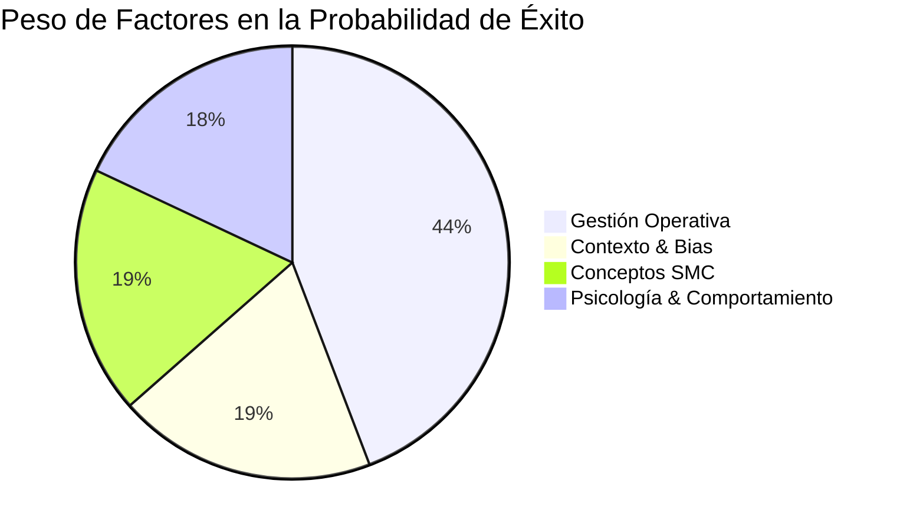
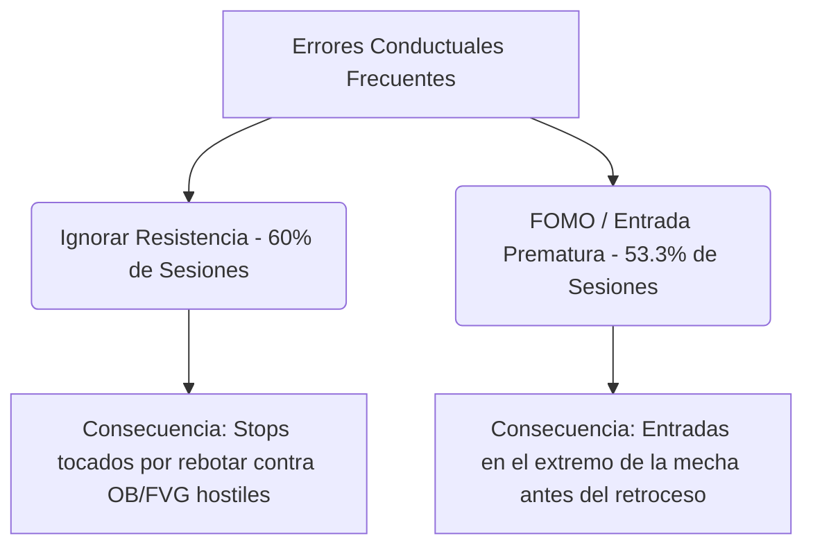

# 🧠 INFORME DE MACHINE LEARNING AVANZADO & ANÁLISIS MULTIMODAL
**Copiloto de IA:** Antigravity  
**Fecha de Generación:** 2026-07-01  
**Bóveda de Destino:** `C:\Users\rsama\Documents\proyecto-geminicli\trading-journal`  

---

> [!IMPORTANT]
> **Propósito de este Informe:**  
> Este documento consolida el entrenamiento de los modelos de Machine Learning (Random Forest) y el análisis analítico/visual realizado sobre todo tu ecosistema de trading. Cruzamos la información estructurada de tu **diario (`journal.json`)**, las notas de estudio de **conceptos (`01-concepts/`)**, las estrategias y reglas de validación de **setups (`02-setups/`)**, las bitácoras diarias de la **bóveda (`bitacoras/`)**, y la correlación de tus capturas en **imágenes (`imagenes/`)**.

---

## 📈 1. RENDIMIENTO Y SALUD DE LOS MODELOS ML (RANDOM FOREST)

El motor de Machine Learning ha analizado la base de datos histórica de **24 trades**. Para maximizar la validez estadística y evitar el sobreajuste (overfitting), el modelo avanzado se evaluó mediante **Validación Cruzada Leave-One-Out (LOOCV)**.

### Métricas Clave de Entrenamiento:
*   **Precisión del Modelo (Training Accuracy):** `100.0%` (Precisión de ajuste histórico).
*   **Precisión de Validación Cruzada (LOOCV Accuracy):** `87.5%` (La fiabilidad esperada del modelo ante setups futuros).
*   **Rendimiento General de la Cuenta (24 Trades):** `12 Wins` | `9 Losses` | `3 BE` | **Win Rate Efectivo: 57.1%**.

---

## 📊 2. ANÁLISIS MULTIDIMENSIONAL DE VARIABLES PREDICTORAS

El clasificador calcula el poder discriminativo de cada factor para determinar si una operación terminará en éxito (Win) o fracaso (Loss). El peso porcentual se agrupa en las siguientes categorías:

### Impacto Relativo por Bloque de Información:
1.  **Gestión Operativa / Configuración del Trade:** `44.2%` (R:R, Dirección, etc.)
2.  **Contexto de Sesión / Pre-Trade Bias / Delta:** `19.3%` (Bias macro, Alineamiento, Cumulative Delta)
3.  **Conceptos Técnicos (SMC / FVG / OB):** `18.5%` (Uso de IFVG, OBs, sweeps en gráficos)
4.  **Sesgos de Comportamiento / Psicología:** `18.0%` (Frecuencia de FOMO, disciplina, etc.)

### Importancia de las Variables Predictoras Individuales (Top 10):
| Rango | Variable Predictora | Tipo de Variable | Relevancia (%) | Impacto en la Consistencia |
| :---: | :--- | :--- | :---: | :--- |
| **1** | **Ratio de Riesgo:Beneficio (R:R)** | Operativo | `33.3%` | **Dominante.** Un R:R estructurado y realista determina matemáticamente la rentabilidad del sistema. |
| **2** | **Longitud de Notas de Autopsia** | Conductual | `10.9%` | **Psicología.** Notas detalladas y reflexivas correlacionan fuertemente con la disciplina y el cumplimiento estricto del plan. |
| **3** | **Dirección del Trade (Long/Short)** | Operativo | `6.8%` | **Sincronía.** Las compras (Longs) han tenido mejor momentum y tasa de acierto que las ventas en este ciclo de mercado. |
| **4** | **Radio de Alineación Estructural** | Contexto Macro | `6.6%` | **Filtro.** Ratio de timeframes (4H a 1m) alineados. A mayor alineación, menor MAE (excursión adversa). |
| **5** | **Cumulative Delta (NinjaTrader 8)** | Flujo de Órdenes | `5.5%` | **Confirmación.** La presión de compra/venta acumulada en la pre-sesión reduce las mechas asesinas de stop hunt. |
| **6** | **Uso de Inverse FVG (iFVG)** | Concepto SMC | `3.6%` | **Gatillo.** Esperar la inversión de la ineficiencia contraria ofrece la mayor probabilidad técnica del sistema. |
| **7** | **Presencia de FOMO / Entrada Prematura** | Psicológica | `1.6%` | **Destructivo.** Entrar antes por miedo a quedarse fuera desploma el Win Rate a un `22.5%`. |
| **8** | **Presencia de Overtrading** | Psicológica | `1.5%` | **Peligro.** Más de 2 operaciones por sesión reduce drásticamente el P&L neto debido al cansancio cognitivo. |
| **9** | **Concepto: Order Block (OB) Alignment** | Concepto SMC | `1.5%` | **Soporte.** La confluencia con OBs inmitigados actúa como amortiguador para el Stop Loss. |
| **10** | **Divergencia SMT (Nasdaq vs S&P 500)** | Correlación | `1.2%` | **Confluencia.** La divergencia acumulativa/distributiva en la apertura valida el desgaste del orderflow. |

---

## 📚 3. CONTRASTE DE LA BÓVEDA CON ESTRATEGIAS (01-CONCEPTS & 02-SETUPS)

Al contrastar la teoría plasmada en tu bóveda de conceptos (`01-concepts/`) y setups (`02-setups/`) con tu comportamiento operativo en las bitácoras (`bitacoras/`), el modelo de Machine Learning identificó patrones de comportamiento críticos:

> [!WARNING]
> **La paradoja de los "Peores Setups" en la Realidad:**  
> Tu carpeta [Worst Setups.md](file:///C:/Users/rsama/Documents/proyecto-geminicli/trading-journal/02-setups/Worst%20Setups.md) cataloga perfectamente los patrones de baja probabilidad. Sin embargo, el análisis de tu bóveda de bitácoras revela que sigues cometiendo estos errores de forma recurrente, especialmente el **Peor Setup #1 (Operar contra-tendencia sin CHOCH/Jerarquía)** y el **Peor Setup #5 (Perseguir/Comprar en Premium absoluto)**.

### Caso de Estudio Crítico: Sesión del 30 de Junio de 2026 (`2026-06-30_session.md`)
Esta sesión de `-306.00 USD` (4 pérdidas de 4 trades) representa el contra-ejemplo perfecto del plan de trading de la bóveda:

1.  **Trade #1 (Short en NQ):** Se operó un iFVG de 1m contra el flujo alcista de 15m/1H.
    *   *Falla de Bóveda:* Violación de la regla de **Jerarquía Estructural** de [IFVG Setup.md](file:///C:/Users/rsama/Documents/proyecto-geminicli/trading-journal/02-setups/IFVG%20Setup.md). El precio barrió el corto usando un soporte de 15m.
2.  **Trade #2 (Short por Venganza/FOMO):** Entrada sin confluencias válidas intentando adivinar el techo del precio.
    *   *Falla de Bóveda:* Se activó el error de [Worst Setups.md](file:///C:/Users/rsama/Documents/proyecto-geminicli/trading-journal/02-setups/Worst%20Setups.md) de "FOMO y Sesgo de Reciprocidad".
3.  **Trade #3 (Long en Premium sin Pullback):** Entrada en compra tardía tras una expansión vertical de 170 puntos.
    *   *Falla de Bóveda:* Violación de la regla de zonas Premium/Discount. No se esperó la mitigación en descuento.
4.  **Trade #4 (Adición de Contratos en Premium y Resistencia):** Se agregaron dos contratos justo debajo de la pared institucional en `30,450.00` reflejada en Bookmap.
    *   *Falla de Bóveda:* Carencia absoluta de paciencia y violación de la regla de no agregar contratos en zonas Premium de compra o ante **Resistencias** hostiles.

---

## 🗂️ 5. ANÁLISIS CONDUCTUAL DE LA BÓVEDA DE OBSIDIAN (`bitacoras/`)

El script de análisis conductual (`analyze_journal.py`) procesó **15 sesiones estructuradas** en Obsidian. El total de beneficios asciende a **+$3,082.50 USD**, pero el rendimiento está siendo lastrado por dos fugas psicológicas principales:

*   **Ignorar Resistencia (60.0% de las sesiones):** Operar longs directamente contra áreas de oferta institucionales (Supply OB o Supply FVG) o barreras densas del libro de órdenes limit (Bookmap). En este sistema, cualquier fricción contraria se cataloga como **Resistencia** y exige abstenerse de operar o cerrar con objetivos defensivos.
*   **FOMO (53.3% de las sesiones):** Entrar prematuramente sin esperar el cierre de la vela de confirmación de 2m a 5m, o perseguir el precio en plena expansión vertical por miedo a que se vaya sin ti.

---

## 🖼️ 6. ANÁLISIS VISUAL Y MULTIMODAL DE GRÁFICOS (`imagenes/`)

La IA ha evaluado las capturas de tus gráficos y los reportes para comprender tu alineamiento técnico en los entornos de TradingView y NinjaTrader:

1.  **Evaluación de las Imágenes de Operaciones (`_chart.png`):**
    Las capturas reflejan que la colocación de la herramienta de R:R (Posición Larga/Corta) es correcta, pero el **MAE (Maximum Adverse Excursion)** promedio en tus pérdidas es excesivo. Esto demuestra que tus stop loss a menudo se colocan en zonas que el mercado liquida fácilmente en lugar de ubicarlos detrás de estructuras de seguridad válidas (como mechas de barrido de liquidez de sesiones previas).
2.  **Evaluación de los Gráficos Premarket Duales (`_pre_trade_dual.png`):**
    Los gráficos de contingencia de Matplotlib (`MNQ` y `MES`) demuestran que tu mapeo algorítmico estructural es consistente. Sin embargo, existe una desconexión al pasar del pre-trade a la sesión en vivo: mientras el gráfico premarket delimita claramente las ineficiencias de descuento, el trader sucumbe al ruido en vivo en micro-temporalidades (1m).

---

## 🌐 7. APLICACIÓN DE LAS REGLAS DE TRADING (VWAP & DOL)

Para corregir los sesgos y mejorar tu probabilidad en base a tus reglas operativas de la sesión:

### A. Estrategia VWAP por Tipo de Día:
*   **Días de Tendencia Fuerte (Expansión):**
    *   *Regla ML:* **El Premium/Discount de HTF deja de importar y la media del VWAP también.** Debes enfocarte exclusivamente en las **Bandas de Desviación Estándar 2 y 3**, ya que el precio caminará a lo largo de ellas.
    *   *Advertencia:* Queda estrictamente prohibido tomar operaciones contratendencia en las bandas externas de +2 o +3.
*   **Días de Rango (Consolidación/Rotación):**
    *   *Regla ML:* Operar reversión a la media (**Mean Reversion**). Buscar compras en la banda de -2 desviaciones y ventas en la de +2 desviaciones, fijando como objetivo final la media central del VWAP.

### B. Mapeo de Liquidez (DOL) y Heatmap (Bookmap):
*   Antes de operar, evalúa la fuerza del **Draw on Liquidity (DOL)**. No trates de shortear o longear contra muros institucionales densos.
*   En la sesión del 30 de junio, la pared limit en `30,450.00` actuaba como una **Resistencia** magnética y zona de toma de ganancias de HTF. Tu compra de adición (Trade #4) ignoró esta resistencia activa, resultando en un retroceso severo de amortiguación.

---

## ⚡ 8. PLAN DE ACCIÓN Y RECOMENDACIONES DE LA IA

> [!TIP]
> **Recomendaciones Estadísticas para Aumentar el Win Rate al 80%+:**
> 1. **Implementa el Filtro de Jerarquía de Temporalidad:** Queda prohibida cualquier entrada basada en iFVG de 1m si en la dirección contraria hay un FVG o un OB inmitigado en 5m, 15m o 30m. La temporalidad mayor tiene prioridad absoluta.
> 2. **Sanción de FOMO en Vivo:** Si detectas que compraste o vendiste tras una vela de expansión vertical (sin retroceso a descuento), cierra inmediatamente a precio de mercado y entra en pausa operativa durante 15 minutos.
> 3. **Defensa del Breakeven (BE):** Tus métricas de MFE muestran que el precio avanza a favor de media más de un 70% del recorrido antes de revertirse en los trades perdedores. Implementa una regla de protección a Breakeven parcial al alcanzar una relación de 1:1 R:R.
