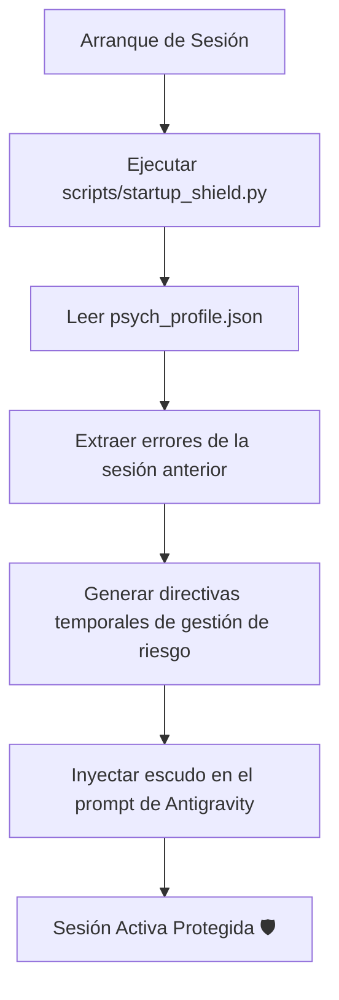
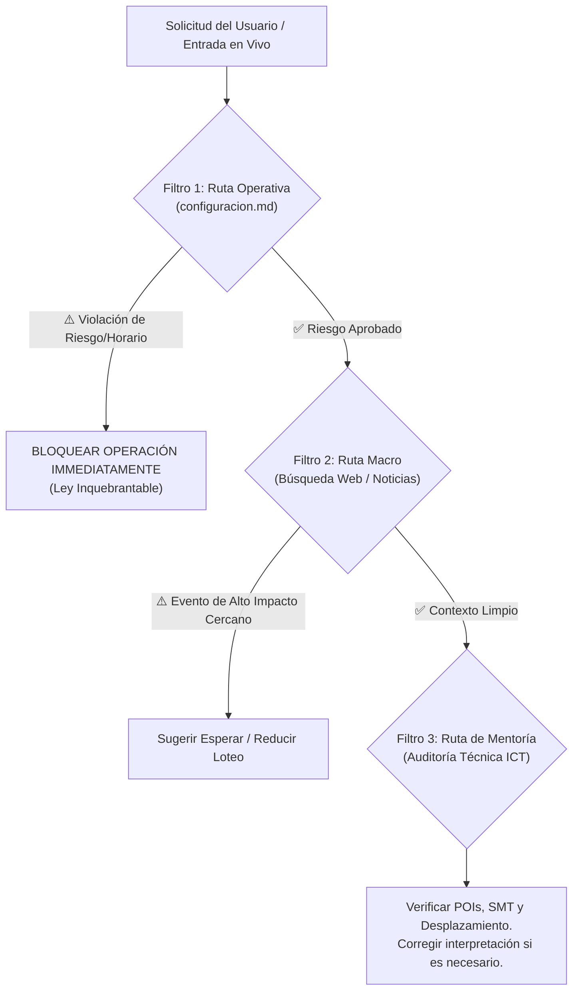

# 🏛️ Veredicto Arquitectónico y Propuesta de Escalabilidad

He analizado con rigor técnico tu propuesta de evolución para nuestro ecosistema de trading. Como copiloto de tu entorno local, mi veredicto es **favorable en un 80%**, con algunas advertencias críticas sobre optimización de recursos y latencia que debemos considerar para no sobrediseñar el sistema.

A continuación, presento la autopsia técnica de cada punto y el plan de implementación recomendado.

---

## 1. 🌀 Memoria y RAG (LlamaIndex vs. Contexto Masivo)

> [!WARNING]
> **Veredicto:** **Sobrediseño con Latencia Innecesaria. Recomiendo Simplificar.**

*   **El Riesgo de LlamaIndex:** Tu bóveda de Obsidian actualmente ocupa menos de **500 KB** (entre conceptos, bitácoras y configuraciones). Con mi ventana de contexto nativa de **1 a 2 millones de tokens**, puedo digerir tu bóveda entera en una sola llamada sin perder rendimiento. Introducir una base de datos vectorial (LlamaIndex) agregaría latencia de red, costo de tokens de embeddings, y dependencias pesadas de python (cffi, sqlite, etc.) sin aportar un beneficio real en velocidad.
*   **La Alternativa Óptima:** 
    1.  **Nexo Nacio de Búsqueda:** Utilizar el servidor MCP de Obsidian (`obsidian-second-brain`) es una excelente idea. Nos da herramientas nativas como `obsidian_search` y `graph_query` sin necesidad de indexación vectorial local.
    2.  **Caché por Hash (SHA-256):** Es brillante. Mantendremos un script ligero que genere un JSON de hashes de tus bitácoras y conceptos. Yo solo leeré los archivos cuyos hashes hayan cambiado respecto a la última sesión.
*   **Freno de Seguridad:** Aprobado al 100%. Mi rol de escritura se limitará a la creación de bitácoras del día (`YYYY-MM-DD_session.md`) y actualización del `journal.json`, bloqueando cualquier intento de reescritura de datos históricos.

---

## 2. 📈 Evolución Cuantitativa (LightGBM/XGBoost y Startup Hook)

> [!TIP]
> **Veredicto:** **Brillante e Innovador. Es la Confluencia del Trading Profesional.**

*   **De Random Forest a Gradient Boosting:** La migración en `ml_setup_classifier.py` a LightGBM/XGBoost es técnicamente superior para capturar relaciones no lineales y secuenciales de la acción del precio.
*   **Feature Importance Conductual:** Integrar tus métricas conductuales (de `psych_profile.json` y `journal.json`) como variables de entrada (ej. *"racha de pérdidas"*, *"horas de pantalla antes de la entrada"*, *"errores cometidos ayer"*) es una propuesta de nivel institucional. El modelo no solo dirá si el mercado es propicio, sino **qué tan propenso eres tú a cometer un error bajo estas condiciones de mercado**.
*   **Inyección Dinámica de Prompt (Startup Hook):** Es la mejor defensa operativa. Diseñaremos un script de arranque (`scripts/startup_shield.py`) que:
    1.  Lea el último estado de `psych_profile.json`.
    2.  Genere directivas temporales (ej. *"Ayer operó por FOMO en un iFVG. Hoy: Bloquea entradas que no tengan limit al 50% de la vela"*).
    3.  Inyecte estas directivas al inicio de mi contexto conversacional diario.

---

## 3. 🛡️ El Router de Decisiones (LangGraph vs. Lógica Cognitiva)

> [!NOTE]
> **Veredicto:** **Aprobado con Simplificación. Lógica de Enrutamiento Cognitiva.**

*   **LangGraph vs. Prompting de Reglas:** Aunque LangGraph es muy potente para multi-agentes, para nuestra interacción diaria añade latencia de ejecución. Recomiendo estructurar este enrutamiento **directamente en mi sistema de reglas cognitivas (System Prompt/AGENTS.md)**:

1.  **Ruta Operativa (La Ley):** Inmutable. Mi primera capa de razonamiento siempre evaluará si tu solicitud viola tus reglas de gestión en `configuracion.md`. Si es así, te frenaré sin importar la confluencia técnica.
2.  **Ruta de Mentoría (Auditoría ICT):** Dejaré de ser un mero registrador pasivo. Si marcas mal un POI, ignoras un SMT o fuerzas una narrativa alcista en una expansión bajista, te confrontaré activamente explicándote la teoría correcta.
3.  **Ruta Macro (Web/Noticias):** Cruzaré el calendario económico diario en tiempo real con tus filtros de horario operativo.

---

## 📅 Plan de Ruta para la Implementación

Si apruebas esta estructura simplificada y ultra-eficiente, iniciaremos con los siguientes hitos de desarrollo:

*   [ ] **Hito 1: El Escudo de Arranque (Startup Hook):** Crear el script `scripts/startup_shield.py` para leer `psych_profile.json` e inyectar dinámicamente mis directivas de protección en el chat al abrir la sesión.
*   [ ] **Hito 2: ML Evolucionado (XGBoost + Psicología):** Reescribir `scripts/ml_advanced_analyzer.py` para entrenar un modelo XGBoost que integre variables de tu comportamiento del trade junto con los datos de mercado.
*   [ ] **Hito 3: Integración de Servidores MCP:** Configurar los servidores de búsqueda web (Tavily/Brave) y Obsidian (`second-brain`) en tu configuración de MCP local.
