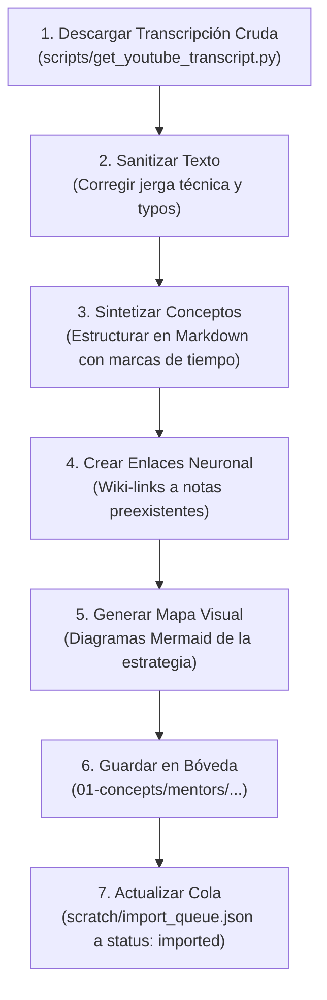

# 📋 Plan de Procesamiento de Videos y Gestión de Tokens (Refinado)

Este documento define el protocolo de instrucciones que yo (**Antigravity**) seguiré paso a paso para procesar tus videos y playlists de trading, y las recomendaciones sobre qué modelo utilizar para optimizar el consumo de tokens.

---

## 1. ⚙️ Protocolo de Instrucciones (¿Qué haré en cada video?)

Cuando me indiques procesar un video o lote de la cola, seguiré estrictamente este flujo de trabajo:

### Detalle del Formato de Salida:
Cada nota creada en `trading-journal/01-concepts/mentors/<nombre-mentor>/` tendrá:
*   **YAML Frontmatter:** Datos de origen (`url`, `mentor`, `playlist_name`, `tags`).
*   **Callout de Resumen Rápido:** Lo esencial en 3 viñetas.
*   **Desglose Cronológico (`[MM:SS]`):** Síntesis de los temas del video con sus marcas de tiempo reales.
*   **Reglas Mecánicas (IF/THEN):** Condiciones claras que el mentor define para tomar entradas, stops y objetivos.
*   **Wiki-links (`[[Concepto]]`):** Conexiones automáticas a tus conceptos existentes como `[[Order Block (OB)]]` o `[[Inverse FVG (iFVG)]]`.
*   **Diagrama Mermaid:** Flujo lógico visual del modelo de entrada del mentor.

---

## 2. 🧠 Recomendación de Modelos y Gestión de Tokens

Para procesar estas transcripciones (que suelen ser textos masivos de 20 a 60 minutos de charla) sin agotar tus cuotas o topar los límites de contexto, te recomiendo las siguientes configuraciones en tu cliente Antigravity:

| Modelo | Ventana de Contexto | Eficiencia de Tokens | Cuándo Usarlo |
| :--- | :---: | :---: | :--- |
| **Gemini 3.5 Flash (High)** *(Recomendado)* | **1,000,000 tokens** | 🟢 **Ultra-Eficiente** | **Para el 95% del proceso.** Permite devorar transcripciones de videos de 2 horas sin despeinarse, es sumamente rápido y consume una fracción mínima de tokens, evitando que alcances límites de cuota diaria. |
| **Gemini 3.5 Pro** | **2,000,000 tokens** | 🟡 **Consumo Medio-Alto** | **Solo para videos teóricos extremadamente complejos.** Tiene un razonamiento lógico y generación de diagramas Mermaid superior, pero consume más recursos. |
| **Claude 3.5 Sonnet / GPT-4o** | **200,000 / 128,000** | 🔴 **Consumo Muy Alto** | **No recomendado.** Te quedarás sin tokens o chocarás con límites de rate-limit (RPM/TPM) al intentar procesar transcripciones largas de más de 30 minutos. |

> [!TIP]
> **Estrategia Óptima para no agotar Tokens:**
> 1.  Mantén activo **Gemini 3.5 Flash** para toda la importación rutinaria.
> 2.  Procesemos los videos en **lotes de 2 en 2** por turno. Esto le permite al modelo estructurar con el máximo detalle cada nota sin recortar información y te da espacio para revisar que todo esté a tu gusto antes de continuar.

---

## 3. 📝 Lista de Mentores y Carpetas Destino

Para mantener tu "cerebro digital" ordenado, guardaré las notas en las siguientes rutas específicas:
*   **Supreme Trading:** `trading-journal/01-concepts/mentors/supreme-trading/`
*   **PB Trading:** `trading-journal/01-concepts/mentors/pb-trading/`
*   **TJR:** `trading-journal/01-concepts/mentors/tjr/`
*   **Fabio Valentini:** `trading-journal/01-concepts/mentors/fabio-valentini/`
*   **Cramz:** `trading-journal/01-concepts/mentors/cramz/`
